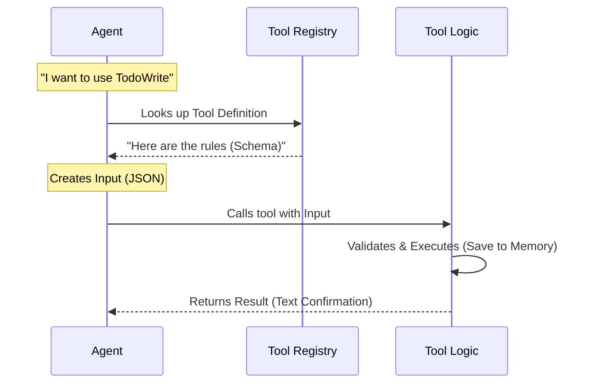

# Chapter 3: Tool Definition

In the previous chapter, [State Persistence](02_state_persistence.md), we solved the problem of "amnesia" by ensuring our To-Do list is saved to the application's global memory.

Now, we have the data structure (the ingredients) and the memory (the cupboard). But how does the AI actually "cook"?

In this chapter, we will learn about **Tool Definition**. This is the process of packaging our logic into a specific "skill" that the AI Agent can equip and use.

## Motivation: The "Skill Card" Analogy

Think of an AI Agent like a character in a Role-Playing Game (RPG).
*   The Agent has basic stats (intelligence, language processing).
*   But to do specific jobs, it needs **Skills**.

A carpenter has a "Hammering" skill. To use it, they need:
1.  **Name:** "Hammering"
2.  **Input:** Wood and Nails.
3.  **Action:** Swing the hammer.
4.  **Result:** A nailed piece of wood.

If we don't define these four things clearly, the carpenter (or the AI) won't know how to interact with the world.

The **Tool Definition** is that Skill Card. It binds the name, the rules (schemas), and the logic together into one package.

---

## Use Case: Equipping the Agent

Imagine our AI Agent is running. It decides: *"I need to update my plan to show that I finished the analysis."*

For the Agent to act on this thought, it looks through its list of available tools. It needs to find a tool that:
1.  Is named `TodoWrite`.
2.  Accepts a list of tasks as input.
3.  Promises to save that list.

If we don't define the tool correctly, the Agent might try to send text instead of JSON, or it might not find the tool at all.

---

## How It Works: The Flow

When we define a tool, we are essentially filling out a registration form for the AI system.



### The `buildTool` Function
In our codebase, we use a helper function called `buildTool`. This function takes all the separate pieces we discussed in previous chapters and wraps them into a single object the system understands.

---

## Implementation Details

Let's look at `TodoWriteTool.ts`. We will break the definition down into its four essential pillars.

### 1. The Identity (Name & Description)
First, we tell the AI what this tool is.

```typescript
export const TodoWriteTool = buildTool({
  name: 'TodoWrite', // The internal ID
  
  // A hint for the AI to know WHEN to pick this tool
  searchHint: 'manage the session task checklist', 
  
  // The detailed manual (See Chapter 4)
  async description() { return DESCRIPTION },
  
  // ... other properties
})
```
*Explanation:* The `searchHint` is crucial. It's like a label on a toolbox drawer. When the AI thinks "I need to manage tasks," it matches this hint.

### 2. The Rules (Input Schema)
We must be strict about what the AI sends us. We use the schema we designed in [Task Structure & States](01_task_structure___states.md).

```typescript
// Define what inputs the tool accepts
const inputSchema = lazySchema(() =>
  z.strictObject({
    // We expect an object with a 'todos' list
    todos: TodoListSchema().describe('The updated todo list'),
  }),
)

// Bind it to the tool definition
// ... inside buildTool({
  get inputSchema() { return inputSchema() },
// ...
```
*Explanation:* If the AI tries to send a "shopping_list" instead of "todos", this gatekeeper stops it immediately. It ensures the "nails" are actually nails.

### 3. The Action (Execution Logic)
This is where the magic happens. When the tool is called, the `call` function runs. This uses the logic we built in [State Persistence](02_state_persistence.md).

```typescript
// ... inside buildTool({
  async call({ todos }, context) {
    // 1. Get the Key (Who is asking?)
    const todoKey = context.agentId ?? getSessionId()

    // 2. Save to Global Memory (The "Whiteboard")
    context.setAppState(prev => ({
      ...prev,
      todos: { ...prev.todos, [todoKey]: todos },
    }))

    // 3. Return data for the system
    return { data: { newTodos: todos } }
  },
// ...
```
*Explanation:* This function receives the valid `todos`, finds the correct place in memory (`todoKey`), and saves it.

### 4. The Feedback (Result Mapping)
The AI works best when it reads text, not raw computer data. We need to translate the result of the code back into a sentence for the Agent.

```typescript
// ... inside buildTool({
  mapToolResultToToolResultBlockParam({ verificationNudgeNeeded }, toolUseID) {
    // The message the AI actually reads
    const base = `Todos have been modified successfully. Ensure that you continue to use the todo list to track your progress.`
    
    return {
      tool_use_id: toolUseID,
      type: 'tool_result',
      content: base, // + optional nudges
    }
  },
// })
```
*Explanation:* After the tool runs, the Agent reads this message. It acts as a confirmation: "Okay, I have successfully updated my list. I can move on."

---

## Putting It All Together

The **Tool Definition** is the bridge between your code and the AI's brain.

1.  **Identity:** Tells the AI the tool exists.
2.  **Schema:** Forces the AI to use the structure from **Chapter 1**.
3.  **Call:** Executes the saving logic from **Chapter 2**.
4.  **Result:** Tells the AI the job is done.

Without this definition, `TodoWriteTool` would just be a pile of unused code. With it, it becomes an active capability of the Agent.

## Conclusion

We have now successfully registered our tool!
1.  We defined the data shape.
2.  We handled the memory storage.
3.  We packaged it all into a "Skill" using `buildTool`.

However, just giving the AI a tool isn't enough. We need to give it an "Instruction Manual" so it knows *how* to behave while using it.

[Next Chapter: Usage Guidelines (Prompt)](04_usage_guidelines__prompt_.md)

---

Generated by [Code IQ](https://github.com/adityasoni99/Code-IQ)