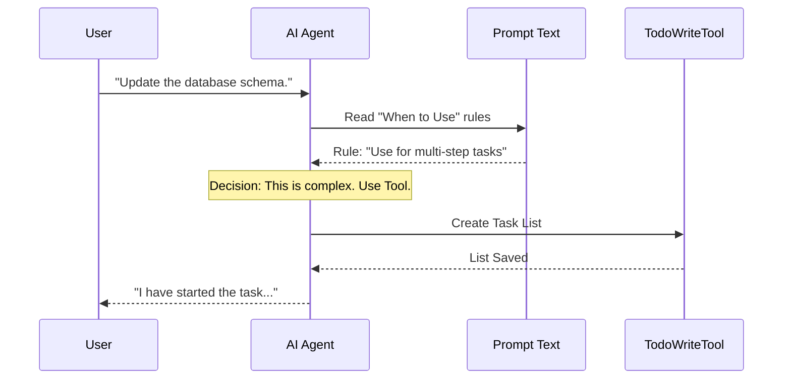

# Chapter 4: Usage Guidelines (Prompt)

In the previous chapter, [Tool Definition](03_tool_definition.md), we successfully registered our tool. We gave the AI the "Skill Card" so it technically *can* use the `TodoWriteTool`.

However, just because you own a hammer doesn't mean you should use it to open a window.

If we don't give the AI strict behavioral guidelines, it might try to create a complex To-Do list for simple requests like "Say Hello." This creates unnecessary bureaucracy and wastes time.

In this chapter, we will write the **Usage Guidelines (Prompt)**. Think of this as the "Employee Handbook" or "Standard Operating Procedure" that tells the Agent *when* and *how* to use the tool.

## The Motivation: The "Employee Handbook"

Imagine you hire a new project manager. You hand them a clipboard (the tool) and say:

> "Use this clipboard to track large projects with multiple steps. Do **NOT** use this clipboard if someone just asks you for the time."

Without these instructions, the manager might write down:
1.  *Look at wrist.*
2.  *Read time.*
3.  *Speak time.*

That is inefficient. We want the AI to be smart about its resources. The **Prompt** is a block of text that defines this logic.

---

## Use Case: To Plan or Not to Plan?

The prompt helps the AI categorize user requests into two buckets.

### Bucket A: When to Use (Complex)
**User:** "Refactor the login system, add Google Auth, and update the tests."
*   **AI Decision:** This is huge. It has multiple steps. I risk forgetting something.
*   **Action:** Use `TodoWriteTool`.

### Bucket B: When NOT to Use (Simple)
**User:** "What is 2 + 2?"
*   **AI Decision:** This is trivial. I can answer immediately.
*   **Action:** Do NOT use the tool. Just reply.

---

## How It Works: The Decision Flow

When the AI receives a message, it reads our specific guidelines before deciding which tool to pick.



---

## Implementation Details

The "Prompt" is simply a long text string exported from a file (usually `prompt.ts`). It uses "Natural Language" to program the AI.

Let's break down the `PROMPT` variable from our codebase into its critical sections.

### 1. The Core Instruction
We start by telling the AI what the tool is for at a high level.

```typescript
// prompt.ts
export const PROMPT = `
Use this tool to create and manage a structured task list...
This helps you track progress, organize complex tasks, and demonstrate thoroughness to the user.
`
```
*Explanation:* This sets the context. It tells the AI that using this tool isn't just about data; it's about "demonstrating thoroughness."

### 2. "When to Use" (The Triggers)
We explicitly list scenarios where the tool is mandatory.

```typescript
// prompt.ts (Excerpt)
`
## When to Use This Tool
Use this tool proactively in these scenarios:

1. Complex multi-step tasks (3 or more steps)
2. User explicitly requests a todo list
3. After receiving new instructions (capture requirements)
4. When you start working on a task
`
```
*Explanation:* We give concrete rules. "3 or more steps" is a clear boundary that prevents the AI from guessing.

### 3. "When NOT to Use" (The Guardrails)
Equally important is telling the AI when to stop.

```typescript
// prompt.ts (Excerpt)
`
## When NOT to Use This Tool
Skip using this tool when:

1. There is only a single, straightforward task
2. The task can be completed in less than 3 trivial steps
3. The request is purely conversational ("Hello")
`
```
*Explanation:* This section prevents the "bureaucracy" problem we discussed in the motivation.

### 4. Teaching by Example (Few-Shot Prompting)
The most powerful way to teach an AI is to show, not just tell. We provide specific XML-style examples `<example>` inside the prompt string.

```typescript
// prompt.ts (Excerpt)
`
<example>
User: How do I print 'Hello World' in Python?
Assistant: *Does NOT use tool*
<reasoning>
This is a single, trivial task. No tracking needed.
</reasoning>
</example>
`
```
*Explanation:* When the AI sees a real conversation example, it mimics that behavior. By including a `<reasoning>` block, we teach the AI *how to think* about the decision.

### 5. Enforcing Grammar (Recall Chapter 1)
Finally, we reiterate the data structure rules we learned in [Task Structure & States](01_task_structure___states.md).

```typescript
// prompt.ts (Excerpt)
`
**IMPORTANT**: Task descriptions must have two forms:
- content: "Run tests" (Imperative)
- activeForm: "Running tests" (Continuous)
`
```
*Explanation:* Even though the code (Schema) validates this, repeating it in the text prompt makes the AI much less likely to make a mistake.

---

## Connecting the Prompt to the Tool

Now that we have written the text, how does the system know about it?

In **Chapter 3**, we looked at the `TodoWriteTool` definition. There is a specific function called `prompt()` that connects this text file to the tool definition.

```typescript
// TodoWriteTool.ts
import { PROMPT } from './prompt.js'

export const TodoWriteTool = buildTool({
  name: 'TodoWrite',
  
  // The system calls this to get the "Handbook"
  async prompt() {
    return PROMPT
  },
  
  // ... other properties
})
```
*Explanation:* When the AI considers using `TodoWrite`, the system injects the text from `PROMPT` into the AI's context window.

---

## Summary

In this chapter, we learned that coding the tool isn't enough; we have to "train" the employee.

1.  **The Prompt** serves as the usage manual.
2.  **Explicit Rules** ("When to use" / "When not to use") prevent misuse.
3.  **Examples** (Few-Shot Prompting) teach the AI by showing it correct scenarios.
4.  **Integration** happens in the tool definition via the `prompt()` function.

Now the AI knows **what** the tool is, **how** to save the data, and **when** to use it.

But what happens if the AI creates a plan, does the work, and then claims it's finished without actually checking if the code works? We need a way to gently remind it to double-check its work.

[Next Chapter: Verification Nudge](05_verification_nudge.md)

---

Generated by [Code IQ](https://github.com/adityasoni99/Code-IQ)