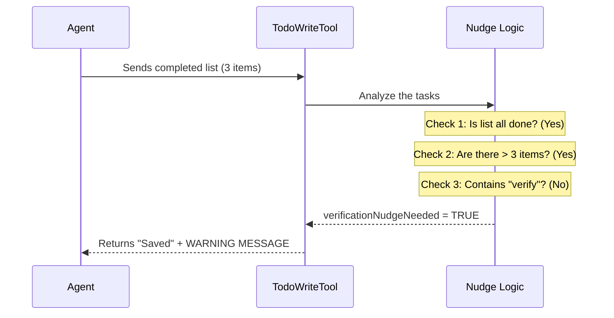

# Chapter 5: Verification Nudge

In the previous chapter, [Usage Guidelines (Prompt)](04_usage_guidelines__prompt_.md), we gave our AI Agent an "Instruction Manual" so it knows when to use the tool. We taught it how to plan.

But even the best plans can go wrong if nobody checks the results.

Imagine a chef who cooks a 5-course meal but never tastes the soup before serving it. It might look beautiful, but it could be incredibly salty!

In this final chapter, we will explore the **Verification Nudge**. This is a safety mechanism built into `TodoWriteTool` that acts like a wise supervisor, gently reminding the Agent to test its work before declaring victory.

## The Motivation: The "Overconfident Engineer"

AI Agents are often optimistic. They write code, mark the task as done, and assume everything works perfectly.

**The Problem:**
If an Agent completes a massive list of tasks (e.g., "Rewrite Database," "Update API," "Fix Frontend") but never actually runs the code to check if it works, we risk deploying broken software.

**The Solution:**
The **Verification Nudge**.
If the tool notices the Agent has done a lot of work (3 or more tasks) but hasn't included a step like "Verify" or "Test," the tool adds a warning message to the output.

It basically says: *"Hey, you did a lot of work, but I didn't see you test anything. Are you sure you're done?"*

---

## Use Case: Catching the Mistake

Let's look at a scenario where this feature saves the day.

### The Agent's Risky Plan
The Agent sends a list where every task is marked `completed`:
1.  [Completed] Update User Schema
2.  [Completed] Migrate Data
3.  [Completed] Update Login UI

### The Tool's Reaction
The tool analyzes this list:
1.  **Is it finished?** Yes (All are completed).
2.  **Is it big?** Yes (3 tasks).
3.  **Is there a test?** No (The word "verify" is missing).

**Result:** instead of just saying "Saved," the tool responds:
> "Todos modified. **NOTE: You just closed out 3+ tasks and none of them was a verification step. Please verify before finishing.**"

This prompts the Agent to say, *"Ah, right. I should run the tests,"* and it creates a new task.

---

## How It Works: The Logic Flow

The logic happens inside the tool right before it returns the result to the Agent.



---

## Implementation Details

Let's look at the code in `TodoWriteTool.ts` to see how we implement this safety net.

### Step 1: Detecting the Risk
Inside the `call` function, we inspect the `todos` array. We are looking for a specific pattern of behavior.

```typescript
// Inside TodoWriteTool.ts -> call()

// 1. Are all tasks marked completed?
const allDone = todos.every(t => t.status === 'completed')

// 2. Is the list long enough to worry about?
const isBigBatch = todos.length >= 3

// 3. Did they mention verification? (Case-insensitive Regex)
const hasVerification = todos.some(t => /verif/i.test(t.content))
```
*Explanation:* We define our criteria. We use a simple Regular Expression (`/verif/i`) to check if the Agent wrote "Verify," "Verification," or "Verifying" in any of the task descriptions.

### Step 2: Setting the Flag
Now we combine these checks into a single boolean flag.

```typescript
let verificationNudgeNeeded = false

// If it's a big, finished batch with NO verification...
if (allDone && isBigBatch && !hasVerification) {
  verificationNudgeNeeded = true
}

// Pass this flag to the output
return { 
  data: { 
    newTodos: todos, 
    verificationNudgeNeeded // <--- The signal
  } 
}
```
*Explanation:* We don't send the text message yet. We just calculate the *fact* that a nudge is needed. We pass `verificationNudgeNeeded` out of the logic function.

### Step 3: delivering the Message
Finally, we need to convert that `true` flag into English text the Agent can read. This happens in the `mapToolResultToToolResultBlockParam` function.

```typescript
// Inside mapToolResultToToolResultBlockParam

// The standard success message
const base = `Todos have been modified successfully.`

// The conditional warning
const nudge = verificationNudgeNeeded
  ? `\n\nNOTE: You just closed out 3+ tasks and none of them was a verification step. Before writing your final summary, spawn the verification agent.`
  : '' // If false, add nothing.

// Combine them
return {
  content: base + nudge,
}
```
*Explanation:* The Agent sees the `content` string. By appending the `nudge`, we inject new instructions into the conversation stream immediately after the mistake happens.

---

## Why This Matters

This pattern—**Logic-Based Nudging**—is powerful for AI engineering.

1.  **It is Passive:** It doesn't stop the Agent from working. It just suggests a correction.
2.  **It is Context-Aware:** It doesn't annoy the Agent on small tasks (less than 3 items).
3.  **It Enforces Quality:** It creates a "Quality Gate" that forces the Agent to stop and think.

## Tutorial Conclusion

Congratulations! You have completed the `TodoWriteTool` tutorial series.

We have built a robust system that turns a chaotic AI into a disciplined worker:
1.  [Task Structure & States](01_task_structure___states.md): We defined a strict language for tasks.
2.  [State Persistence](02_state_persistence.md): We gave the Agent a memory so it doesn't forget the plan.
3.  [Tool Definition](03_tool_definition.md): We packaged the code into a "Skill."
4.  [Usage Guidelines (Prompt)](04_usage_guidelines__prompt_.md): We wrote the manual on *when* to use it.
5.  **Verification Nudge**: We added a supervisor to ensure quality control.

By combining structured data (JSON), persistent state, and smart logic, you have created a tool that significantly improves the reliability of an AI Agent.

---

Generated by [Code IQ](https://github.com/adityasoni99/Code-IQ)