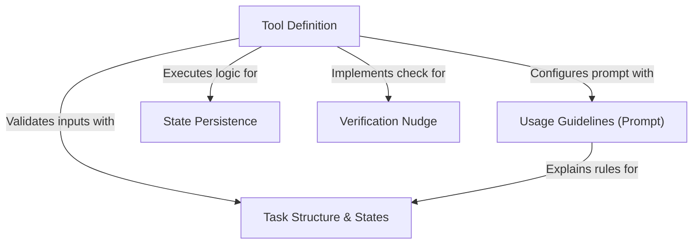

# Tutorial: TodoWriteTool

The `TodoWriteTool` enables an AI agent to **create and manage a structured checklist** of tasks during complex coding sessions. It acts as a persistent memory aid, ensuring workflows are broken down into **trackable steps** (pending, in_progress, completed) that are saved to the application's state. Additionally, it features a *quality assurance mechanism* that nudges the agent to perform verification if it attempts to finish a large batch of tasks without explicit testing steps.

## Chapters

1. [Task Structure & States](01_task_structure___states.md)
2. [State Persistence](02_state_persistence.md)
3. [Tool Definition](03_tool_definition.md)
4. [Usage Guidelines (Prompt)](04_usage_guidelines__prompt_.md)
5. [Verification Nudge](05_verification_nudge.md)

---

Generated by [Code IQ](https://github.com/adityasoni99/Code-IQ)