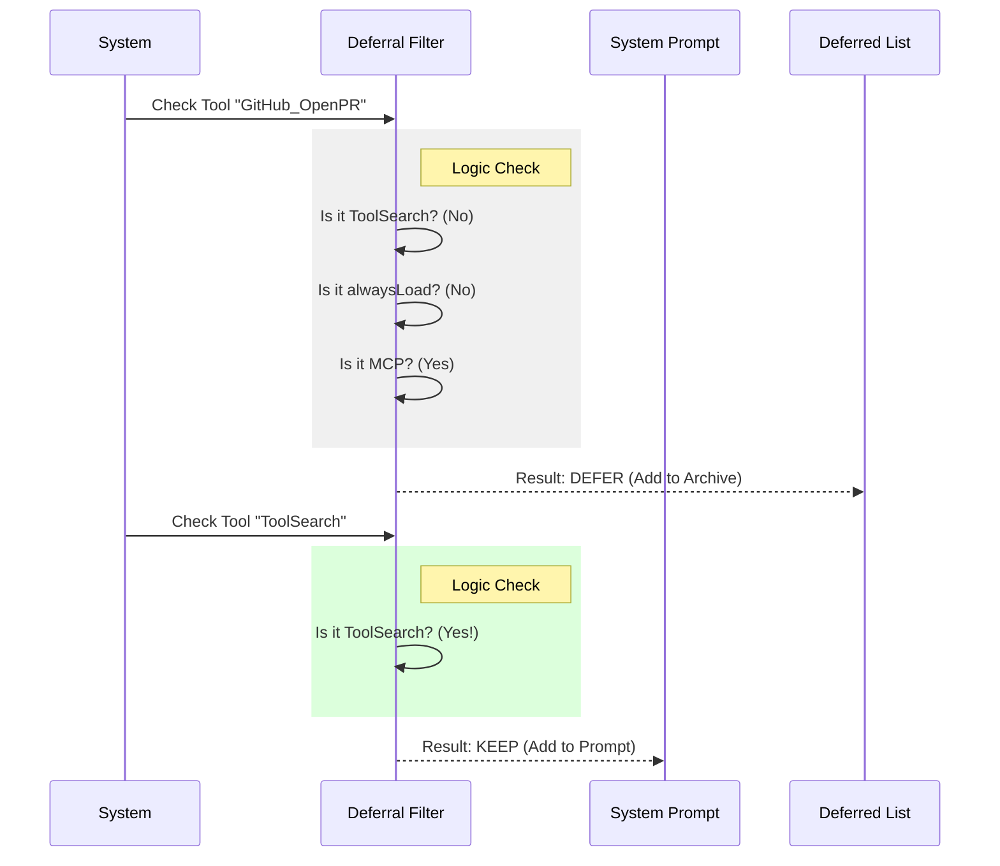

# Chapter 1: Deferred Tool Filtering

Welcome to the first chapter of the **ToolSearchTool** tutorial! 

Before we dive into how an AI searches for tools, we need to answer a fundamental question: **Why do we need to search in the first place?**

## The Motivation: The Library Analogy

Imagine you walk into a massive library. 
- **Immediate Access:** On the front desk, there is a small "Reference Section" with the most essential books (dictionary, map, phone book). You can grab these instantly.
- **The Archive:** Hidden in the back are thousands of specialized books. They are too heavy to carry all at once.

If the Librarian (the AI) tried to hold every single book in their hands (the System Prompt) at the same time, they would collapse! 

**Deferred Tool Filtering** is the logic that decides which tools stay on the "Reference Desk" (loaded immediately) and which go into the "Archive" (deferred/hidden) until requested.

## Key Concept: The Gatekeeper Logic

The heart of this system is a decision-making function called `isDeferredTool`. It acts as a gatekeeper for every tool available to the AI.

It asks three main questions to decide a tool's fate:
1. Is this a Critical Tool? (Must be available)
2. Is this an "MCP" (External) Tool? (Usually hidden)
3. Does the tool have a specific flag? (Manual override)

Let's break down how to implement this logic using the code from `prompt.ts`.

### 1. The Safety Lock (Critical Infrastructure)

The most important rule is that the **Search Tool** itself cannot be hidden. If the AI needs the Search Tool to find tools, and the Search Tool is hidden inside the archive... the AI gets stuck in an infinite loop.

```typescript
// From prompt.ts
export function isDeferredTool(tool: Tool): boolean {
  // Never defer ToolSearch itself!
  // The model needs it to load everything else.
  if (tool.name === TOOL_SEARCH_TOOL_NAME) {
    return false 
  }
  // ... continue checks
}
```

**Explanation:**
We explicitly check if the tool's name matches `TOOL_SEARCH_TOOL_NAME`. If it does, we return `false` (do not defer). This tool stays on the Reference Desk.

### 2. Handling External Tools (MCP)

"MCP" stands for Model Context Protocol. These are tools provided by external servers (like a GitHub or Slack integration). Because a user might have 50 different external tools connected, we generally want to hide them by default to save space.

```typescript
// Inside isDeferredTool function...

// MCP tools are always deferred by default
// (They are workflow-specific and numerous)
if (tool.isMcp === true) {
  return true
}
```

**Explanation:**
If the tool is marked as an MCP tool, we return `true` (defer it). These go straight to the Archive.

### 3. Manual Overrides (Flags)

Sometimes, we want to force a specific behavior regardless of the tool type. We use flags like `alwaysLoad` (Force stay) or `shouldDefer` (Force hide).

```typescript
// Inside isDeferredTool function...

// Check this FIRST (before MCP check)
// Explicit opt-out allows specific MCP tools to stay visible
if (tool.alwaysLoad === true) {
  return false
}

// ... MCP check happens here ...

// Finally, check standard configuration
return tool.shouldDefer === true
```

**Explanation:**
*   `alwaysLoad`: This is a "VIP Pass." Even if it's an MCP tool, if this is true, keep it visible.
*   `shouldDefer`: The default setting for standard tools. If the developer set this to true, hide the tool.

## Visualizing the Flow

Here is what happens "Under the Hood" when the system starts up and looks at a tool.



## Implementation Deep Dive

The logic we discussed is aggregated in a single function in `prompt.ts`. While the production code handles complex feature flags (like 'KAIROS' or 'FORK_SUBAGENT'), the core logic remains focused on the order of operations.

Here is a simplified view of the complete function logic:

```typescript
export function isDeferredTool(tool: Tool): boolean {
  // 1. VIP Pass: Explicitly requested to stay loaded
  if (tool.alwaysLoad === true) return false

  // 2. Bulk Filter: All MCP tools go to archive
  if (tool.isMcp === true) return true

  // 3. Safety Lock: Never hide the key to the archive!
  if (tool.name === TOOL_SEARCH_TOOL_NAME) return false

  // 4. Default behavior based on tool configuration
  return tool.shouldDefer === true
}
```

### What happens to the "Deferred" tools?
If `isDeferredTool` returns `true`:
1. The tool's full definition (JSON schema) is **omitted** from the system prompt.
2. Only the **name** of the tool is kept.
3. This list of names is passed to the AI so it knows *what* exists, but not *how* to use them yet.

## Conclusion

You have now set up the "Library." 
1. **ToolSearch** and essential tools are on the desk (Immediate Access).
2. Specialized and External tools are in the back (Deferred).

But wait—if the tools are in the back, how does the AI know they exist? And how does it ask the Librarian to fetch them?

To solve this, we need to tell the AI about the "Archive" and give it instructions on how to use the search tool. We will cover this in the next chapter.

[Next: Chapter 2 - Dynamic Prompt Generation](02_dynamic_prompt_generation.md)

---

Generated by [Code IQ](https://github.com/adityasoni99/Code-IQ)