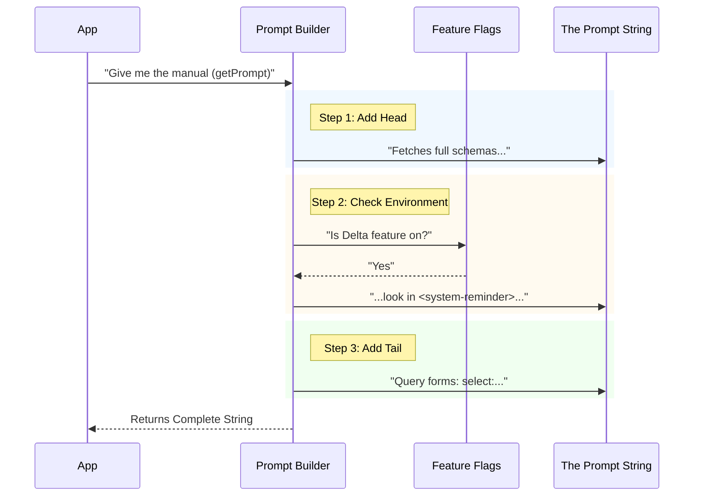

# Chapter 2: Dynamic Prompt Generation

Welcome back! In [Deferred Tool Filtering](01_deferred_tool_filtering.md), we organized our tools into a "Reference Desk" (immediate access) and an "Archive" (hidden/deferred).

However, we have a small problem. We put the tools in the Archive to hide them... but now they are **too** hidden. The AI doesn't know they exist, and it certainly doesn't know how to ask for them.

We need to hand the AI an **Instruction Manual**.

## The Motivation: The "Magic" Manual

Imagine you buy a complicated machine. You need a manual to operate it. 
However, in our software, the machine works differently depending on who is using it (e.g., are we on a slow computer? Is a specific experimental feature turned on?).

If we wrote a static text file as our manual, it would be wrong half the time.

**Dynamic Prompt Generation** is the process of writing this manual *programmatically*. We don't just read a string from a file; we build the instructions on the fly to ensure they match the current environment.

## The Interface Contract

This generated prompt acts as a **Contract**. It promises the AI three things:
1.  **Purpose:** What this tool does ("It fetches tools").
2.  **Context:** Where to look for the names of hidden tools.
3.  **Syntax:** How to speak to the tool ("Use `select:` or `notebook`...").

Let's look at how `prompt.ts` builds this manual piece by piece.

## Component 1: The Head (The Purpose)

The first part of the manual never changes. It simply states the mission.

```typescript
// From prompt.ts
const PROMPT_HEAD = `Fetches full schema definitions for deferred tools so they can be called.

`
```
**Explanation:**
This tells the AI: "Your goal with this tool is to get the JSON schemas for tools you can't see yet."

## Component 2: The Hint (The Dynamic Part)

This is where the magic happens. We need to tell the AI where to find the list of tool *names* (the index of the Archive). 

Sometimes the system puts these names in a system-reminder. Sometimes it puts them in a user message XML block. The code must decide which instruction to give.

```typescript
// From prompt.ts
function getToolLocationHint(): string {
  // check if we are using the "Delta" feature or if user is 'ant'
  const deltaEnabled =
    process.env.USER_TYPE === 'ant' ||
    getFeatureValue_CACHED_MAY_BE_STALE('tengu_glacier_2xr', false)

  // Return different text based on the check
  return deltaEnabled
    ? 'Deferred tools appear by name in <system-reminder> messages.'
    : 'Deferred tools appear by name in <available-deferred-tools> messages.'
}
```

**Explanation:**
1.  We check a feature flag (`tengu_glacier...`) or user type.
2.  If the feature is **On**, we tell the AI to look in `<system-reminder>`.
3.  If the feature is **Off**, we tell the AI to look in `<available-deferred-tools>`.

This ensures the AI never looks in the wrong place.

## Component 3: The Tail (The Syntax)

Finally, we explain *how* to use the tool. This includes specific command formats and what the output will look like.

```typescript
// From prompt.ts
const PROMPT_TAIL = ` ... This tool takes a query ...
Query forms:
- "select:Read,Edit,Grep" — fetch these exact tools by name
- "notebook jupyter" — keyword search
- "+slack send" — require "slack" in the name...`
```

**Explanation:**
This sets the rules. If the AI wants the `Read` tool, it must type `select:Read`. If it wants to search vaguely, it can type `notebook`. This syntax will be parsed in [Chapter 4: Direct Selection Mode](04_direct_selection_mode.md) and [Chapter 3: Keyword Search & Scoring](03_keyword_search___scoring.md).

## Putting It All Together

How do we generate the final manual? We simply stick the pieces together.

```typescript
// From prompt.ts
export function getPrompt(): string {
  // Head + Dynamic Hint + Tail
  return PROMPT_HEAD + getToolLocationHint() + PROMPT_TAIL
}
```

**Explanation:**
When the system starts, it calls `getPrompt()`. This function:
1.  Takes the static header.
2.  Runs the logic to get the correct hint.
3.  Appends the static syntax rules.
4.  Returns one complete string to feed into the AI.

## Visualizing the Build Process

Here is what happens inside the code when the application asks for the tool definition.



## Why This Matters

Without **Dynamic Prompt Generation**, we would confuse the AI. 

If the system code puts tool names in a `<system-reminder>`, but a static prompt told the AI to look in `<available-deferred-tools>`, the AI would say: *"I cannot find the tools you mentioned."*

By generating the prompt via code, we ensure the **instructions always match the reality** of the system configuration.

## Conclusion

You now have a system that:
1.  Hides tools to save space ([Chapter 1](01_deferred_tool_filtering.md)).
2.  Dynamically writes an instruction manual telling the AI where to find them and how to search (This Chapter).

Now the AI knows the rules: *"Type 'notebook jupyter' to search."* 

But what happens when the AI actually sends that string? How does our code interpret "notebook jupyter" and find the right tool?

We will explore the search engine itself in the next chapter.

[Next: Chapter 3 - Keyword Search & Scoring](03_keyword_search___scoring.md)

---

Generated by [Code IQ](https://github.com/adityasoni99/Code-IQ)