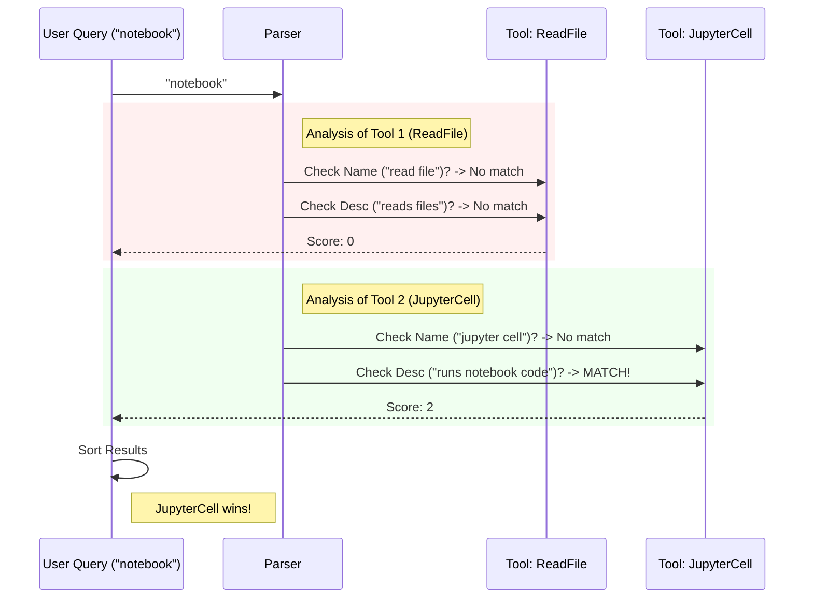

# Chapter 3: Keyword Search & Scoring

Welcome to the search engine room!

In [Chapter 2: Dynamic Prompt Generation](02_dynamic_prompt_generation.md), we gave the AI an instruction manual. We told it: *"If you need a tool you can't see, ask for it using a keyword like 'notebook'."*

Now, we have to handle that request. If the AI sends the word "notebook," but our tool is technically named `Jupyter_ExecuteCell`, how do we connect the dots?

We need a **Fuzzy Search Algorithm**.

## The Motivation: The "Vague" Librarian

Imagine you go to a librarian and ask: *"Do you have anything about stars?"*

A bad librarian looks strictly for books with the exact word "stars" in the title.
A **good** librarian (our algorithm) looks for:
1.  **Title:** "The Life of **Stars**" (Exact match! High priority).
2.  **Category:** A book in the "Astronomy" section (Related match).
3.  **Description:** A book titled "The Sun" that mentions "stars" in the blurb (Low priority).

**Keyword Search & Scoring** is the logic that assigns "points" to tools based on how well they match the user's query, ensuring the best tool floats to the top.

## Concept 1: Translating "Computer Speak"

Tools often have ugly technical names like `readFile` or `mcp__github__create_issue`. Humans (and LLMs) prefer natural language like "read file" or "github".

Before we search, we must "clean" the tool names.

```typescript
// From ToolSearchTool.ts
function parseToolName(name: string) {
  // 1. Handle "CamelCase" (e.g., ReadFile -> read file)
  let cleanName = name.replace(/([a-z])([A-Z])/g, '$1 $2')
  
  // 2. Handle underscores (e.g., mcp__server -> mcp server)
  cleanName = cleanName.replace(/_/g, ' ')

  return cleanName.toLowerCase().split(/\s+/)
}
```

**Explanation:**
We take a rigid name like `WriteLog` and turn it into `['write', 'log']`. This allows the search engine to find this tool even if the user just searches for "write".

## Concept 2: The Scoring Game

This is the heart of the chapter. We turn searching into a game where tools compete for points. The tool with the most points wins.

The algorithm compares the **User Query** against three parts of the tool:
1.  The **Name** (Most important).
2.  The **Search Hint** (A manual keyword tag).
3.  The **Description** (Least important).

### The Point System

Here is a simplified version of the logic inside `searchToolsWithKeywords`.

```typescript
// Inside the scoring loop...
let score = 0

// 1. High Score: The query word is in the Tool Name
if (toolNameParts.includes(searchTerm)) {
    score += 10 // GOLD MEDAL
}

// 2. Medium Score: The query matches a manual "Search Hint"
else if (toolHint.includes(searchTerm)) {
    score += 4  // SILVER MEDAL
}

// 3. Low Score: The query is found in the description text
else if (toolDescription.includes(searchTerm)) {
    score += 2  // BRONZE MEDAL
}
```

**Why do we do this?**
If you search for "Graph," you probably want the `GraphGenerator` tool (Score: 10). You probably *don't* want the `Calculator` tool, even though its description says "can plot a graph" (Score: 2).

## Concept 3: The "MCP" Prefix

"MCP" stands for **Model Context Protocol**. These are external tools (like plugins). By convention, they often start with `mcp__` (e.g., `mcp__slack__post_message`).

If a user searches for "slack," we need to make sure `mcp__slack...` gets a massive score boost.

```typescript
// Special handling for MCP tools
if (isMcpTool && toolNameParts.includes(searchTerm)) {
    // MCP tools get extra points for name matches
    // because "slack" is a very specific intent.
    score += 12 // PLATINUM MEDAL
}
```

## Visualizing the Search Process

Let's watch what happens when the AI searches for **"notebook"**.



## Implementation Deep Dive

Let's look at the real code implementation. It uses a function called `searchToolsWithKeywords`.

### Step 1: Exact Match ( The "Fast Lane")

Before doing any complex math, we check if the user typed the name exactly.

```typescript
// From ToolSearchTool.ts
async function searchToolsWithKeywords(query, deferredTools, tools) {
  const queryLower = query.toLowerCase().trim()

  // Did they type the exact name? (e.g., "ReadFile")
  const exactMatch = deferredTools.find(
      t => t.name.toLowerCase() === queryLower
  )
  
  // If yes, stop here. We found it.
  if (exactMatch) {
    return [exactMatch.name]
  }
  
  // ... otherwise start the scoring engine ...
}
```

### Step 2: The Scoring Loop

If it wasn't an exact match, we run the fuzzy scorer.

```typescript
// Simplified view of the scoring loop
const scored = await Promise.all(deferredTools.map(async tool => {
    // Parse the name into parts
    const parsed = parseToolName(tool.name)
    
    // Get the tool's description (cached for speed)
    const description = await getToolDescriptionMemoized(tool.name, tools)

    let score = 0
    
    // Check every word in the user's query
    for (const term of queryTerms) {
        // Run the point system logic we discussed above
        score += calculatePoints(term, parsed, description)
    }

    return { name: tool.name, score }
}))
```

### Step 3: Filtering and Sorting

Finally, we take the list of scored tools, remove the losers (Score 0), and pick the winners.

```typescript
return scored
  .filter(item => item.score > 0)    // Remove irrelevant tools
  .sort((a, b) => b.score - a.score) // Highest score first
  .slice(0, maxResults)              // Take top 5
  .map(item => item.name)            // Return names only
```

## How to Solve the Use Case

Let's look at a concrete example.

**The Scenario:**
The user has an external tool called `mcp__weather__get_forecast`.
The AI wants to know the weather, so it searches for: `weather`.

**What happens:**
1.  **Input:** Query = "weather".
2.  **Parsing:** `mcp__weather__get_forecast` becomes `['mcp', 'weather', 'get', 'forecast']`.
3.  **Scoring:**
    *   Does "weather" match the parsed name? **Yes.**
    *   Is it an MCP tool? **Yes.**
    *   **Score:** 12 points (Platinum match).
4.  **Output:** The search returns `['mcp__weather__get_forecast']`.

## Conclusion

You have now built a "Fuzzy Librarian." 
1.  It understands that `CamelCase` is actually "Camel Case".
2.  It prioritizes names over descriptions using a point system.
3.  It gives special treatment to external (MCP) tools.

But what if the AI **already knows** the exact name of the tool it wants? What if it doesn't want to search, but just wants to *grab* the tool immediately? 

There is a special syntax for that: `select:ToolName`. We will cover this "Express Lane" in the next chapter.

[Next: Chapter 4 - Direct Selection Mode](04_direct_selection_mode.md)

---

Generated by [Code IQ](https://github.com/adityasoni99/Code-IQ)