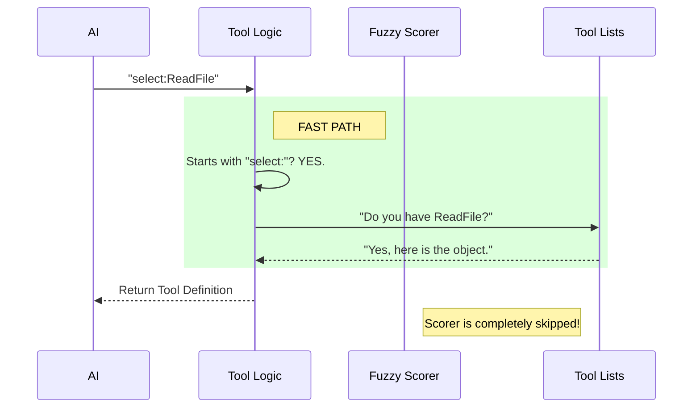

# Chapter 4: Direct Selection Mode

Welcome to the express lane!

In [Chapter 3: Keyword Search & Scoring](03_keyword_search___scoring.md), we built a "Fuzzy Librarian" that diligently reads every book description to find matches for vague queries like "notebook." This is great when the AI is exploring.

But what if the AI **already knows** exactly what it wants? 

If the AI knows the tool is named `ReadFile`, it shouldn't have to ask for "something that reads files" and hope the scoring algorithm works. It should be able to demand the tool by name.

## The Motivation: The "Call Number" Analogy

Imagine you are back in the library.
- **Fuzzy Search:** You ask, "Do you have any books about 18th-century gardening?" The librarian has to think, search the catalog, and check descriptions. This takes time.
- **Direct Selection:** You hand the librarian a slip that says **"Call Number: 635.09"**. The librarian walks directly to the shelf and hands you the book. Zero thinking required.

**Direct Selection Mode** is that specific call slip. It bypasses the scoring math entirely, reducing latency and eliminating the chance of getting the wrong tool.

## Key Concept: The `select:` Syntax

To trigger this mode, we established a strict rule in [Chapter 2: Dynamic Prompt Generation](02_dynamic_prompt_generation.md). The AI must start its query with `select:`.

### The Use Case
The AI wants to load two tools: `ReadFile` and `WriteFile`.

**Input:** `select:ReadFile,WriteFile`
**Goal:** Immediately return these two specific tools without searching descriptions.

Let's look at how the code handles this "Fast Path."

## Step 1: Detecting the Intent

When the tool receives a query, the very first thing it does is check for the "Magic Prefix."

```typescript
// From ToolSearchTool.ts

// Regex: Starts with "select:", capture everything after it
const selectMatch = query.match(/^select:(.+)$/i)

if (selectMatch) {
  // FAST PATH: Stop here, do not run keyword search!
  // ... process selection ...
}
```

**Explanation:**
We use a Regular Expression (`^select:`) to see if the user wants direct access. If this matches, we skip the entire fuzzy search engine we built in Chapter 3.

## Step 2: Parsing the Request

The AI might ask for one tool, or it might ask for five tools separated by commas. We need to turn the string `select: A, B, C` into a clean list `['A', 'B', 'C']`.

```typescript
// Inside the if(selectMatch) block...

// 1. Get string after colon ("ReadFile, WriteFile")
// 2. Split by comma
// 3. Trim whitespace
const requested = selectMatch[1]
  .split(',')
  .map(s => s.trim())
  .filter(Boolean)
```

**Explanation:**
This cleans up the input. If the AI accidentally types `select: ReadFile,  WriteFile` (with extra spaces), this code ensures we get clean names to look up.

## Step 3: The "No-Op" Safety Net

Here is a clever trick in the system. 
We look for the tool in the **Deferred** list (the Archive). But we *also* look for it in the **Active** list (the tools already on the desk).

```typescript
// Loop through every requested name...
for (const toolName of requested) {
  
  // Check BOTH lists (Deferred AND Active)
  const tool =
    findToolByName(deferredTools, toolName) ??
    findToolByName(tools, toolName)

  if (tool) {
     found.push(tool.name) // Success!
  }
}
```

**Why do we check the Active list?**
Sometimes the AI forgets that it already has a tool loaded. If it asks `select:ToolSearch` (which is already loaded), and we say "Not found in Archive," the AI might panic and crash. 
By checking the Active list, we say "Yes, here it is!" (even though it already had it). This keeps the conversation flowing smoothly.

## Visualizing the Fast Path

Here is the difference between the Search Mode we built previously and Direct Selection.



## Implementation Deep Dive

Let's look at the implementation inside `ToolSearchTool.ts`. This single block handles the entire feature.

```typescript
// From ToolSearchTool.ts

// 1. The Regex Check
const selectMatch = query.match(/^select:(.+)$/i)

if (selectMatch) {
  // 2. Parse the names
  const requested = selectMatch[1].split(',').map(s => s.trim())

  const found: string[] = []

  // 3. Find matches
  for (const toolName of requested) {
    const tool = findToolByName(deferredTools, toolName) ?? 
                 findToolByName(tools, toolName)
    
    if (tool) found.push(tool.name)
  }

  // 4. Return result immediately
  return buildSearchResult(found, query, deferredTools.length)
}
```

**Explanation:**
1.  **Check:** If `selectMatch` exists, we enter the `if` block and never leave (because of the `return` at the end).
2.  **Parse:** We convert the comma-separated string into an array.
3.  **Find:** We look up the exact name. Note that this is case-sensitive or insensitive depending on how `findToolByName` is implemented (usually strict).
4.  **Return:** We wrap the results in a standard response format.

## What happens if the AI makes a typo?

If the AI types `select:ReadFyle` (typo), `findToolByName` returns `null`.
The code then returns an empty list `[]`.

In [Chapter 5: Result Mapping](05_result_mapping__tool_reference_.md), we will see how the system generates a helpful error message like *"No matching deferred tools found"* so the AI can correct its spelling.

## Conclusion

You have now implemented a high-speed "Express Lane" for your tools. 
1.  **Fuzzy Search** (Chapter 3) helps the AI explore.
2.  **Direct Selection** (Chapter 4) helps the AI execute quickly when it knows what it wants.

We have gathered the tool names. Now, we have one final step. We need to take these tool names (strings) and convert them into a special format called a `tool_reference` block so the LLM knows how to "install" them into its context.

[Next: Chapter 5 - Result Mapping (Tool Reference)](05_result_mapping__tool_reference_.md)

---

Generated by [Code IQ](https://github.com/adityasoni99/Code-IQ)