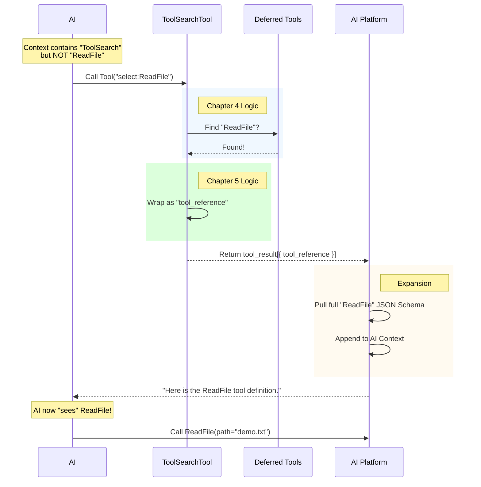

# Chapter 5: Result Mapping (Tool Reference)

Welcome to the final chapter of the **ToolSearchTool** tutorial!

In [Chapter 4: Direct Selection Mode](04_direct_selection_mode.md), we successfully identified exactly which tools the AI wants. We ended up with a simple list of names, for example: `['ReadFile', 'WriteFile']`.

But we have a problem. If we just send the text string `"ReadFile"` back to the AI, the AI will say: *"Okay, you said 'ReadFile', but I still don't know **how** to use it. What arguments does it take?"*

We need to send the AI the "Instruction Manual" (Schema) for that tool.

## The Motivation: The "Hyperlink" Analogy

Imagine you are browsing a website and you see a list of documents.
-   **Text Only:** You see the word "Report.pdf". You can read the title, but you can't open the file.
-   **Hyperlink:** You click the link, and the browser effectively "downloads" the file so you can read the contents.

**Result Mapping** is the process of turning a plain text name (the title) into a **Tool Reference** (the hyperlink).

When the AI receives this reference, the system automatically "downloads" the full tool definition (inputs, types, description) from the Archive and inserts it into the conversation. This allows the AI to use the tool in its very next turn.

## Key Concept: The `tool_reference` Block

We don't send back a standard text message. We send back a structured data block defined by the underlying API (like Anthropic's).

The structure looks like this:

```json
{
  "type": "tool_reference",
  "tool_name": "ReadFile"
}
```

This acts as a signal to the system: *"Please go to the Deferred Tool Archive, find the schema for 'ReadFile', and make it visible to the AI immediately."*

## The Use Case

**Scenario:** The AI searched for `select:ReadFile`.
**Internal State:** Our code found the tool name `['ReadFile']`.
**Goal:** Return the specific JSON object that "activates" this tool.

Let's look at how the code transforms the data.

## Step 1: Handling Success (The Mapper)

The function responsible for this is `mapToolResultToToolResultBlockParam`. Its main job is to loop through our list of names and wrap them in the reference format.

```typescript
// From ToolSearchTool.ts
// Inside mapToolResultToToolResultBlockParam...

return {
  type: 'tool_result',
  tool_use_id: toolUseID,
  content: content.matches.map(name => ({
    type: 'tool_reference',
    tool_name: name,
  })),
}
```

**Explanation:**
1.  `content.matches` is our list `['ReadFile']`.
2.  `.map(...)` transforms each name into `{ type: 'tool_reference', tool_name: 'ReadFile' }`.
3.  We wrap it all in a `tool_result` so the API knows this is the answer to the AI's search request.

## Step 2: Handling Failure (The Empty Search)

Sometimes, the AI searches for something that doesn't exist (e.g., "TimeTravelMachine"). The list of matches will be empty.

If we return an empty list, the AI might hallucinate that it found the tool. We need to be explicit about the failure.

```typescript
// From ToolSearchTool.ts

if (content.matches.length === 0) {
  let text = 'No matching deferred tools found'
  
  // Return a text error message instead of a tool reference
  return {
    type: 'tool_result',
    tool_use_id: toolUseID,
    content: text,
  }
}
```

**Explanation:**
If `matches.length` is 0, we return a plain text message. This tells the AI: *"Stop. You didn't find anything. Try searching for a different keyword."*

## Step 3: The "Pending" State (Advanced)

Sometimes, an external tool (MCP) is technically found, but it is still in the process of connecting to the server. It's "loading."

We add a helpful hint so the AI knows to wait.

```typescript
// Inside the failure check...

if (content.pending_mcp_servers.length > 0) {
    text += `. Some MCP servers are still connecting: ` 
    text += content.pending_mcp_servers.join(', ')
    text += `. Try searching again shortly.`
}
```

**Explanation:**
This provides a better user experience. Instead of saying "Not Found," we say "Not Found *Yet*—please hold."

## Visualizing the Full Lifecycle

Now that we have covered all 5 chapters, let's see the complete lifecycle of a tool search in one diagram.



## Implementation Deep Dive

The code for this logic is concise. It sits at the very end of `ToolSearchTool.ts`.

### The Interface

The function signature looks scary, but it's simple. It takes the output from our search (the names) and the ID of the AI's question (`toolUseID`).

```typescript
// From ToolSearchTool.ts
mapToolResultToToolResultBlockParam(
  content: Output,
  toolUseID: string,
): ToolResultBlockParam {
  // Logic goes here...
}
```

### The Transformation

Here is the logic combining everything we discussed (Failures + Success).

```typescript
// 1. Handle Empty Results
if (content.matches.length === 0) {
  // ... build error string with pending server info ...
  return {
    type: 'tool_result',
    tool_use_id: toolUseID,
    content: text, // Plain text explanation
  }
}

// 2. Handle Success
return {
  type: 'tool_result',
  tool_use_id: toolUseID,
  // 3. The magic transformation
  content: content.matches.map(name => ({
    type: 'tool_reference' as const,
    tool_name: name,
  })),
}
```

## Conclusion

Congratulations! You have completed the **ToolSearchTool** tutorial.

You have built a sophisticated system that manages the AI's cognitive load:

1.  **[Deferred Tool Filtering](01_deferred_tool_filtering.md)**: You separated essential tools from the "Archive" to save space.
2.  **[Dynamic Prompt Generation](02_dynamic_prompt_generation.md)**: You wrote a live manual telling the AI how to search.
3.  **[Keyword Search & Scoring](03_keyword_search___scoring.md)**: You built a fuzzy search engine for vague requests.
4.  **[Direct Selection Mode](04_direct_selection_mode.md)**: You built a fast lane for specific requests.
5.  **Result Mapping (This Chapter)**: You learned how to "hydrate" a simple text name into a fully usable tool using references.

By using this architecture, your AI Agent can have access to thousands of tools without ever running out of context window space. 

You are now ready to expand your agent with as many tools as you can imagine!

---

Generated by [Code IQ](https://github.com/adityasoni99/Code-IQ)