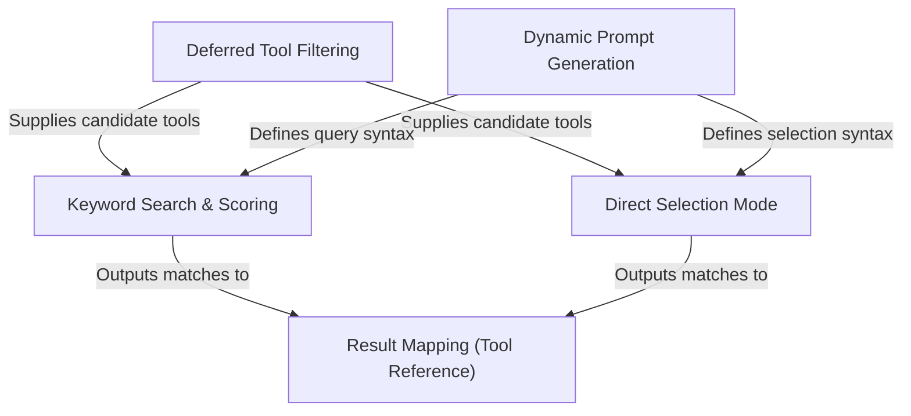

# Tutorial: ToolSearchTool

The **ToolSearchTool** functions as a dynamic catalog for AI agents, managing a large library of tools by keeping most "hidden" (**deferred**) to save context window space. It provides agents with a **Keyword Search** algorithm and a fast **Direct Selection Mode** to discover and retrieve specific tool definitions on demand. The system uses **Dynamic Prompt Generation** to teach the AI how to query the library and **Result Mapping** to format the found tools so they can be immediately executed.

## Chapters

1. [Deferred Tool Filtering](01_deferred_tool_filtering.md)
2. [Dynamic Prompt Generation](02_dynamic_prompt_generation.md)
3. [Keyword Search & Scoring](03_keyword_search___scoring.md)
4. [Direct Selection Mode](04_direct_selection_mode.md)
5. [Result Mapping (Tool Reference)](05_result_mapping__tool_reference_.md)

---

Generated by [Code IQ](https://github.com/adityasoni99/Code-IQ)