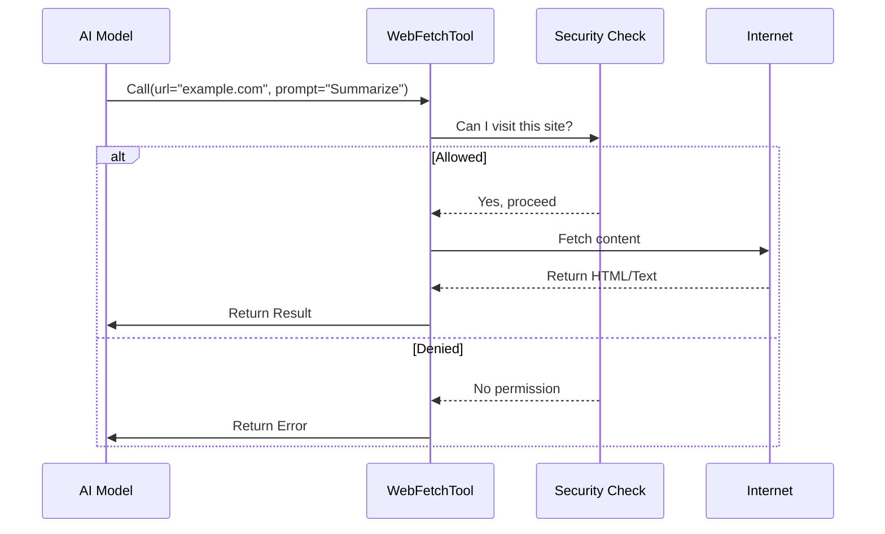

# Chapter 1: WebFetchTool Definition

Welcome to the **WebFetchTool** project! This tutorial will guide you through building a powerful tool that allows Artificial Intelligence (AI) to interact with the World Wide Web.

## The Motivation: Giving the AI "Eyes"

Imagine an AI as a brilliant researcher locked in a windowless room. It knows everything that was in the books it read during training, but it has no idea what happened on the news *today*. It cannot visit a website to check documentation or look up a weather forecast.

**The Use Case:**
You want to ask your AI: *"Go to https://example.com and summarize the main article."*

Without a tool, the AI acts like a brain in a jar—it simply can't reach the internet. The **WebFetchTool** solves this. It acts as the "driver" of a car. The AI tells the driver where to go (the URL) and what to do when they get there (the prompt), and the tool handles the driving, parking, and looking around.

## What is the WebFetchTool?

The `WebFetchTool` is the central blueprint. It is the interface between the AI's intent and the actual execution of fetching web pages. It defines three critical things:

1.  **Input:** What the AI must provide (e.g., a website address).
2.  **Output:** What the tool gives back (e.g., text from the website).
3.  **Flow:** The steps to take (Check permission -> Fetch -> Process -> Return).

### 1. The Input Schema (The Steering Wheel)

To drive a car, you need to know where you are going. Similarly, our tool requires specific inputs defined using a library called `zod`.

Here is the simplified definition of what the tool accepts:

```typescript
// Define what the AI must send us
const inputSchema = lazySchema(() =>
  z.strictObject({
    url: z.string().url().describe('The URL to fetch content from'),
    prompt: z.string().describe('The prompt to run on the fetched content'),
  }),
)
```

*   **`url`**: The destination. It must be a valid web address.
*   **`prompt`**: Specific instructions, like "Summarize this" or "Find the pricing."

### 2. The Output Schema (The Destination Report)

After the tool visits the website, it needs to report back to the AI.

```typescript
// Define what we send back to the AI
const outputSchema = lazySchema(() =>
  z.object({
    result: z.string().describe('The processed text content'),
    code: z.number().describe('HTTP response code (e.g., 200)'),
    url: z.string().describe('The URL that was actually fetched'),
  }),
)
```

*   **`result`**: The actual text found on the website (or the answer to the specific prompt).
*   **`code`**: A technical status number (200 means "Success", 404 means "Not Found").

## How It Works: The Execution Flow

When the AI decides to use the `WebFetchTool`, a specific sequence of events occurs. Before looking at the code, let's visualize the process.



### The `call` Method

The heart of the tool is the `call` method. This function executes the logic shown in the diagram above.

Here is a simplified view of how the `WebFetchTool` orchestrates the process:

```typescript
async call({ url, prompt }, { abortController }) {
  // 1. Fetch the raw content from the web
  // (We will cover the details of this in Chapter 2)
  const response = await getURLMarkdownContent(url, abortController)

  // 2. Handle Redirects (e.g., moving from http to https)
  if (response.type === 'redirect') {
    return createRedirectMessage(response.redirectUrl);
  }

  // 3. Process the content based on the AI's prompt
  // (We will cover this in Chapter 3)
  const result = await applyPromptToMarkdown(prompt, response.content, ...)

  // 4. Return the data structured according to our Output Schema
  return {
    data: {
      result: result,
      code: response.code,
      url: url
    }
  }
}
```

**Explanation:**
1.  **Fetching:** The tool delegates the hard work of downloading the page to a helper function. We will build this in [Content Fetching & Conversion](02_content_fetching___conversion.md).
2.  **Redirects:** If a website sends us to a new address, we inform the AI so it knows what happened.
3.  **Processing:** We don't just dump raw code on the AI. We process it first. We will learn how to do this in [AI Content Extraction](03_ai_content_extraction.md).
4.  **Returning:** Finally, we package the data neatly so the AI can read it.

## Permissions and Safety

You wouldn't want a driver taking your car anywhere without asking, right? The `WebFetchTool` includes a `checkPermissions` method.

```typescript
async checkPermissions(input, context) {
  // Check if the URL is in our "Safe List"
  if (isPreapprovedHost(input.url)) {
    return { behavior: 'allow' }
  }

  // Otherwise, ask the user or check user-defined rules
  // (Details in Chapter 4)
  return checkUserRules(input);
}
```

This ensures the tool only visits websites the user has approved. We will dive deep into this system in [Security & Permission Guardrails](04_security___permission_guardrails.md).

## Conclusion

In this chapter, we defined the **WebFetchTool**. It is the "driver" that:
1.  Accepts a **URL** and a **Prompt**.
2.  Checks if it has **Permission** to go there.
3.  **Fetches** the content.
4.  **Returns** a readable result to the AI.

However, we haven't actually written the code to *download* the website yet! The `WebFetchTool` is just the manager; it needs workers to do the heavy lifting.

In the next chapter, we will build the engine that actually connects to the internet and turns messy HTML into clean text.

[Next: Content Fetching & Conversion](02_content_fetching___conversion.md)

---

Generated by [Code IQ](https://github.com/adityasoni99/Code-IQ)