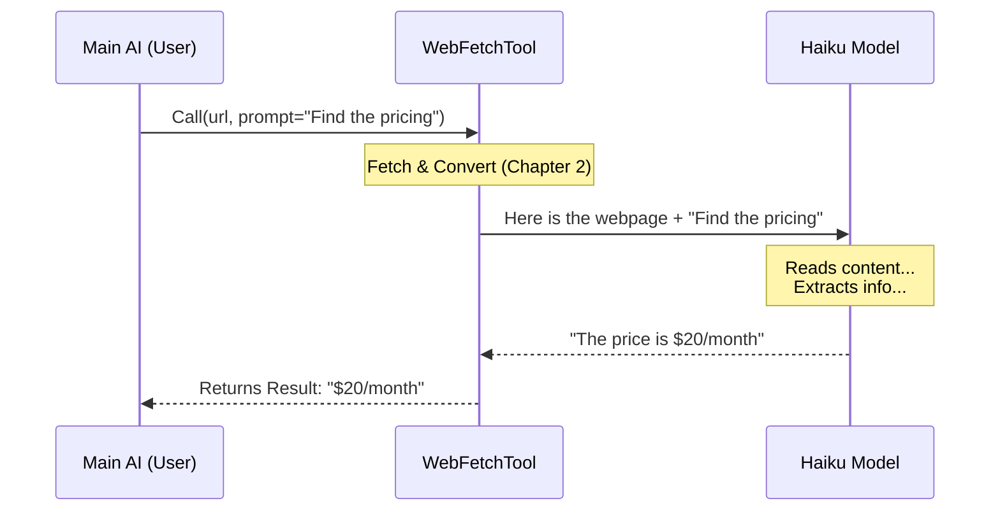

# Chapter 3: AI Content Extraction

In the previous chapter, [Content Fetching & Conversion](02_content_fetching___conversion.md), we built an engine that visits a URL and turns messy HTML into clean Markdown text.

Now we have a new problem: **Information Overload.**

Imagine you are looking for a specific cooking recipe. You visit a blog post, but before the recipe, there are 10 pages of stories about the author's childhood, their garden, and the history of flour.

If we send *all* that text to the main AI, two things happen:
1.  **Confusion:** The AI might get distracted by the story and miss the ingredients.
2.  **Waste:** AI models process text in units called "tokens." Sending irrelevant text wastes memory and money.

## The Solution: The "Intern" Analogy

To solve this, the **WebFetchTool** uses a clever trick. It hires an "Intern."

*   **The Boss (Main AI):** The powerful model (like Claude 3.5 Sonnet) interacting with the user. It asks: *"Get me the ingredients list from this URL."*
*   **The Intern (Secondary AI):** A smaller, faster, cheaper model (like Claude 3 Haiku) that lives *inside* the tool.

**The Process:**
1.  The Tool downloads the *entire* 50-page document.
2.  The Tool gives the document to the **Intern** (Haiku) with a note: *"Read this and only write down the ingredients list."*
3.  The Intern writes a short summary.
4.  The Tool gives that short summary to the **Boss**.

This process is called **AI Content Extraction**.

## Visualizing the Workflow

Let's look at how the data flows. Notice how the "Main AI" never sees the full, messy webpage content—only the polished answer.



## Step 1: Preparing the Prompt

We need to construct the instructions for our "Intern." We do this in `prompt.ts` using a function called `makeSecondaryModelPrompt`.

This function creates a "sandwich":
1.  **Top Bun:** The Markdown content from the website.
2.  **Meat:** The user's specific prompt (e.g., "Summarize this").
3.  **Bottom Bun:** Guidelines (e.g., "Be concise," "Don't quote song lyrics").

```typescript
// prompt.ts
export function makeSecondaryModelPrompt(content, prompt, isSafe) {
  // 1. Define strict guidelines (simplified)
  const guidelines = isSafe 
    ? "Include relevant details." 
    : "Be concise. Max 125 chars for quotes.";

  // 2. Sandwich the content between headers and the user's prompt
  return `
    Web page content:
    ---
    ${content}
    ---
    ${prompt}
    ${guidelines}
  `
}
```

**Why the guidelines?**
We add specific rules to ensure the output is safe and useful. for example, we tell the model, "You are not a lawyer," so it doesn't try to give legal advice based on a Terms of Service page.

## Step 2: Running the Extraction

Now we move to the core logic in `utils.ts`. The function `applyPromptToMarkdown` is where the magic happens.

### 1. Truncating the Content
Even our Intern has limits. If a webpage is massive (like a whole book), we cut it off to prevent errors.

```typescript
// utils.ts -> applyPromptToMarkdown
export async function applyPromptToMarkdown(prompt, content, ...) {
  // If content is too big, chop it off
  const MAX_LENGTH = 100_000 // characters

  const truncatedContent = content.length > MAX_LENGTH
      ? content.slice(0, MAX_LENGTH) + '\n\n[Content truncated...]'
      : content
```

### 2. Calling the Secondary AI
Now we send this package to the fast model (`queryHaiku`). This is an API call to the AI provider.

```typescript
  // Create the full prompt using our helper from Step 1
  const modelPrompt = makeSecondaryModelPrompt(
    truncatedContent,
    prompt,
    isPreapprovedDomain
  )

  // Ask Claude Haiku to process it
  const assistantMessage = await queryHaiku({
    userPrompt: modelPrompt,
    // ... options for the API call
  })
```

### 3. Returning the Answer
Finally, we extract the text from the AI's response and return it.

```typescript
  // Get the text text from the response
  const { content } = assistantMessage.message
  
  if (content.length > 0 && 'text' in content[0]) {
    // Return the clean, extracted text
    return content[0].text
  }
  
  return 'No response from model'
}
```

## Bringing It Together in the Tool

Back in our main file `WebFetchTool.ts`, we tie Chapter 2 and Chapter 3 together inside the `call` function.

```typescript
// WebFetchTool.ts -> call method

// 1. Get the raw Markdown (Chapter 2)
const response = await getURLMarkdownContent(url, abortController)

// 2. Extract specific info using the "Intern" (Chapter 3)
const result = await applyPromptToMarkdown(
  prompt,
  response.content,
  abortController.signal,
  // ... options
)

// 3. Return the clean result to the Main AI
return {
  data: {
    result: result, // This is the focused answer
    url: url
  }
}
```

## Why this Architecture Matters

This "Two-Model" approach is a fundamental pattern in modern AI engineering.

1.  **Cost:** Processing 100k tokens on a top-tier model is expensive. Doing it on a smaller model is cheap.
2.  **Speed:** Smaller models respond faster.
3.  **Context Window:** By summarizing the content *first*, we save room in the Main AI's brain for the rest of the conversation.

## Conclusion

We have now built a sophisticated pipeline:
1.  We **Fetch** the web page.
2.  We **Convert** it to Markdown.
3.  We **Extract** only the relevant information using a secondary AI.

However, giving an AI access to the internet carries risks. What if the AI tries to download a malicious file? What if it tries to access your company's private internal dashboard?

We need a security guard. In the next chapter, we will build the permission system that keeps the tool safe.

[Next: Security & Permission Guardrails](04_security___permission_guardrails.md)

---

Generated by [Code IQ](https://github.com/adityasoni99/Code-IQ)