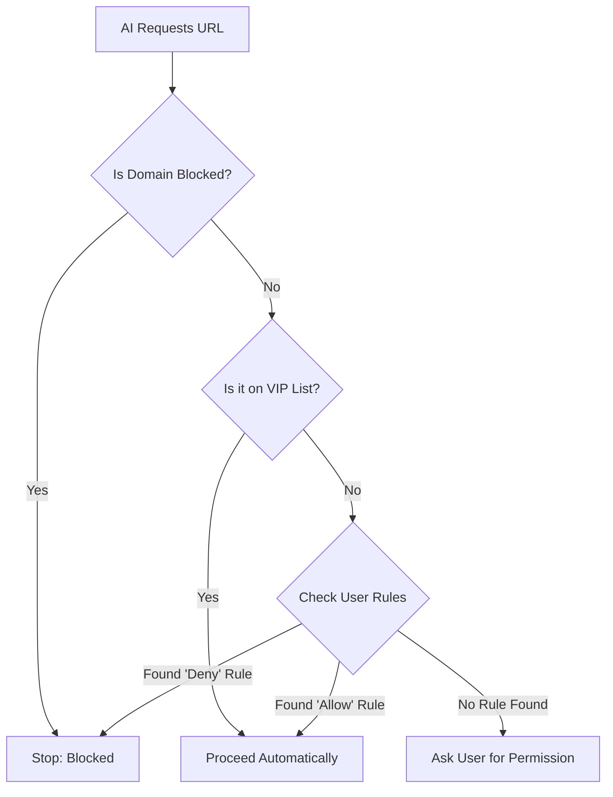

# Chapter 4: Security & Permission Guardrails

In the previous chapter, [AI Content Extraction](03_ai_content_extraction.md), we taught our tool how to read massive web pages and extract specific answers.

Now we have a powerful tool that can visit websites. **But this power creates a risk.**

What if the AI tries to visit your private home router? What if it tries to send your code to a malicious website? What if it tries to access a confidential company dashboard?

We need a **Security Guard**. In this chapter, we will build the "Border Control" system that decides which URLs are safe to visit.

## The Motivation: Border Control

Imagine the `WebFetchTool` is a traveler trying to enter a country (the Internet). Before the traveler can go anywhere, they must pass through a Border Control Agent.

The Agent checks three things:
1.  **The "No-Fly" List:** Is this destination dangerous or banned by the company?
2.  **The VIP List:** Is this a trusted destination (like official documentation) that doesn't need a visa?
3.  **The Visa Check:** Has the user explicitly given permission to visit this place?

If the answer is "No" to all of these, the Agent stops the traveler and calls the user: *"Hey, the AI wants to go to `example.com`. Is that okay?"*

## The Decision Flow

Before the `call` function (fetching the data) ever runs, the system runs a method called `checkPermissions`.

Here is the decision tree:



## Layer 1: The "No-Fly" List (Enterprise Blocking)

In corporate environments, security teams often block access to certain websites to prevent data leaks.

Inside our utility functions (`utils.ts`), we perform a "Preflight Check" before doing anything else.

```typescript
// utils.ts (Simplified)
const checkResult = await checkDomainBlocklist(hostname)

if (checkResult.status === 'blocked') {
  // Stop immediately if the enterprise blocklist says NO
  throw new DomainBlockedError(hostname)
}
```

This happens automatically in the background. It ensures that the tool respects the security policies of the organization where it is running.

## Layer 2: The VIP List (Preapproved Domains)

Developers constantly look up documentation. It would be very annoying if the tool asked for permission every time you wanted to read the Python docs or React tutorials.

To solve this, we have a **Preapproved List** (we will explore the contents of this list in [Preapproved Domain List](05_preapproved_domain_list.md)).

In the `checkPermissions` method, we check this list first:

```typescript
// WebFetchTool.ts
async checkPermissions(input, context) {
  const { url } = input as { url: string }
  const parsedUrl = new URL(url)

  // 1. Check the VIP List
  if (isPreapprovedHost(parsedUrl.hostname, parsedUrl.pathname)) {
    return {
      behavior: 'allow', // Go right ahead!
      decisionReason: { type: 'other', reason: 'Preapproved host' },
    }
  }
  // ... continue to next checks
}
```

If the URL is on the list (e.g., `docs.python.org`), the tool returns `allow` immediately. The user is never bothered.

## Layer 3: User Rules (The Visa)

If a domain isn't blocked, but it's not on the VIP list either (like a random blog post), we check the **User's Rules**.

The user might have previously said:
*   "Always allow `wikipedia.org`"
*   "Never allow `suspicious-site.com`"

We check these rules using the `permissionContext`.

### Checking for Deny Rules

First, we check if the user has explicitly banned this site.

```typescript
// WebFetchTool.ts -> checkPermissions
  const ruleContent = `domain:${parsedUrl.hostname}`
  
  // Check for 'deny' rules
  const denyRule = getRuleByContentsForTool(
    permissionContext, 
    WebFetchTool, 
    'deny'
  ).get(ruleContent)

  if (denyRule) {
    return { behavior: 'deny', message: 'Denied by rule' }
  }
```

### Checking for Allow Rules

Next, we check if the user has explicitly allowed this site in the past.

```typescript
  // Check for 'allow' rules
  const allowRule = getRuleByContentsForTool(
    permissionContext, 
    WebFetchTool, 
    'allow'
  ).get(ruleContent)

  if (allowRule) {
    return { behavior: 'allow' }
  }
```

## Layer 4: The "Ask" (Default Behavior)

If the URL is not VIP, not Denied, and not Allowed, the tool must pause and ask the user. This is the default "Safety First" behavior.

We return a result with `behavior: 'ask'`. Crucially, we also provide **Suggestions**. These are buttons the UI can show the user, like "Always Allow This Domain."

```typescript
// WebFetchTool.ts -> checkPermissions
  return {
    behavior: 'ask',
    message: `Claude wants to fetch ${url}. Allow?`,
    suggestions: [
      {
        type: 'addRules',
        rules: [{ toolName: 'WebFetch', ruleContent: `domain:${hostname}` }],
        behavior: 'allow', // If clicked, allow and save rule
      },
    ],
  }
```

## Internal Safety: Egress Blocking

There is one more hidden layer of security deep in the engine room. Even if the user says "Yes," the network environment might prevent the connection.

In `utils.ts`, we handle `EgressBlockedError`.

```typescript
// utils.ts
if (error.response?.headers['x-proxy-error'] === 'blocked-by-allowlist') {
  // The network proxy blocked us
  throw new EgressBlockedError(hostname)
}
```

This prevents the AI from bypassing network firewalls even if it tries to.

## Conclusion

In this chapter, we built a robust security system:

1.  **Blocklists:** Stop access to known bad or internal sites.
2.  **VIP List:** Allow frictionless access to safe documentation.
3.  **User Rules:** Respect the user's "Always Allow" or "Block" settings.
4.  **Ask User:** If unsure, always ask permission.

This system balances **Safety** (don't leak data) with **Usability** (don't annoy the user for safe sites).

We mentioned the "VIP List" several times. You might be wondering: *Which websites are actually on this list?*

In the next chapter, we will look at exactly how we define trusted domains and how we handle tricky cases like specific paths on GitHub.

[Next: Preapproved Domain List](05_preapproved_domain_list.md)

---

Generated by [Code IQ](https://github.com/adityasoni99/Code-IQ)