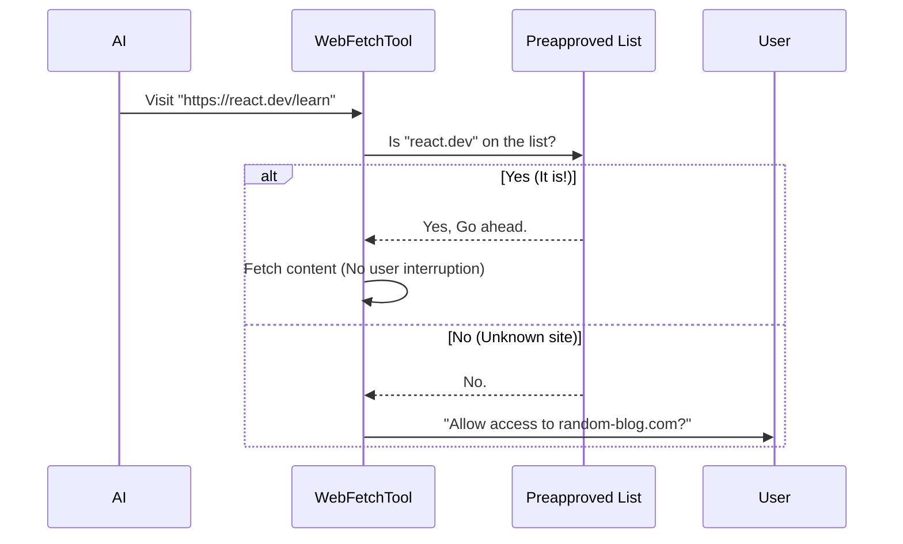

# Chapter 5: Preapproved Domain List

In the previous chapter, [Security & Permission Guardrails](04_security___permission_guardrails.md), we built a "Border Control" agent. This agent stops the AI from visiting any website unless the user says "Yes."

While this is safe, it can be annoying. Imagine if you had to show your passport every time you walked into your own kitchen!

**The Use Case:**
You are a developer asking the AI to help you write Python code. The AI needs to check the official Python documentation five times in one hour.
*   **Without this chapter:** You get 5 pop-ups asking for permission.
*   **With this chapter:** The AI accesses `docs.python.org` instantly, but still asks permission for unknown blogs.

## The Solution: The "Pre-Check" Lane

We solve this using a **Preapproved Domain List**.

Think of this like the "TSA Pre-Check" or "Global Entry" lane at an airport.
1.  **Regular Travelers (Unknown URLs):** Must stop, take off shoes, and answer questions (User Permission).
2.  **Trusted Travelers (Preapproved URLs):** Walk right through the metal detector without stopping.

## What goes on the List?

We don't let just *anyone* into the fast lane. The list in `preapproved.ts` is carefully curated. It consists almost entirely of **Documentation** and **Reference** sites.

Here is a snippet of what the list looks like in code:

```typescript
// preapproved.ts
export const PREAPPROVED_HOSTS = new Set([
  'docs.python.org',       // Python Documentation
  'react.dev',             // React Documentation
  'developer.mozilla.org', // MDN Web Docs
  'stackoverflow.com',     // Coding answers
  'npmjs.com',             // Node packages
  // ... many others
])
```

**Why these sites?**
*   **High Frequency:** They are used constantly for coding tasks.
*   **Low Risk:** They are public, static resources. They don't contain your private emails or company secrets.

## How the Check Works

When the `WebFetchTool` wants to visit a URL, it runs a quick check before bothering the user.



## Implementation Details

Let's look at how we implement this in `preapproved.ts`. We need a system that is **fast** (O(1) lookup) and handles **tricky paths**.

### 1. The Simple Hostname Check

For 99% of cases, we just want to match the domain name (like `google.com`).

We optimize this by splitting our list into two buckets. The first bucket is for simple domains.

```typescript
// preapproved.ts (Simplified logic)

// 1. Exact matches only
const HOSTNAME_ONLY = new Set([
  'react.dev',
  'docs.python.org',
  'en.cppreference.com'
])
```

When a request comes in, we check this set first.

### 2. The Tricky Case: Path-Based Rules

Sometimes, a domain is too big to trust completely.

Take **GitHub**.
*   `github.com/anthropics` (The makers of Claude) -> **Safe/Trusted**.
*   `github.com/random-hacker/malware` -> **Not Trusted**.

We cannot simply allow `github.com`. We need to allow specific *folders* (paths) on that domain.

```typescript
// preapproved.ts
// 2. Domains where we only trust specific sub-folders
const PATH_PREFIXES = new Map()

// We map "github.com" to specific allowed paths
PATH_PREFIXES.set('github.com', [
  '/anthropics', // Allow Anthropic's code
  '/microsoft'   // Allow Microsoft's code
])
```

### 3. The `isPreapprovedHost` Function

Now we combine these two checks into one main function. This is the function the `WebFetchTool` calls.

First, we check the simple list:

```typescript
export function isPreapprovedHost(hostname: string, pathname: string): boolean {
  // 1. Fast check: Is the exact hostname in our safe list?
  if (HOSTNAME_ONLY.has(hostname)) {
    return true
  }
  
  // ... continued below
```

If that fails, we check if the domain has specific path rules:

```typescript
  // 2. Check if this host has specific path restrictions
  const prefixes = PATH_PREFIXES.get(hostname)
  
  if (prefixes) {
    for (const p of prefixes) {
      // Check if the URL starts with the allowed path
      if (pathname === p || pathname.startsWith(p + '/')) {
        return true
      }
    }
  }
  
  return false
}
```

**Beginner Explanation:**
1.  **Input:** `hostname` ("github.com") and `pathname` ("/anthropics/project").
2.  **Logic:** The code sees that "github.com" has special rules. It checks if `/anthropics/project` starts with `/anthropics`.
3.  **Result:** `true` (Allowed).

## Security Warning: Why only GET?

You might wonder: *"If we trust these domains, why can't the AI do anything it wants there?"*

We only allow **Fetching** (reading). We do not inherently allow sending data.

Some trusted domains, like `kaggle.com` or `huggingface.co`, allow users to upload files. If we gave the AI unrestricted access, a bad actor could trick the AI into:
1.  Reading your private file.
2.  "Posting" (uploading) that file to a public Kaggle notebook.

By restricting the `WebFetchTool` to simple **GET** requests (downloading only) and using this list, we prevent data exfiltration.

## Integration with the Tool

Back in [Security & Permission Guardrails](04_security___permission_guardrails.md), we saw `checkPermissions`. Now we understand exactly what happens in that first few lines of code:

```typescript
// WebFetchTool.ts
async checkPermissions(input, context) {
  const { url } = input
  const parsedUrl = new URL(url)

  // This calls the function we just wrote!
  if (isPreapprovedHost(parsedUrl.hostname, parsedUrl.pathname)) {
    return {
      behavior: 'allow', // Instant access!
      decisionReason: { type: 'other', reason: 'Preapproved host' },
    }
  }
  
  // ... otherwise ask user
}
```

## Conclusion

In this chapter, we improved the user experience significantly by creating a "Fast Lane" for trusted documentation sites.

1.  We defined a **Set** of safe domains.
2.  We handled simple domains (`react.dev`) and complex paths (`github.com/anthropics`).
3.  We integrated this check into our permission system.

Now the AI can browse documentation as fast as it can "think," without bothering you.

But what if the AI needs to check the *same* documentation page twice in one minute? Downloading the page again is slow and wasteful.

In the next chapter, we will give the tool a "Short-Term Memory" so it remembers what it just read.

[Next: Response Caching](06_response_caching.md)

---

Generated by [Code IQ](https://github.com/adityasoni99/Code-IQ)