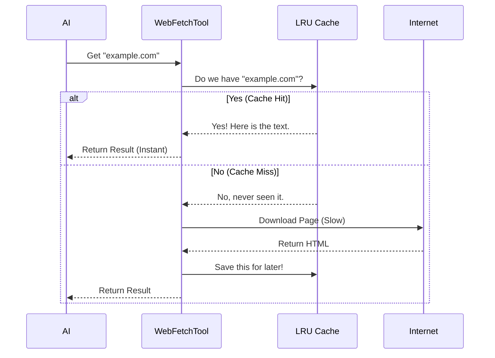

# Chapter 6: Response Caching

In the previous chapter, [Preapproved Domain List](05_preapproved_domain_list.md), we sped up our tool by creating a "Fast Lane" for trusted websites. This removed the need to ask the user for permission every single time.

However, we still have a speed limit: **The Network**.

Even if we have permission, downloading a large webpage takes time. If the AI is trying to analyze a documentation page and asks three questions about it in a row, it would normally have to download that page three times.

In this chapter, we will implement **Response Caching**. This gives our tool a "Short-Term Memory," allowing it to remember pages it just visited.

## The Motivation: The "Sticky Note" Analogy

Imagine you need to call a plumber.
1.  **First time:** You go to the phone book, search for "Plumber," find the number, and dial it. This takes 2 minutes.
2.  **Second time (10 minutes later):** If you didn't write it down, you have to go back to the phone book and search again. This is a waste of time!

**The Efficient Way:**
When you look up the number the first time, you write it on a **Sticky Note** and put it on your monitor.
Now, if you need the number again 10 minutes later, you just look at the note. It takes 1 second.

**In WebFetchTool:**
*   **The Phone Book:** The Internet (Slow).
*   **The Sticky Note:** The Cache (Instant).
*   **The Trash Can:** After 15 minutes, we throw the sticky note away to ensure we don't use old, outdated numbers.

## Key Concept: LRU Cache

We don't want to remember *every* website forever, or we would run out of RAM (memory). We use a data structure called an **LRU Cache**.

*   **L**east
*   **R**ecently
*   **U**sed

Think of it like a desk with limited space. You keep piling documents on it. When the desk is full and you need to add a new document, you throw away the one you haven't looked at in the longest time.

## Setting Up the Cache

We use a library called `lru-cache`. In our `utils.ts` file, we configure the "desk space" for our tool.

We define two rules:
1.  **Time To Live (TTL):** How long does a note last? (15 minutes).
2.  **Max Size:** How much data can we hold? (50 Megabytes).

```typescript
// utils.ts
import { LRUCache } from 'lru-cache'

// Rule 1: Memories fade after 15 minutes
const CACHE_TTL_MS = 15 * 60 * 1000 

// Rule 2: We can store up to 50MB of text
const MAX_CACHE_SIZE_BYTES = 50 * 1024 * 1024 

const URL_CACHE = new LRUCache<string, CacheEntry>({
  maxSize: MAX_CACHE_SIZE_BYTES,
  ttl: CACHE_TTL_MS,
})
```

**Explanation:**
*   `CACHE_TTL_MS`: If we fetched a page 16 minutes ago, the cache deletes it. If we ask for it again, we must fetch it fresh from the web.
*   `URL_CACHE`: This is our storage box. Keys are URLs (like "google.com"), and values are the page content.

## How the Cache Works: The Flow

When `getURLMarkdownContent` is called, we don't run to the internet immediately. We check our pockets (the cache) first.



## Step 1: Checking the Cache

Inside our main fetching function, the very first logic block checks the cache.

```typescript
// utils.ts -> getURLMarkdownContent

export async function getURLMarkdownContent(url, abortController) {
  // 1. Check if we have the page in memory
  const cachedEntry = URL_CACHE.get(url)

  // 2. If found, return it immediately!
  if (cachedEntry) {
    return {
      content: cachedEntry.content, // The markdown text
      code: cachedEntry.code,       // e.g. 200 OK
      // ... copy other properties
    }
  }
  
  // ... If not found, continue to fetch from network
}
```

**Why this matters:**
This check happens in milliseconds. If the data is there, we skip the security checks, the network request, and the HTML-to-Markdown conversion. It is wildly efficient.

## Step 2: Saving to the Cache

If the page wasn't in the cache, we proceed to download it (as learned in [Content Fetching & Conversion](02_content_fetching___conversion.md)).

Once we have done the hard work of downloading and converting HTML to Markdown, we save the result before returning it.

```typescript
// utils.ts -> end of getURLMarkdownContent

  // ... (Network fetch and conversion happened above)

  // Create the entry to save
  const entry: CacheEntry = {
    bytes: rawBuffer.length,
    code: response.status,
    content: markdownContent, // The clean text
    contentType,
  }

  // Save it! 
  // We tell the cache how big this is so it respects the 50MB limit
  URL_CACHE.set(url, entry, { size: contentBytes })

  return entry
}
```

Now, the *next* time this function is called with this `url`, Step 1 will succeed!

## Bonus: Domain Check Caching

We also cache something else: **Permission Checks**.

In [Security & Permission Guardrails](04_security___permission_guardrails.md), we discussed checking if a domain is blocked by enterprise rules. This involves asking an external API ("Is `evil.com` safe?").

We don't want to spam that API either.

```typescript
// utils.ts
const DOMAIN_CHECK_CACHE = new LRUCache<string, true>({
  max: 128,              // Remember last 128 domains
  ttl: 5 * 60 * 1000,    // Remember for 5 minutes
})

export async function checkDomainBlocklist(domain) {
  // If we checked this recently, assume the answer hasn't changed
  if (DOMAIN_CHECK_CACHE.has(domain)) {
    return { status: 'allowed' }
  }
  
  // ... otherwise perform the API check
}
```

This creates a dual-layer caching strategy:
1.  **URL Cache:** Remembers the *content* of a specific page.
2.  **Domain Cache:** Remembers if a *website* is allowed to be visited.

## Conclusion

By adding a few lines of code to initialize an `LRUCache`, we have dramatically improved the user experience.
1.  **Speed:** Repeated requests are instant.
2.  **Cost:** We save bandwidth and API calls.
3.  **Stability:** If the website goes down 1 minute later, we still have the copy in memory.

We have built a fast, safe, and intelligent tool. But there is one final piece of the puzzle. When the tool is working—fetching, checking permissions, or reading from cache—how does the user know what's going on?

In the final chapter, we will look at the visual elements that communicate status to the user.

[Next: UI Feedback Components](07_ui_feedback_components.md)

---

Generated by [Code IQ](https://github.com/adityasoni99/Code-IQ)