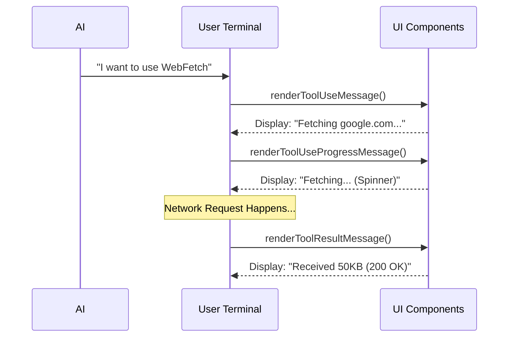

# Chapter 7: UI Feedback Components

In the previous chapter, [Response Caching](06_response_caching.md), we gave our tool a "memory" to make it faster and more efficient.

At this point, we have a fully functional engine. It can fetch pages, extract data, check permissions, and cache results. **But there is one problem: It is invisible.**

When the AI decides to use the tool, the user (you) sees a blank screen for a few seconds while the network request happens. You might wonder: *"Is it working? Did it freeze?"*

In this final chapter, we will build the **Dashboard** for our car. We will create **UI Feedback Components** that tell the user exactly what is happening in the terminal.

## The Motivation: The Dashboard Analogy

Imagine driving a car that has no dashboard. You don't know how fast you are going, how much fuel you have, or if the engine is overheating.

The `WebFetchTool` needs a dashboard too. We need to display three specific states to the user:

1.  **Intent:** "I am about to visit `google.com`."
2.  **Progress:** "I am currently downloading data..." (The "Loading" spinner).
3.  **Result:** "I finished! I downloaded 50KB of text."

We build these using **React** components designed for the command line (using a library called `ink`).

## The Concept: The UI Lifecycle

Every tool usage goes through a specific lifecycle. We need a React component for each stage.



Let's look at the file `UI.tsx` to see how we implement these.

## Component 1: The Input Message (Intent)

When the tool starts, we want to show the user what parameters the AI chose.

We use `renderToolUseMessage`. This function receives the `url` and `prompt` the AI wants to use.

```typescript
// UI.tsx
export function renderToolUseMessage(input) {
  // If there's no URL, show nothing
  if (!input.url) return null;

  // Simple display: just show the URL
  return `url: "${input.url}"`;
}
```

**Explanation:**
This is the equivalent of the turn signal in a car. It tells the user: "I am turning left (visiting this URL) now."

## Component 2: The Progress Indicator (The Spinner)

Network requests take time. We need to reassure the user that the tool hasn't crashed.

We use `renderToolUseProgressMessage`. This is displayed *while* the `call` function is running.

```typescript
// UI.tsx
import { Text } from '../../ink.js'; // Helper for terminal text

export function renderToolUseProgressMessage() {
  // Show a dimmed text message
  // The system automatically adds a spinner animation next to this
  return (
    <Text dimColor>Fetching…</Text>
  );
}
```

**Explanation:**
*   **`<Text>`**: This is like a `<span>` or `<div>` in HTML, but for the terminal.
*   **`dimColor`**: Makes the text grey so it's not distracting.

## Component 3: The Result Summary (The Report)

This is the most important part. When the tool finishes, we have a huge string of Markdown content (potentially 100,000 characters).

**We should NOT dump the entire webpage content into the terminal.** It would spam the user's screen.

Instead, we show a **Summary**: the file size and the status code.

```typescript
// UI.tsx
import { formatFileSize } from '../../utils/format.js';

export function renderToolResultMessage(output) {
  // Convert bytes (e.g., 50000) to readable text (e.g., "50 KB")
  const formattedSize = formatFileSize(output.bytes);

  return (
    <Text>
      Received <Text bold>{formattedSize}</Text> ({output.code} {output.codeText})
    </Text>
  );
}
```

**Example Output:**
`Received 50 KB (200 OK)`

**Explanation:**
It acts like a receipt. It confirms the transaction was successful without forcing you to read the entire product manual right there at the checkout counter.

## Formatting Helpers

To make the UI look professional, we use a few helper functions.

### Truncating Long URLs
If the AI visits a URL with 500 characters, it will look messy. We use `getToolUseSummary` to create a short version for the history logs.

```typescript
// UI.tsx
export function getToolUseSummary(input) {
  if (!input?.url) return null;
  
  // Cut off the string if it's too long
  return truncate(input.url, TOOL_SUMMARY_MAX_LENGTH);
}
```

## Integrating UI with the Tool

Now that we have written our components in `UI.tsx`, we need to tell the `WebFetchTool` to use them.

We do this in the `WebFetchTool.ts` definition file.

```typescript
// WebFetchTool.ts
import { 
  renderToolUseMessage, 
  renderToolUseProgressMessage, 
  renderToolResultMessage 
} from './UI.js'

export const WebFetchTool = buildTool({
  name: 'web_fetch',
  
  // Connect the UI components here:
  renderToolUseMessage,
  renderToolUseProgressMessage,
  renderToolResultMessage,
  
  // ... rest of the tool definition
})
```

By simply passing these functions to `buildTool`, the system handles everything else. It knows exactly when to mount the Progress component and when to switch to the Result component.

## Project Conclusion

Congratulations! You have successfully walked through the creation of the **WebFetchTool**.

Let's recap the journey:

1.  **[WebFetchTool Definition](01_webfetchtool_definition.md):** We defined the inputs (URL) and outputs (Content) using Zod schemas.
2.  **[Content Fetching & Conversion](02_content_fetching___conversion.md):** We built the engine to download HTML and convert it to Markdown.
3.  **[AI Content Extraction](03_ai_content_extraction.md):** We added a "smart filter" using a secondary AI model to extract specific answers from large pages.
4.  **[Security & Permission Guardrails](04_security___permission_guardrails.md):** We added a Border Control agent to prevent the AI from visiting dangerous or private sites.
5.  **[Preapproved Domain List](05_preapproved_domain_list.md):** We created a "Fast Lane" for trusted documentation sites.
6.  **[Response Caching](06_response_caching.md):** We gave the tool a short-term memory to speed up repeated requests.
7.  **[UI Feedback Components](07_ui_feedback_components.md):** We built a dashboard so the user can see what is happening in real-time.

You now have a robust, secure, and user-friendly tool that gives your AI "eyes" to browse the web. Happy coding!

---

Generated by [Code IQ](https://github.com/adityasoni99/Code-IQ)