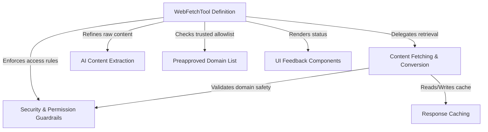

# Tutorial: WebFetchTool

The **WebFetchTool** acts as a secure "smart browser" that enables an AI to fetch and read content from the internet. Instead of just dumping raw code, it converts webpages into clean **Markdown** and uses a secondary, specialized AI model to *extract exactly what the user asked for*. The system includes strict security guardrails to block private or dangerous sites and uses an internal cache to speed up repeated requests.

## Chapters

1. [WebFetchTool Definition](01_webfetchtool_definition.md)
2. [Content Fetching & Conversion](02_content_fetching___conversion.md)
3. [AI Content Extraction](03_ai_content_extraction.md)
4. [Security & Permission Guardrails](04_security___permission_guardrails.md)
5. [Preapproved Domain List](05_preapproved_domain_list.md)
6. [Response Caching](06_response_caching.md)
7. [UI Feedback Components](07_ui_feedback_components.md)

---

Generated by [Code IQ](https://github.com/adityasoni99/Code-IQ)