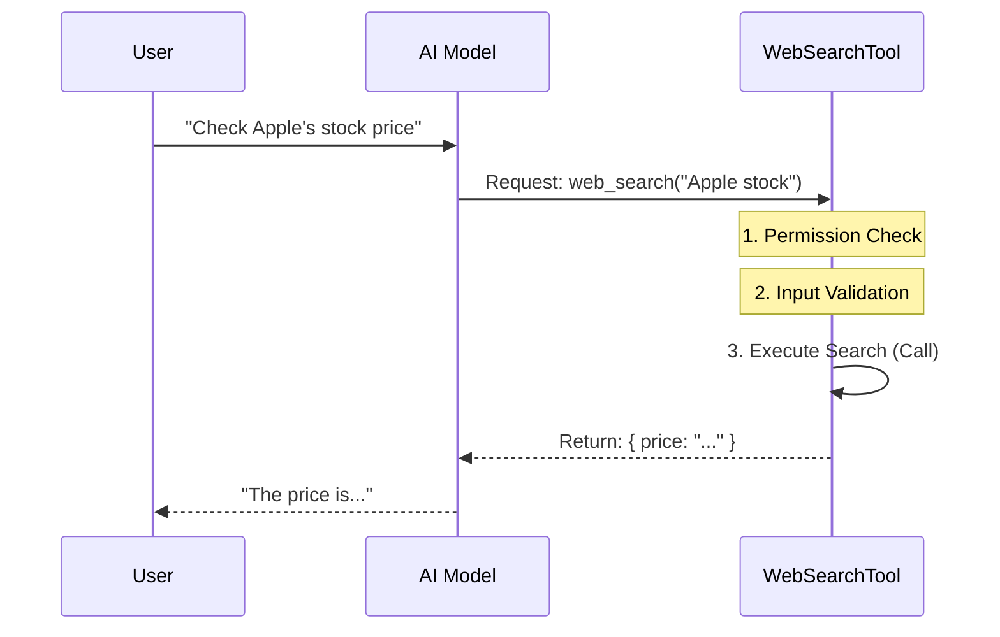

# Chapter 1: Tool Definition & Lifecycle

Welcome to the **WebSearchTool** project! In this tutorial series, we are going to build a bridge that allows an AI (like Claude) to access the internet.

Imagine you have a brilliant assistant who is locked in a library with books from 2023. If you ask, "What is the stock price of Apple right now?", they can't answer. They need a phone to check the internet.

In this project, we are building that "phone." We call it the **WebSearchTool**.

## The Concept: The "Job Description"

In our code, a "Tool" is essentially a specialized contractor we hire to help the AI. For the AI to use this contractor effectively, we need a clear **Job Description**.

The **Tool Definition** tells the AI:
1.  **Who** the tool is (Name).
2.  **What** the tool does (Description).
3.  **When** the tool is allowed to work (Permissions).
4.  **How** the tool performs the task (The Lifecycle).

## The Tool Lifecycle

Before looking at code, let's look at the "Lifecycle"—the step-by-step process that happens every time the AI wants to search the web.

1.  **Definition**: The app loads the tool's "Job Description."
2.  **Permission Check**: The app asks, "Is this user allowed to use Web Search?"
3.  **Validation**: The AI sends a query (e.g., "Apple stock price"). The tool checks, "Is this a valid query?"
4.  **Execution (`call`)**: The tool actually goes out to the internet and fetches data.

Here is how the User, the AI, and our Tool interact:



## Implementation Walkthrough

Let's look at how we build this in TypeScript. We use a helper function called `buildTool`. This function wraps up all our logic into a neat package the system can understand.

### 1. Defining Identity
First, we give the tool a name and a description. This is how the AI recognizes it.

```typescript
import { buildTool } from '../../Tool.js'
import { WEB_SEARCH_TOOL_NAME } from './prompt.js'

export const WebSearchTool = buildTool({
  name: WEB_SEARCH_TOOL_NAME, // Usually 'web_search'
  
  userFacingName() {
    return 'Web Search' // What the human sees in the UI
  },

  async description(input) {
    // This tells the AI what is happening
    return `Claude wants to search the web for: ${input.query}`
  },
// ... continued below
```

**Explanation:**
*   `name`: The internal ID used by the code.
*   `userFacingName`: A pretty name shown to the user in the interface.
*   `description`: A dynamic description of what the tool is currently doing.

### 2. Defining Structure (Schemas)
The tool needs to know exactly what inputs it requires (like a search query) and what output it produces. We define these using "Schemas".

*Note: We will dive deep into the specific code for this in [Chapter 2: Data Contract (Schemas)](02_data_contract__schemas_.md).*

```typescript
  // ... inside buildTool
  get inputSchema(): InputSchema {
    return inputSchema() // Defines that we need a "query" string
  },
  get outputSchema(): OutputSchema {
    return outputSchema() // Defines that we return a list of results
  },
```

**Explanation:**
This acts like a contract. The tool promises: "If you give me data matching `inputSchema`, I will give you back data matching `outputSchema`."

### 3. Safety and Validation
Before we let the tool run, we must ensure the request is valid. We don't want to search for empty strings or prohibited domains.

```typescript
  async validateInput(input) {
    const { query, allowed_domains, blocked_domains } = input
    
    // Rule: We need a query to search!
    if (!query.length) {
      return {
        result: false,
        message: 'Error: Missing query',
        errorCode: 1,
      }
    }
    // ... (more validation logic)
    return { result: true }
  },
```

**Explanation:**
`validateInput` is the bouncer at the door. It checks the input *before* any expensive or dangerous code runs. If this returns `false`, the tool execution stops immediately.

### 4. The Execution Logic (`call`)
This is the heart of the tool. The `call` method is where the actual work happens.

*Note: The actual searching logic involves streaming and prompting, which are covered in [Chapter 3: Prompt Engineering Context](03_prompt_engineering_context.md) and [Chapter 4: Streaming Execution Strategy](04_streaming_execution_strategy.md).*

Here is a simplified view of the `call` method:

```typescript
  async call(input, context, _canUseTool, _parentMessage, onProgress) {
    const startTime = performance.now()
    const { query } = input
    
    // 1. Create a message to send to the search subsystem
    const userMessage = createUserMessage({
      content: 'Perform a web search for the query: ' + query,
    })

    // 2. Run the search (Simplified for this chapter)
    // This connects to the internet and gets results
    const data = await performSearchLogic(userMessage, context, onProgress)

    // 3. Return the package
    return { data }
  },
```

**Explanation:**
1.  **Input:** Takes the validated `query`.
2.  **Process:** Uses an internal helper (abstracted here as `performSearchLogic`) to actually browse the web.
3.  **Output:** Returns the data wrapped in an object.

### 5. Permissions (`isEnabled`)
Finally, we need to decide if the tool should even appear as an option.

```typescript
  isEnabled() {
    const provider = getAPIProvider() // e.g., 'firstParty', 'vertex'
    
    // Example: Only enable for certain providers
    if (provider === 'firstParty') {
      return true
    }
    
    // Disable for others unless specific conditions are met
    return false
  },
```

**Explanation:**
The `isEnabled` function runs very early. If it returns `false`, the AI won't even know this tool exists. This is useful for feature flagging or restricting expensive tools to premium users.

## Conclusion

You have now defined the "Contractor." You've given it a name, a description, rules for validation, and a method to execute the job.

However, simply defining the tool isn't enough. The AI needs to know exactly **how to format the data** it sends to the tool, and exactly **how to read the data** the tool sends back.

In the next chapter, we will look at how we enforce these rules strictly.

[Next Chapter: Data Contract (Schemas)](02_data_contract__schemas_.md)

---

Generated by [Code IQ](https://github.com/adityasoni99/Code-IQ)