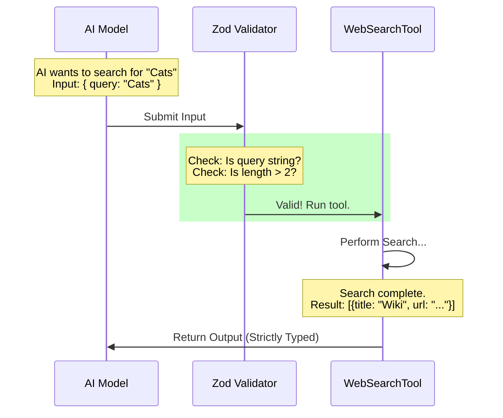

# Chapter 2: Data Contract (Schemas)

In [Chapter 1: Tool Definition & Lifecycle](01_tool_definition___lifecycle.md), we introduced the **WebSearchTool** as a specialized "contractor" we hire to browse the web for the AI. We defined its name and general job description.

But how do we ensure this contractor understands exactly what we want? And how do we ensure they return the results in a format we can actually use?

This brings us to **Data Contracts (Schemas)**.

## The Motivation: Preventing Chaos

Imagine you send your assistant to the store with a note that just says "Food." They might come back with a bag of flour, or a single grape, or nothing at all. To get what you want, you need a specific form: "I need a list of items, where each item has a name and a quantity."

In software, if we don't strictly define the shape of data, chaos ensues:
1.  The AI might try to search using a number instead of text.
2.  The Tool might return a messy HTML blob instead of a clean list of links.
3.  The system crashes because a required field is missing.

To solve this, we use **Schemas**.

### The "Customs Declaration" Analogy

Think of a Schema as a **Customs Declaration Form** at an airport.

*   **Inbound (Input Schema):** Before the AI's request can enter the tool, it must pass inspection. "Do you have a query? Is it a string of text? Is it long enough?" If not, the request is rejected immediately.
*   **Outbound (Output Schema):** Before the results leave the tool to go back to the AI, they are packaged perfectly. "Is this a list of titles and URLs?"

We use a library called **Zod** to build these strict forms.

---

## 1. The Input Schema: What enters?

The **Input Schema** defines the arguments the AI must provide to run the tool.

### The Basic Requirement
At a minimum, to search the web, we need a **query**.

```typescript
import { z } from 'zod/v4'

// Define the shape of the input
const simpleInput = z.object({
  // We strictly require a string that is at least 2 characters long
  query: z.string().min(2).describe('The search query to use'),
})
```

**Explanation:**
*   `z.object`: Expect a JSON object `{ ... }`.
*   `query`: The name of the field.
*   `z.string()`: The value *must* be text.
*   `.min(2)`: The text *must* be at least 2 characters. searching for "a" is useless.
*   `.describe(...)`: This text is actually sent to the AI! It helps the AI understand what to put here.

### Adding Optional Filters
The `WebSearchTool` also supports advanced filtering, like telling Google to only search specific websites.

```typescript
const fullInputSchema = z.object({
  query: z.string().min(2),
  
  // Optional: A list of specific websites to allow
  allowed_domains: z.array(z.string()).optional(),
  
  // Optional: A list of websites to block
  blocked_domains: z.array(z.string()).optional(),
})
```

**Explanation:**
*   `z.array(z.string())`: This expects a list of text strings, e.g., `["wikipedia.org", "github.com"]`.
*   `.optional()`: The AI *can* provide this, but it doesn't have to.

---

## 2. The Output Schema: What leaves?

Once the tool has done its job (which we will cover in [Chapter 4: Streaming Execution Strategy](04_streaming_execution_strategy.md)), it needs to return data. We don't want to return a mess; we want a structured report.

### Defining a Single Search Hit
First, we define what a single "search result" looks like.

```typescript
// A single item in the search list
const searchHitSchema = z.object({
  title: z.string().describe('The title of the search result'),
  url: z.string().describe('The URL of the search result'),
})
```

**Explanation:**
Every search hit is guaranteed to have a `title` and a `url`. This makes it easy for the UI to render them as clickable links later (see [Chapter 6: Interface Rendering (UI)](06_interface_rendering__ui_.md)).

### The Full Output Package
Now we wrap those hits into the final package.

```typescript
const outputSchema = z.object({
  query: z.string(), // Echo back the query we ran
  
  // A list of the search hits we defined above
  results: z.array(searchHitSchema),
  
  durationSeconds: z.number(), // How long did it take?
})
```

**Explanation:**
This is the "Contract" for the output. The tool promises to return an object containing the original `query`, an array of `results`, and the `durationSeconds`.

---

## 3. How It Works (Internal Implementation)

How does the system enforce these rules? Let's look at the flow when the AI tries to use the tool.

### The Flow of Data



If the AI sends bad data (e.g., an empty query), the **Guard** (Zod) blocks it before the Tool ever runs, preventing errors.

### The Implementation Details

In the actual `WebSearchTool.ts` file, we wrap these schemas in a helper called `lazySchema`. This is a small performance trick to ensure we don't load these definitions until we actually need them.

#### Step 1: Defining the Types
We use a powerful TypeScript feature called `z.infer`. This reads our Zod definition and automatically creates a TypeScript type for us. This means we don't have to write the type definition twice!

```typescript
// In WebSearchTool.ts

// 1. Define the Schema
const inputSchema = lazySchema(() => z.strictObject({
    query: z.string().min(2),
    // ... domains ...
}))

// 2. Automatically generate the TypeScript type
type Input = z.infer<ReturnType<typeof inputSchema>>
// Input is now: { query: string; allowed_domains?: string[] ... }
```

#### Step 2: Attaching to the Tool
In the `buildTool` function we saw in Chapter 1, we attach these schemas as "getters".

```typescript
export const WebSearchTool = buildTool({
  name: WEB_SEARCH_TOOL_NAME,
  
  // ... (name, description, etc)

  get inputSchema() {
    return inputSchema() // Return the Zod object
  },
  
  get outputSchema() {
    return outputSchema() // Return the Zod object
  },
```

**Explanation:**
By attaching these schemas to the tool definition, the system can automatically generate documentation for the AI. When the AI asks, "How do I use `web_search`?", the system reads `inputSchema` and replies: "You must send a JSON object with a `query` string."

## Conclusion

We have now successfully created the **Data Contract**.

1.  We used **Input Schemas** to ensure the AI asks valid questions.
2.  We used **Output Schemas** to ensure we return clean, structured answers (Titles and URLs).
3.  We used **Zod** to enforce these rules automatically.

Now that we have a defined tool and a strict data contract, we need to teach the AI *how* and *why* to use it. The schemas tell the AI the "syntax," but they don't explain the strategy.

In the next chapter, we will look at how we construct the prompt that gives the AI the context it needs to search effectively.

[Next Chapter: Prompt Engineering Context](03_prompt_engineering_context.md)

---

Generated by [Code IQ](https://github.com/adityasoni99/Code-IQ)