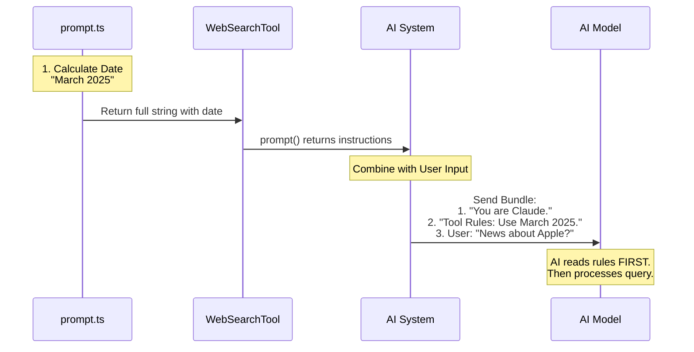

# Chapter 3: Prompt Engineering Context

Welcome back! In [Chapter 2: Data Contract (Schemas)](02_data_contract__schemas_.md), we built strict "Customs Declaration Forms" (Schemas) so our AI knows *syntax*: what data format to send and receive.

But knowing **syntax** isn't the same as knowing **strategy**.

Imagine you hire a brilliant research assistant, but they have been living in a cave since 2021. You ask them: "Find the latest iPhone reviews."
1.  They might search for "iPhone 13" because they don't know it's 2024.
2.  They might give you a summary but forget to tell you *which* website they got it from.

To fix this, we need to give the AI a **Mission Briefing** before it starts working. In the world of AI, this is called **Prompt Engineering Context**.

## The Motivation: The "Rules of Engagement"

This abstraction solves three specific problems that code schemas cannot solve:

1.  **Time Awareness:** The AI doesn't inherently know "today." We must tell it.
2.  **Attribution:** We need to force the AI to cite its sources (e.g., "According to [CNN](...)").
3.  **Behavioral Constraints:** We need to tell it *when* to use the tool (e.g., "Only for current events").

Think of the **Prompt Engineering Context** as the set of standing orders given to a soldier. It tells them not just *how* to fire the weapon (Schema), but *when* to fire and *what rules* to follow.

---

## 1. Injecting Time (The "Now" Problem)

AI models are trained on static data. If you ask an AI "What is the current year?", it might hallucinate or give you its training cutoff date.

To use a Web Search tool effectively, the AI needs to know the current date so it can search for "Best Laptops 2025" instead of just "Best Laptops."

### The Implementation
We handle this in a file called `prompt.ts`. We use a helper function to get the real-world date and inject it directly into the instructions.

```typescript
// prompt.ts
import { getLocalMonthYear } from 'src/constants/common.js'

export function getWebSearchPrompt(): string {
  // 1. Get the real time from the system
  const currentMonthYear = getLocalMonthYear() 
  
  // 2. Inject it into the text
  return `... The current month is ${currentMonthYear} ...`
}
```

**Explanation:**
By using the `${currentMonthYear}` variable, we dynamically update the instructions every time the tool is used. The AI reads this and thinks: "Ah, I am operating in March 2025. I should adjust my search queries accordingly."

---

## 2. Enforcing Citations (The "Show Your Work" Problem)

If an AI browses the web and just gives you an answer, you have no way of verifying it. We want the AI to act like a journalist: act on facts and link to sources.

We don't leave this to chance. We write a **Critical Requirement** in the prompt.

```typescript
// prompt.ts
/* ... inside the string return ... */
`
CRITICAL REQUIREMENT - You MUST follow this:
  - After answering, you MUST include a "Sources:" section
  - List all relevant URLs as markdown hyperlinks
  - Example format:
    [Your answer here]
    
    Sources:
    - [Title](https://example.com/1)
`
```

**Explanation:**
We use capitalization ("CRITICAL REQUIREMENT", "MUST") to stress importance. LLMs (Large Language Models) pay closer attention to these "system instructions" than to normal user chat. This ensures the output is verifiable.

---

## 3. Connecting the Prompt to the Tool

Now that we have written the "Mission Briefing," how does the `WebSearchTool` actually use it?

Recall the `buildTool` function from [Chapter 1: Tool Definition & Lifecycle](01_tool_definition___lifecycle.md). There is a specific property called `prompt`.

```typescript
// WebSearchTool.ts
import { getWebSearchPrompt } from './prompt.js'

export const WebSearchTool = buildTool({
  name: 'web_search',
  
  // ... other properties ...

  // The tool provides its own instructions
  async prompt() {
    return getWebSearchPrompt()
  },
})
```

**Explanation:**
When the AI system starts up, it asks every tool: "Do you have any special instructions for the model?" The `WebSearchTool` responds by running `getWebSearchPrompt()`, generating the text with the current date, and handing it over.

---

## Visualizing the Flow

Here is how this context gets from our code into the "brain" of the AI.



---

## The Complete "Mission Briefing"

Here is what the final generated prompt looks like. This is exactly what the AI reads before it processes your request.

> **System Instruction:**
> *   Allows Claude to search the web...
> *   **IMPORTANT - Use the correct year:** The current month is **March 2025**. You MUST use this year when searching for recent information.
> *   **CRITICAL REQUIREMENT:** You MUST include a "Sources:" section at the end of your response...

By combining the **Structure** (Chapter 2) with this **Context** (Chapter 3), the AI is now fully equipped.
1.  It knows **how** to format the data (JSON).
2.  It knows **what** creates a valid query (Schemas).
3.  It knows **when** (the date) and **why** (to cite sources) it is doing the job.

## Conclusion

We have successfully briefed our "AI Contractor." It knows the date, it knows to cite its sources, and it knows the shape of the data to send.

But we haven't actually *sent* the AI to the internet yet. We have just prepared it.

In the next chapter, we will tackle the most complex part of the system: **Execution**. We will look at how the tool actually connects to the browser, streams data, and handles the back-and-forth conversation with the web.

[Next Chapter: Streaming Execution Strategy](04_streaming_execution_strategy.md)

---

Generated by [Code IQ](https://github.com/adityasoni99/Code-IQ)