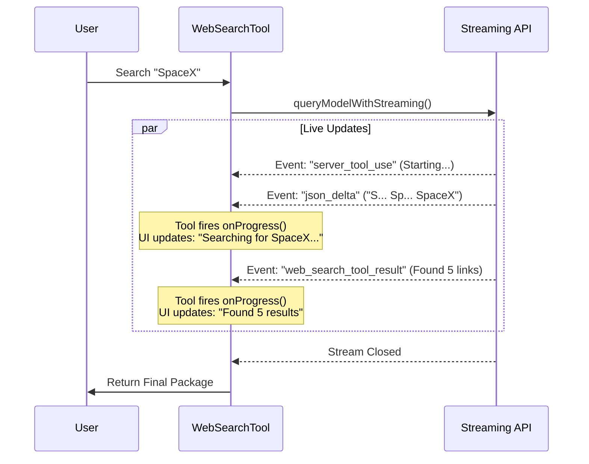

# Chapter 4: Streaming Execution Strategy

In [Chapter 3: Prompt Engineering Context](03_prompt_engineering_context.md), we gave our AI a "Mission Briefing" (the current date and rules for citation). Now, it is time to send it out into the field to actually perform the work.

In a standard web application, you send a request and wait... and wait... until the server is completely finished. But searching the web takes time. If we just waited, the user would stare at a frozen screen for 10 seconds.

We need a better approach. We need **Streaming**.

## The Concept: The Live Sports Commentator

Think of a standard API request like reading a newspaper. You only find out the score of the game the next morning, long after it happened.

**Streaming Execution** is like a **Live Sports Commentator**.
1.  **Play-by-play:** "The AI is thinking..."
2.  **Event:** "The AI has decided to search for 'Apple Stock'!"
3.  **Update:** "Found 5 results!"
4.  **Recap:** "Here is the summary."

Instead of waiting for the final report, our tool listens to every "play" as it happens and updates the user interface instantly.

---

## 1. The Setup: Starting the Stream

The logic for this lives inside the `call` method of our tool (which we introduced in Chapter 1).

Instead of calling a function that returns a value, we call a function that returns a **Stream**.

```typescript
// Inside WebSearchTool.ts -> call()

// 1. Create the message for the AI
const userMessage = createUserMessage({
  content: 'Perform a web search for the query: ' + input.query,
})

// 2. Start the stream!
const queryStream = queryModelWithStreaming({
  messages: [userMessage],
  // ... configuration options (models, permissions, etc)
})
```

**Explanation:**
*   `createUserMessage`: We package the user's query into a format the AI understands.
*   `queryModelWithStreaming`: This is our special function. It opens a live connection to the AI model. It doesn't return data yet; it returns a connection we can listen to.

---

## 2. The Event Loop: Listening for "Plays"

Now that the stream is open, we need to sit and watch what comes through. We use a JavaScript structure called a `for await` loop. This loop pauses and waits for each new piece of data to arrive.

### The Basic Loop Structure
```typescript
const allContentBlocks = [] // We will store everything here

// Loop through every event as it arrives from the server
for await (const event of queryStream) {
  
  // Logic to handle different events goes here...
  
}
```

**Explanation:**
This loop runs continuously until the AI is finished. Every time the AI "speaks" or "does something," the `event` variable updates.

---

## 3. Key Events: What are we watching for?

In our "Sports Commentator" analogy, there are a few specific events we care about most.

### Event A: The "Decision" (`server_tool_use`)
This happens when the AI decides, "I need to run a search." It hasn't searched yet; it's just announcing its intent.

```typescript
if (event.event?.type === 'content_block_start') {
  const block = event.event.content_block
  
  // The AI says: "I am going to use the tool!"
  if (block.type === 'server_tool_use') {
    currentToolUseId = block.id
    // We note the ID so we can track this specific search
  }
}
```

### Event B: The "Input Delta" (Typing the Query)
This is very cool. As the AI "types" the search query (e.g., "A... Ap... Appl..."), we receive it character by character. We can update a progress bar in real-time!

```typescript
if (delta?.type === 'input_json_delta') {
  // 1. Accumulate the typed characters
  currentToolUseJson += delta.partial_json
  
  // 2. Report progress to the UI
  if (onProgress) {
    onProgress({
      data: { type: 'query_update', query: parsedQuery }
    })
  }
}
```

**Explanation:**
`onProgress` is a callback function. By calling it here, we tell the User Interface (UI): "Update the text on the screen now!"

### Event C: The "Result" (`web_search_tool_result`)
This is the touchdown. The search is complete, and we have data (URLs and Titles) back from the provider.

```typescript
if (block.type === 'web_search_tool_result') {
  const hits = block.content // This is the array of links
  
  // Notify the UI that we have results
  if (onProgress) {
    onProgress({
      data: { 
        type: 'search_results_received', 
        resultCount: hits.length 
      }
    })
  }
}
```

---

## 4. Visualizing the Flow

Let's look at a diagram of what happens when a user searches for "SpaceX".



---

## 5. Result Accumulation

While we are streaming updates to the UI to keep the user happy, we are also silently building the final data package in the background.

Remember the `allContentBlocks` array we created at the start? We push every piece of data into it.

```typescript
// Inside the loop
if (event.type === 'assistant') {
  // Save the data for later processing
  allContentBlocks.push(...event.message.content)
}
```

When the loop finishes (the stream closes), `allContentBlocks` contains a complete history of the entire operation: the thought process, the query used, and the raw search results.

## 6. Wrapping Up

Finally, once the stream is done, we calculate how long it took and return the raw data.

```typescript
const endTime = performance.now()
const durationSeconds = (endTime - startTime) / 1000

// Pass the raw blocks to a helper to format them
const data = makeOutputFromSearchResponse(
  allContentBlocks, 
  query, 
  durationSeconds
)

return { data }
```

**Explanation:**
We don't try to clean up the data inside the streaming loop. The loop's only job is to **listen** and **report progress**. We leave the heavy lifting of formatting the data for the next step.

## Conclusion

In this chapter, we turned a static "wait and see" tool into a **Live, Reactive System**.

1.  We initiated a **Stream** instead of a simple request.
2.  We listened for **Events** (`server_tool_use`, `web_search_tool_result`).
3.  We used `onProgress` to act like a sports commentator, updating the UI in real-time.

Now we have a pile of raw data blocks stored in `allContentBlocks`. It contains JSON fragments, text, and metadata. It's a bit of a mess.

In the next chapter, we will learn how to take this raw stream data and turn it into a clean, strictly typed object that matches the Output Schema we defined in Chapter 2.

[Next Chapter: Result Processing & Serialization](05_result_processing___serialization.md)

---

Generated by [Code IQ](https://github.com/adityasoni99/Code-IQ)