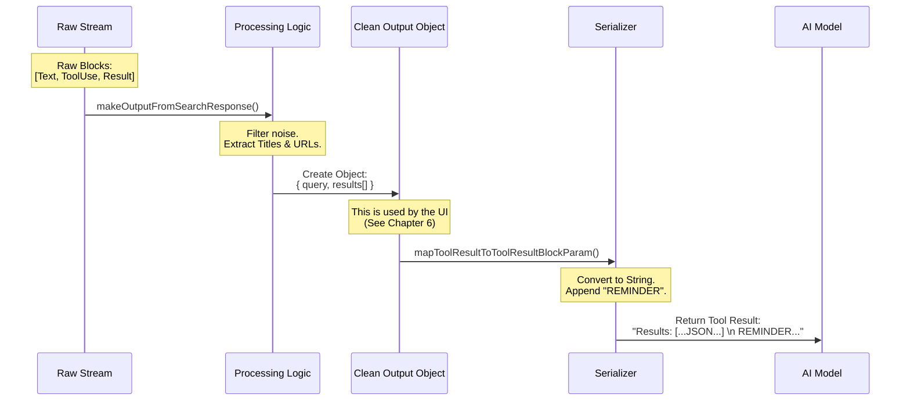

# Chapter 5: Result Processing & Serialization

In [Chapter 4: Streaming Execution Strategy](04_streaming_execution_strategy.md), we learned how to act like a "Live Sports Commentator," streaming events from the internet in real-time.

At the end of that chapter, we were left with a variable called `allContentBlocks`. This is a raw, messy pile of data containing everything that happened during the stream: the AI's internal thoughts, the command to search, and the raw JSON coming back from the search provider.

Now, we need to tidy up.

## The Concept: The Court Stenographer

Think of this phase as a **Court Stenographer**.

1.  **The Raw Recording:** During a trial (the search execution), people talk over each other. There are objections, mumbled words, and side conversations. This is our `allContentBlocks`.
2.  **The Transcription:** The stenographer reviews the tape and types up a clean, official record. They remove the "ums" and "ahs" and organize the facts. This is **Result Processing**.
3.  **The Reading:** Finally, the clerk reads the official verdict back to the judge (the AI). This is **Serialization**.

In this chapter, we will build the logic that turns chaos into order.

---

## 1. The Messy Input (`allContentBlocks`)

When the streaming finishes, we have an array of "Blocks." It looks something like this (simplified):

```json
[
  { "type": "text", "text": "I need to check..." },
  { "type": "server_tool_use", "name": "web_search" },
  { "type": "text", "text": "checking google..." },
  { "type": "web_search_tool_result", "content": [{ "url": "..." }] }
]
```

This is hard to use. The UI can't easily render this, and we can't save this to a database easily. We need to convert this into the clean **Output Schema** we defined in [Chapter 2: Data Contract (Schemas)](02_data_contract__schemas_.md).

---

## 2. The Cleanup Logic

We use a helper function called `makeOutputFromSearchResponse`. Its job is to filter through the noise and extract the gold.

### Step A: Setting up the Containers
First, we prepare empty arrays to hold our clean data.

```typescript
function makeOutputFromSearchResponse(blocks, query, duration) {
  const results = [] // We will put clean hits here
  let textAcc = ''   // We will accumulate text here
  
  // ... loop logic starts here
```

**Explanation:**
We are preparing to iterate through the list of blocks. We separate "Text" (commentary) from "Results" (actual links).

### Step B: The Mining Loop
We loop through every block. If we find a `web_search_tool_result`, we grab the content.

```typescript
  for (const block of blocks) {
    // Did we find a search result block?
    if (block.type === 'web_search_tool_result') {
      
      // Extract just the Title and URL
      const hits = block.content.map(r => ({ 
        title: r.title, 
        url: r.url 
      }))

      // Save it to our clean list
      results.push({ content: hits })
    }
    // ... handle text blocks ...
  }
```

**Explanation:**
The raw block might contain extra metadata we don't need. Here, we map it strictly to `{ title, url }`. This ensures our output matches our Schema perfectly.

### Step C: The Final Package
Finally, we wrap it all up in the `Output` object.

```typescript
  return {
    query: query,            // "Apple Stock"
    results: results,        // [{ title: "...", url: "..." }]
    durationSeconds: duration // 1.2s
  }
} // End of function
```

**Explanation:**
This return value is the **Official Record**. It is clean, typed, and ready to be sent to the User Interface (which we will see in Chapter 6).

---

## 3. Serialization: Reading it Back to the AI

We have processed the results for our internal app state. However, the AI (Claude) is still waiting for an answer!

The AI doesn't read our internal database objects. It reads **Text**. We must take our clean object and convert it ("serialize" it) into a text string that the AI can understand.

We do this in a method called `mapToolResultToToolResultBlockParam`.

### Step A: Formatting the Text
We loop through our clean results and build a long string.

```typescript
mapToolResultToToolResultBlockParam(output, toolUseID) {
  const { query, results } = output
  
  // Start the message
  let formattedOutput = `Web search results for query: "${query}"\n\n`

  // Loop through results and turn them into text
  results.forEach(result => {
    if (result.content?.length > 0) {
      // Turn the JSON object into a string representation
      formattedOutput += `Links: ${JSON.stringify(result.content)}\n\n`
    }
  })
  // ... continued below
```

**Explanation:**
We use `JSON.stringify` to turn the array of links into a text representation. The AI is smart enough to read JSON text and understand it.

### Step B: The Final Reminder
This is a "Prompt Engineering" trick. Even though we told the AI to cite sources in [Chapter 3: Prompt Engineering Context](03_prompt_engineering_context.md), LLMs can sometimes forget rules during long conversations.

We inject a **Reminder** at the very end of the data package.

```typescript
  // Append a strict rule to the end of the data
  formattedOutput += 
    '\nREMINDER: You MUST include the sources above in your response.'

  return {
    tool_use_id: toolUseID,
    type: 'tool_result',
    content: formattedOutput.trim(),
  }
},
```

**Explanation:**
This is the last thing the AI "hears" before it generates its answer. By placing the reminder here, we significantly increase the chance that the AI will correctly link to the websites it found.

---

## 4. Visualizing the Pipeline

Here is the complete journey of the data, from the raw stream to the final message sent to the AI.



---

## 5. Why do we separate Processing and Serialization?

You might wonder: "Why not just send the raw JSON straight to the AI?"

1.  **Efficiency:** The raw stream is huge. Our `Output` object is small.
2.  **UI Separation:** Our User Interface needs a Javascript Object to render pretty buttons and lists. The AI needs a String. By separating them, we satisfy both needs.
3.  **Control:** We can inject extra instructions (like the "REMINDER") into the AI's version without messing up the data shown to the human user.

## Conclusion

We have now completed the backend logic for the **WebSearchTool**.

1.  We defined the tool and lifecycle ([Chapter 1](01_tool_definition___lifecycle.md)).
2.  We created strict contracts ([Chapter 2](02_data_contract__schemas_.md)).
3.  We gave the AI context ([Chapter 3](03_prompt_engineering_context.md)).
4.  We streamed the execution ([Chapter 4](04_streaming_execution_strategy.md)).
5.  And now, we have cleaned the data and formatted it for the AI.

The tool works! The AI can search, find data, and answer the question.

However, the **Human User** is still looking at a blank screen. They don't see the internal JSON objects. They need a beautiful, interactive display to see what the AI found.

In the final chapter, we will learn how to render these results in the User Interface.

[Next Chapter: Interface Rendering (UI)](06_interface_rendering__ui_.md)

---

Generated by [Code IQ](https://github.com/adityasoni99/Code-IQ)