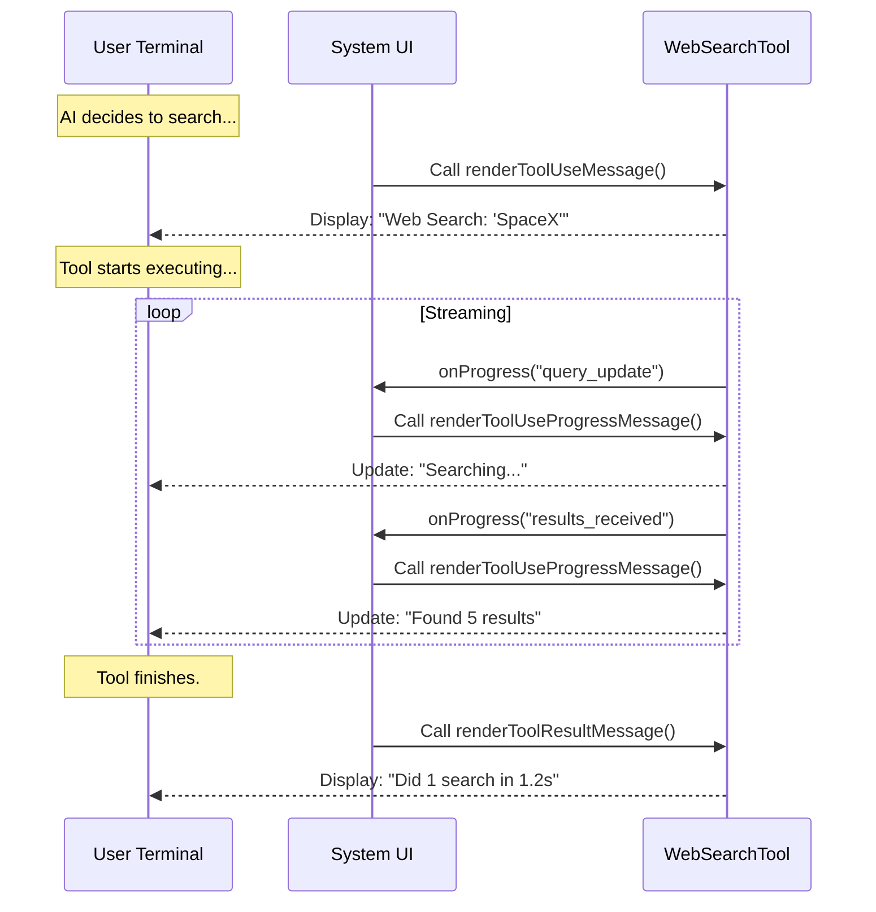

# Chapter 6: Interface Rendering (UI)

Welcome to the final chapter of our series!

In [Chapter 5: Result Processing & Serialization](05_result_processing___serialization.md), we finished the "Backend" work. We cleaned up the messy data streams into a neat structure for the AI to understand.

But what about the **Human**?

Currently, if you ran the tool, the terminal would sit blank for a few seconds while the AI works, and then suddenly spit out an answer. This feels broken. Users need to know what is happening *right now*.

This brings us to **Interface Rendering (UI)**.

## The Concept: The Dashboard

Think of the `WebSearchTool` as a car engine.
*   **The Engine (Logic):** Burns fuel and turns wheels (fetches data).
*   **The Dashboard (UI):** Shows the driver the speed, fuel level, and check-engine lights.

Even if the engine is perfect, a car without a dashboard is scary to drive. You don't know if it's on, how fast you're going, or if you're about to run out of gas.

In this project, we use **React** (specifically a library called `Ink`) to render text in the terminal. We need to build three specific "Gauges" for our dashboard:

1.  **The Announcement:** "I am starting a search."
2.  **The Progress Bar:** "I found 5 results..."
3.  **The Trip Summary:** "Finished in 1.2 seconds."

---

## 1. The Announcement (`renderToolUseMessage`)

When the AI first decides "I need to search the web," we want to show a static message to the user confirming this decision.

We define this in `UI.tsx`.

### The Code
```typescript
// UI.tsx
import { Text } from '../../ink.js'

export function renderToolUseMessage(input) {
  const { query } = input
  
  // If there is no query yet, show nothing
  if (!query) return null

  // Render the query simply, e.g., "Apple Stock"
  return `"${query}"`
}
```

**Explanation:**
*   **Input:** The function receives the arguments the AI wants to use (defined in [Chapter 2](02_data_contract__schemas_.md)).
*   **Output:** It returns a simple string. The system will wrap this in a nice box automatically.
*   **Result:** The user sees: `Use Tool: Web Search "Apple Stock"`.

---

## 2. The Progress Bar (`renderToolUseProgressMessage`)

This is the most interactive part. In [Chapter 4: Streaming Execution Strategy](04_streaming_execution_strategy.md), we emitted events like `query_update` and `search_results_received`.

Now, we need a component that listens to those events and updates the screen in real-time.

### Handling the Updates
We look at the *latest* progress message and decide what to show.

```typescript
// UI.tsx
export function renderToolUseProgressMessage(progressMessages) {
  // 1. Get the most recent update
  const lastProgress = progressMessages[progressMessages.length - 1]
  const data = lastProgress?.data

  if (!data) return null

  // 2. Decide what to render based on the event type
  switch (data.type) {
    case 'query_update':
      return <Text dimColor>Searching: {data.query}</Text>
      
    case 'search_results_received':
      return <Text dimColor>Found {data.resultCount} results...</Text>
      
    default:
      return null
  }
}
```

**Explanation:**
*   `progressMessages`: An array of every update sent so far. We usually only care about the last one.
*   `switch (data.type)`: We switch visuals based on what is happening.
*   `<Text dimColor>`: This is a React/Ink component. `dimColor` makes the text grey so it's not distracting.

### The User Experience
1.  ** millisecond 0:** Screen is blank.
2.  ** millisecond 500:** User sees `Searching: Apple...` (Grey text).
3.  ** millisecond 1500:** Text *changes* instantly to `Found 5 results...`.

---

## 3. The Trip Summary (`renderToolResultMessage`)

Once the tool is finished, the progress bar disappears. We want to leave a permanent record of what happened so the user can scroll back and see it later.

We use the cleaned `Output` object we created in [Chapter 5](05_result_processing___serialization.md).

### Calculating the Stats
First, we need a tiny helper to count how many valid links we found.

```typescript
// UI.tsx
function getSearchSummary(results) {
  let searchCount = 0
  
  for (const result of results) {
    // Only count actual objects, not error strings
    if (result && typeof result !== 'string') {
      searchCount++
    }
  }
  return { searchCount }
}
```

### Rendering the Final Line
Now we display the stats.

```typescript
// UI.tsx
export function renderToolResultMessage(output) {
  const { searchCount } = getSearchSummary(output.results ?? [])
  
  // Format time: "1.2s" or "800ms"
  const time = output.durationSeconds >= 1 
    ? `${Math.round(output.durationSeconds)}s` 
    : `${Math.round(output.durationSeconds * 1000)}ms`

  return (
    <Box>
      <Text>Did {searchCount} searches in {time}</Text>
    </Box>
  )
}
```

**Explanation:**
*   **Input:** The strict `Output` object.
*   **Logic:** Calculates how long the search took and how many searches ran.
*   **Visual:** Returns a `<Box>` containing the summary text.

---

## 4. Connecting UI to the Tool

We have built the visual components, but they are just floating functions. We need to attach them to our Tool Definition so the system knows when to use them.

We do this back in `WebSearchTool.ts` (referencing [Chapter 1](01_tool_definition___lifecycle.md)).

```typescript
// WebSearchTool.ts
import { 
  renderToolUseMessage, 
  renderToolUseProgressMessage, 
  renderToolResultMessage 
} from './UI.js'

export const WebSearchTool = buildTool({
  name: 'web_search',
  
  // ... other configuration ...

  // Attach the UI functions here!
  renderToolUseMessage,
  renderToolUseProgressMessage,
  renderToolResultMessage,
})
```

**Explanation:**
By importing the functions and adding them to the `buildTool` object, we tell the main application: "When you use this tool, use *these* specific functions to draw the dashboard."

---

## 5. Visualizing the Rendering Lifecycle

Here is the full flow of how the User Interface updates during a tool run.



## Conclusion

Congratulations! You have completed the construction of the **WebSearchTool**.

Let's review what we built across these 6 chapters:

1.  **The Identity ([Chapter 1](01_tool_definition___lifecycle.md)):** We defined who the tool is and its lifecycle.
2.  **The Contract ([Chapter 2](02_data_contract__schemas_.md)):** We defined strict inputs (Schemas) to prevent errors.
3.  **The Brain ([Chapter 3](03_prompt_engineering_context.md)):** We gave the AI context (dates, citation rules) to make it smart.
4.  **The Nervous System ([Chapter 4](04_streaming_execution_strategy.md)):** We built a real-time streaming engine to fetch data.
5.  **The Translator ([Chapter 5](05_result_processing___serialization.md)):** We converted raw data into a clean format for the AI.
6.  **The Face ([Chapter 6](06_interface_rendering__ui_.md)):** We built a UI so the user can see what's happening.

You now have a fully functional, production-grade tool that allows an AI to browse the internet, streaming results in real-time, while keeping the user informed every step of the way.

**End of Tutorial.**

---

Generated by [Code IQ](https://github.com/adityasoni99/Code-IQ)