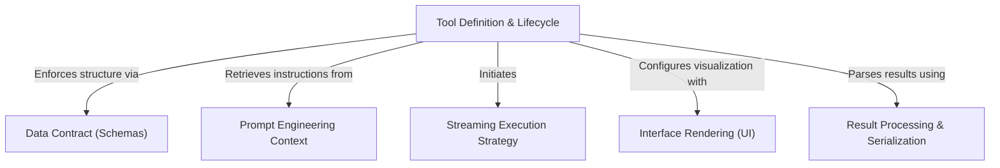

# Tutorial: WebSearchTool

This project implements a comprehensive **Web Search Tool** that enables an AI assistant to fetch real-time information from the internet. It relies on a strict *lifecycle* to manage input validation, executes searches via a **streaming strategy** to provide live feedback, and strictly formats the final output with *markdown citations* to ensure the information is verifiable and user-friendly.

## Chapters

1. [Tool Definition & Lifecycle](01_tool_definition___lifecycle.md)
2. [Data Contract (Schemas)](02_data_contract__schemas_.md)
3. [Prompt Engineering Context](03_prompt_engineering_context.md)
4. [Streaming Execution Strategy](04_streaming_execution_strategy.md)
5. [Result Processing & Serialization](05_result_processing___serialization.md)
6. [Interface Rendering (UI)](06_interface_rendering__ui_.md)

---

Generated by [Code IQ](https://github.com/adityasoni99/Code-IQ)