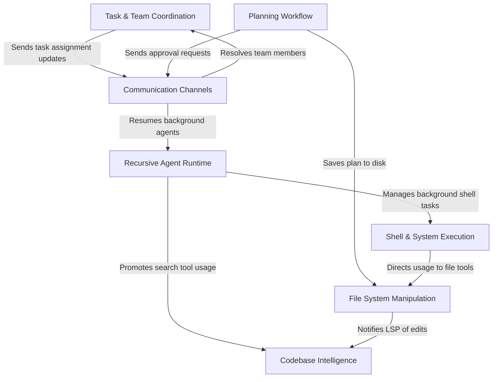

# Tutorial: tools

The **tools** project implements a comprehensive suite of capabilities for an autonomous AI agent, enabling it to interact with the local environment and coordinate complex workflows. It features a **recursive agent runtime** that can spawn specialized sub-agents, a set of **filesystem and codebase intelligence** tools for reading, writing, and analyzing code, and a **planning mode** to architect solutions before implementation. Additionally, it includes a robust **task and team coordination** layer with communication channels to manage multi-agent swarms and maintain persistent state across sessions.

## Chapters

1. [Recursive Agent Runtime](01_recursive_agent_runtime.md)
2. [Task & Team Coordination](02_task___team_coordination.md)
3. [Communication Channels](03_communication_channels.md)
4. [Planning Workflow](04_planning_workflow.md)
5. [File System Manipulation](05_file_system_manipulation.md)
6. [Shell & System Execution](06_shell___system_execution.md)
7. [Codebase Intelligence](07_codebase_intelligence.md)

---

Generated by [Code IQ](https://github.com/adityasoni99/Code-IQ)