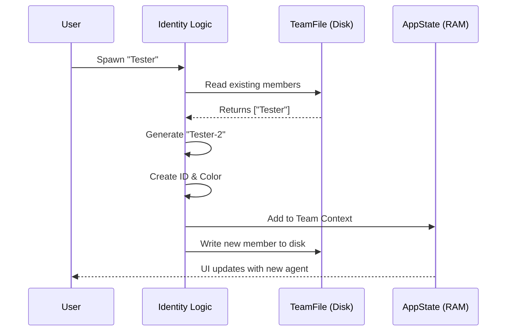

# Chapter 1: Team Context & Identity Management

Welcome to the **Shared** project tutorial! This is the foundation of our multi-agent system. Before we can have agents talking to each other or writing code, we need to know *who* they are.

## Motivation: The "HR" Department of Agents

Imagine a busy office. If a new employee walks in, they need an ID badge, a desk, and an entry in the company directory. If two people are named "Steve," the HR department needs to distinguish them (e.g., "Steve A" and "Steve B").

**Team Context & Identity Management** is exactly that—an HR system for your AI agents.

**The Problem:**
1.  **Duplicate Names:** What if you spawn two agents named "Reviewer"?
2.  **Visual Confusion:** How does the UI know which agent is speaking?
3.  **Lost Data:** If the app restarts, how do we remember who is on the team?

**The Solution:**
A centralized logic that assigns unique IDs, sanitizes names, picks specific colors, and saves this "roster" to both the application memory and a file on disk.

---

## Core Concepts

Let's break down the process of onboarding a new agent into four simple steps.

### 1. The Name Game (Uniqueness & Sanitization)

When a user asks for an agent named "Tester", we first check if "Tester" already exists. If it does, we append a number (e.g., "Tester-2"). We also "sanitize" the name to remove characters that might break our system (like `@` symbols).

```typescript
// Example from internal logic
const uniqueName = await generateUniqueTeammateName(name, teamName)

// If 'Tester' exists, uniqueName becomes 'Tester-2'
const sanitizedName = sanitizeAgentName(uniqueName) 
```

### 2. The Identity Card (Agent ID)

An Agent ID is the definitive unique key. It combines the agent's name with the team name. It looks a bit like an email address.

**Format:** `agentName@teamName`

```typescript
import { formatAgentId } from '../../utils/agentId.js'

// Result: "Tester-2@MyFeatureTeam"
const teammateId = formatAgentId(sanitizedName, teamName)
```

### 3. Visual Identity (Color)

To make the UI friendly, every agent gets a unique color based on their ID. This ensures "Tester-2" doesn't look exactly like "Reviewer-1".

```typescript
import { assignTeammateColor } from '../../utils/swarm/teammateLayoutManager.js'

// Returns a hex code or color name, e.g., "magenta"
const teammateColor = assignTeammateColor(teammateId)
```

### 4. Updating the Directory (State & Persistence)

Finally, we record this new identity in two places:
1.  **AppState (RAM):** Updates the UI immediately so you see the new agent in the sidebar.
2.  **TeamFile (Disk):** Saves the agent to a JSON file so the team persists even if you close the terminal.

---

## Under the Hood: The Onboarding Flow

Here is what happens internally when a request to spawn a new agent is made.



---

## Implementation Walkthrough

Let's look at the actual code in `spawnMultiAgent.ts` that handles this. We will strip away the complex execution logic (which we'll cover in [Execution Backend Strategies](03_execution_backend_strategies.md)) and focus purely on **Identity**.

### Step 1: Handling Duplicates

We read the team file to see who is already working.

```typescript
// spawnMultiAgent.ts (Helper function)

export async function generateUniqueTeammateName(
  baseName: string,
  teamName: string | undefined,
): Promise<string> {
  // Read the list of current agents from disk
  const teamFile = await readTeamFileAsync(teamName)
  
  // Logic to find if "baseName" exists and append -2, -3, etc.
  // ... (implementation details) ...
  return uniqueName
}
```

*Explanation:* This ensures strict uniqueness. You can never have two agents with the exact same ID in the same team.

### Step 2: Updating the Application State

Once the ID and color are generated, we use `setAppState`. This is a React state setter. It tells the frontend: "Here is a new teammate, please render them."

```typescript
// Inside handleSpawn... functions
setAppState(prev => ({
  ...prev,
  teamContext: {
    ...prev.teamContext,
    teammates: {
      ...(prev.teamContext?.teammates || {}),
      [teammateId]: {             // The unique ID Key
        name: sanitizedName,      // Display Name
        color: teammateColor,     // UI Color
        spawnedAt: Date.now(),    // Timestamp
        // ... other backend details
      },
    },
  },
}))
```

*Explanation:* The `teamContext` object is the "live truth" of the application. If an agent isn't in here, the UI doesn't know it exists.

### Step 3: Persisting to Disk

Simultaneously, we write to the `TeamFile`. This is crucial for the "HR Records."

```typescript
// Inside handleSpawn... functions

const teamFile = await readTeamFileAsync(teamName)

// Add the new member to the array
teamFile.members.push({
  agentId: teammateId,
  name: sanitizedName,
  color: teammateColor,
  joinedAt: Date.now(),
  // ... model config and permissions
})

// Save back to disk
await writeTeamFileAsync(teamName, teamFile)
```

*Explanation:* By writing to the file, we ensure that the "Leader" agent can read this file later to understand who is available to perform tasks, even if the application restarts.

---

## Summary

In this chapter, we learned how the system manages **Team Context & Identity**:

1.  **Uniqueness:** Every agent gets a unique name (e.g., `Tester-2`).
2.  **Identification:** We generate a strict `agentId` (`name@team`).
3.  **Visualization:** Agents are assigned specific colors.
4.  **Consistency:** We update both the live UI (`AppState`) and the permanent record (`TeamFile`).

Now that our agent has a name, an ID badge, and a desk, it's time to actually bring them to life and make them run.

[Next Chapter: Agent Spawning Orchestrator](02_agent_spawning_orchestrator.md)

---

Generated by [Code IQ](https://github.com/adityasoni99/Code-IQ)