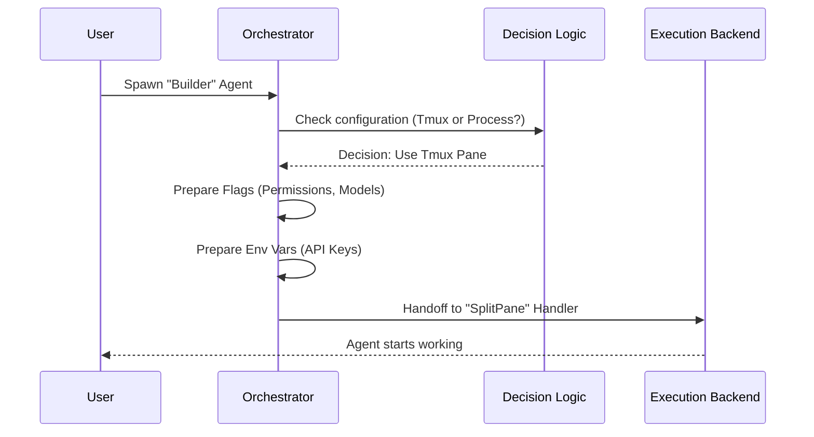

# Chapter 2: Agent Spawning Orchestrator

Welcome to the second chapter of the **Shared** project tutorial!

In the previous chapter, [Team Context & Identity Management](01_team_context___identity_management.md), we learned how to give our agents unique names, IDs, and colors. Now that our agent has an ID badge, we need a way to actually bring them into existence and give them a job.

## Motivation: The "Hiring Manager"

Imagine you run a company. When you hire a new employee, you don't just point at a desk and say "Go." You need a **Hiring Manager** to handle the onboarding logistics:

1.  **Logistics:** Should this employee work remotely (In-Process) or come into the office (Tmux Window)?
2.  **Equipment:** Do they need a specific laptop configuration (Command Line Flags)?
3.  **Briefing:** What is their first assignment (Initial Prompt)?
4.  **Access:** Do they inherit the boss's security clearance (Permissions)?

The **Agent Spawning Orchestrator** is that Hiring Manager. It acts as a central dispatcher. It takes a simple request ("I want a Coder agent") and handles all the complex setup required to launch a fully functional agent process.

---

## Core Concepts

The orchestrator's job can be broken down into three specific tasks.

### 1. The Request (Configuration)
The system needs a "Job Description." This includes the agent's name, their initial instructions (prompt), and what kind of permissions they should have.

### 2. The Decision (Backend Selection)
Not all agents run the same way.
*   **In-Process:** Runs invisibly in the background (fast, lightweight).
*   **Tmux/Pane:** Runs in a visible split-screen terminal (good for monitoring).

The orchestrator checks your settings and decides which "Backend" to use.

### 3. The Backpack (Environment & Flags)
When a new agent spawns, it needs to inherit settings from the main application. The orchestrator packs a "backpack" of environment variables and CLI flags (like `--dangerously-skip-permissions`) so the new agent behaves correctly.

---

## High-Level Flow

Before looking at the code, let's visualize the "Hiring Process."



---

## Implementation Walkthrough

The heart of this system is in `spawnMultiAgent.ts`. The main entry point is a function called `spawnTeammate`.

### Step 1: The Entry Point

We start with `spawnTeammate`. Its only job is to receive the configuration and pass it to the main handler.

```typescript
// spawnMultiAgent.ts

export async function spawnTeammate(
  config: SpawnTeammateConfig,
  context: ToolUseContext,
): Promise<{ data: SpawnOutput }> {
  // Pass the request to the main logic handler
  return handleSpawn(config, context)
}
```

*Explanation:* This is the public face of the Hiring Manager. Other parts of the code call this simple function without worrying about *how* the spawning happens.

### Step 2: The Decision Maker

The `handleSpawn` function determines **where** the agent will live. It checks if we are allowed to run "In-Process" (background) agents or if we need a visible terminal pane.

```typescript
async function handleSpawn(input: SpawnInput, context: ToolUseContext) {
  // Check if we are configured to run agents inside the main process
  if (isInProcessEnabled()) {
    return handleSpawnInProcess(input, context)
  }

  // If not, use the visual split-pane method (Tmux or iTerm)
  const useSplitPane = input.use_splitpane !== false
  if (useSplitPane) {
    return handleSpawnSplitPane(input, context)
  }
  
  // Legacy fallback
  return handleSpawnSeparateWindow(input, context)
}
```

*Explanation:* This acts like a traffic switch. It routes the request to the correct specialist. We will cover the specific handlers in [Execution Backend Strategies](03_execution_backend_strategies.md).

### Step 3: Packing the Backpack (Inheritance)

One of the most critical jobs of the Orchestrator is ensuring the new agent inherits settings from the parent. For example, if you are running in "Auto-Approve" mode, your sub-agents should probably be in that mode too.

The function `buildInheritedCliFlags` constructs the command line arguments for the new agent.

```typescript
function buildInheritedCliFlags(options: { permissionMode?: PermissionMode }) {
  const flags: string[] = []

  // If the parent allows bypassing permissions, pass that flag to the child
  if (options.permissionMode === 'bypassPermissions') {
    flags.push('--dangerously-skip-permissions')
  }

  // If the user specified a specific AI model, pass that along too
  const modelOverride = getMainLoopModelOverride()
  if (modelOverride) {
    flags.push(`--model ${quote([modelOverride])}`)
  }

  return flags.join(' ')
}
```

*Explanation:* This ensures consistency. It prevents a situation where the main agent is smart (using Claude 3.5 Sonnet) but spawns a "dumb" agent (using a default model) because it forgot to pass the configuration down.

### Step 4: Preparing the Command

Finally, inside the specific handlers (like `handleSpawnSplitPane`), the Orchestrator assembles the final command string. It combines the **Binary** (the executable), the **Identity** (from Chapter 1), and the **Backpack** (Flags).

```typescript
// Inside handleSpawnSplitPane...

// 1. Where is the program?
const binaryPath = getTeammateCommand()

// 2. Who is this agent? (Identity)
const identityArgs = `--agent-id ${quote([teammateId])} --team-name ${quote([teamName])}`

// 3. What settings do they need? (The Backpack)
const flagsStr = buildInheritedCliFlags({ ... })

// 4. Combine into one executable command
const spawnCommand = `env ${envVars} ${binaryPath} ${identityArgs} ${flagsStr}`
```

*Explanation:* This `spawnCommand` is the final product of the Orchestrator. It is a complete, executable shell command that defines exactly who the agent is and how it should behave.

---

## Summary

In this chapter, we explored the **Agent Spawning Orchestrator**:

1.  **Centralization:** All requests to create agents go through `spawnTeammate`.
2.  **Dispatching:** It intelligently decides whether to run agents in the background or in a visible pane.
3.  **Inheritance:** It "packs a backpack" of flags and permissions so new agents inherit the parent's configuration.

The Orchestrator has now prepared the command and selected the destination. But how does that command actually get executed? How do we talk to a terminal window or a background process?

We will answer that in the next chapter.

[Next Chapter: Execution Backend Strategies](03_execution_backend_strategies.md)

---

Generated by [Code IQ](https://github.com/adityasoni99/Code-IQ)