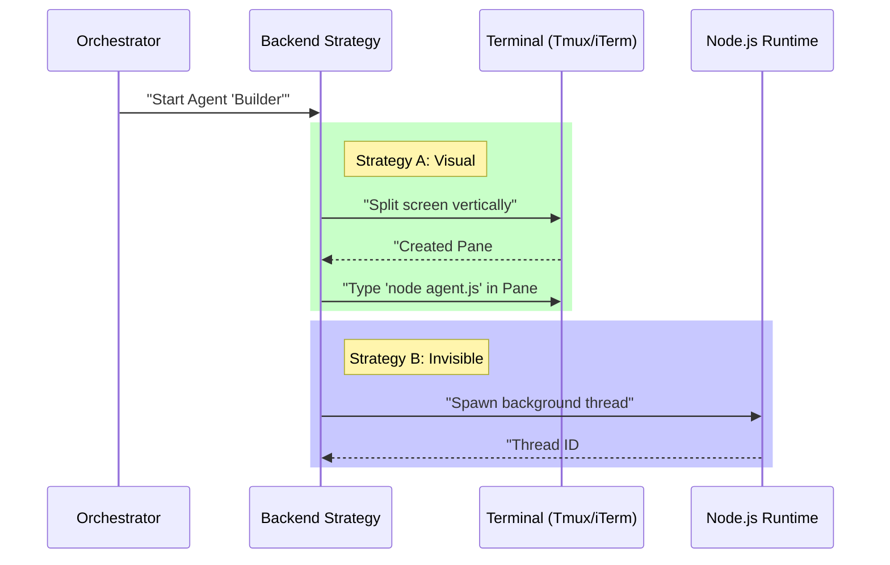

# Chapter 3: Execution Backend Strategies

Welcome to the third chapter of the **Shared** project tutorial!

In the previous chapter, [Agent Spawning Orchestrator](02_agent_spawning_orchestrator.md), we acted as the "Hiring Manager," gathering all the necessary paperwork, permissions, and configurations to hire a new agent.

Now, we need to answer a physical question: **Where does this new agent actually sit?**

## Motivation: The Office Layout

Imagine setting up a workspace for your new employee. You have three options:

1.  **The Open-Plan Desk (Split-Pane):** You set up a desk right next to yours. You can see their screen, and they can see yours. This is great for collaboration.
2.  **The Private Office (Separate Window):** You give them a room down the hall. They have their own space, but you can't easily glance over to see what they are doing.
3.  **The Virtual Assistant (In-Process):** They don't have a physical body or a desk. They exist inside your computer's memory, running invisibly and incredibly fast.

**Execution Backend Strategies** are the code implementations for these three scenarios. They abstract away the messy details of how to create these environments so the rest of the app doesn't have to care.

---

## The Three Backends

Let's look at how the code handles these three different "office" types.

### 1. In-Process (The Virtual Assistant)
*   **Best for:** Speed, background tasks, and lightweight agents.
*   **How it works:** It runs inside the existing Node.js process (the same program running the main app). It shares memory with the main agent.

### 2. Split-Pane (The Open-Plan Desk)
*   **Best for:** Visual monitoring.
*   **How it works:** We use a tool like **Tmux** or **iTerm2**. The code tells the terminal emulator to "split the screen in half" and start a new shell process in the empty space.

### 3. Separate-Window (The Private Office)
*   **Best for:** Keeping the main view clean (Legacy/Fallback).
*   **How it works:** Similar to Split-Pane, but tells Tmux to create a completely new tab or window instead of splitting the current one.

---

## High-Level Flow

Here is what happens when the Orchestrator hands off the task to a specific backend strategy.



---

## Implementation Walkthrough

Let's look at how this is implemented in `spawnMultiAgent.ts`. We will focus on the two most common strategies: **In-Process** and **Split-Pane**.

### Strategy A: The "In-Process" Backend

This is the "Virtual Assistant" approach. Instead of running a shell command, we simply call a JavaScript function to start the agent loop.

#### 1. Configuration
We prepare a config object. Notice we don't need shell flags here; we just pass JavaScript objects directly.

```typescript
// handleSpawnInProcess (spawnMultiAgent.ts)

const config: InProcessSpawnConfig = {
  name: sanitizedName,  // e.g. "Tester-2"
  teamName: teamName,
  prompt: prompt,       // "Write a test for..."
  color: teammateColor,
  // ...
}
```

*Explanation:* Because we are in the same memory space, we don't need to serialize data into text strings. We just pass the data.

#### 2. The Launch (Fire-and-Forget)
We start the agent but we **don't wait** for it to finish. The main agent needs to keep working while the sub-agent runs in the background.

```typescript
// Start the agent execution loop
startInProcessTeammate({
  taskId: result.taskId,
  prompt,
  // ... other context
  abortController: result.abortController,
})

logForDebugging(`Started agent execution for ${teammateId}`)
```

*Explanation:* `startInProcessTeammate` kicks off the loop. The code immediately moves on, allowing the main application to remain responsive.

---

### Strategy B: The "Split-Pane" Backend

This is the "Open-Plan Desk" approach. It is more complex because we have to talk to an external program (Tmux).

#### 1. Creating the Physical Space
First, we ask the layout manager to carve out space on the screen.

```typescript
// handleSpawnSplitPane (spawnMultiAgent.ts)

// Returns the ID of the new blank terminal area
const { paneId } = await createTeammatePaneInSwarmView(
  sanitizedName,
  teammateColor,
)
```

*Explanation:* This sends a command like `tmux split-window -h` to the OS. Suddenly, a blank prompt appears on your screen.

#### 2. Constructing the Command
We can't just pass variables. We have to build a long text string that looks like a command a human would type.

```typescript
// We build a massive string of arguments
const teammateArgs = [
  `--agent-id ${quote([teammateId])}`,
  `--team-name ${quote([teamName])}`,
  `--agent-color ${quote([teammateColor])}`,
  // ... other flags
].join(' ')

// The final executable line
const spawnCommand = `cd ${cwd} && env ${vars} ${binary} ${teammateArgs}`
```

*Explanation:* This turns our nice JavaScript objects back into a raw CLI string: `node app.js --agent-id "Tester-2" ...`

#### 3. Remote Control Typing
Finally, we "type" that command into the new pane programmatically.

```typescript
// Send the command to the new pane
await sendCommandToPane(paneId, spawnCommand, !insideTmux)
```

*Explanation:* We use a socket or shell command to paste our `spawnCommand` into the target pane and hit "Enter" virtually. The agent boots up in that window.

---

## Updating the Roster (Tracking)

Regardless of *where* the agent sits (Process or Pane), we must update our "HR Roster" (the AppState) so the UI knows where to find them.

```typescript
setAppState(prev => ({
  ...prev,
  teamContext: {
    // ...
    teammates: {
      [teammateId]: {
        name: sanitizedName,
        // We record the specific pane ID here
        tmuxPaneId: paneId, 
        // Or "in-process" if it has no pane
        tmuxSessionName: sessionName, 
      },
    },
  },
}))
```

*Explanation:* This unifies the strategies. The UI sidebar doesn't care if `tmuxPaneId` is a real number (Split-Pane) or the string "in-process". It just knows there is an active agent working there.

---

## Summary

In this chapter, we learned about **Execution Backend Strategies**:

1.  **Abstraction:** The system hides the complexity of *how* an agent runs from the user.
2.  **In-Process:** Runs invisibly and fast within the same Node runtime.
3.  **Split-Pane:** Runs in a visible terminal pane by sending shell commands to Tmux.
4.  **Unified State:** Regardless of the backend, the agent is tracked in `AppState` so the UI remains consistent.

Now we have agents spawning, running, and working in their specific environments. But how do we know what they are actually *doing*? How do we see the commands they run and keep a history of their work?

We will explore that in the final chapter.

[Next Chapter: Command Telemetry & Git Tracking](04_command_telemetry___git_tracking.md)

---

Generated by [Code IQ](https://github.com/adityasoni99/Code-IQ)