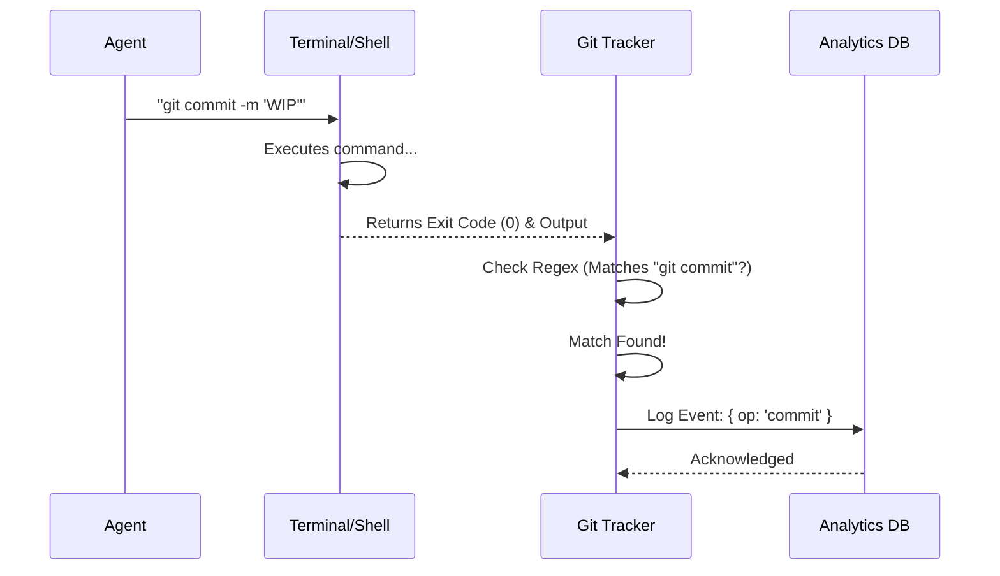

# Chapter 4: Command Telemetry & Git Tracking

Welcome to the final chapter of the **Shared** project tutorial!

In the previous chapter, [Execution Backend Strategies](03_execution_backend_strategies.md), we learned how to spawn agents in different environments—whether invisibly in the background or visibly in a split-pane terminal.

Now that our agents are happily running shell commands, we face a new question: **How do we know what they are achieving?**

## Motivation: The "Scoreboard" Keeper

Imagine you are watching a sports game. You don't just want to watch the players run back and forth; you want to know the **score**.

In our agent system:
*   **The Players:** Your AI Agents.
*   **The Moves:** Shell commands (e.g., `npm install`, `git push`).
*   **The Score:** Successful commits, Pull Requests (PRs) created, and code merged.

**Command Telemetry** acts as the Scoreboard Keeper. It sits quietly on the sidelines, watching every command the agent types. When it sees something interesting—like a Git commit—it notes it down.

**The Problem:**
1.  **Visibility:** The system needs to know if the agent actually finished a task (like pushing code) without asking the user.
2.  **Metrics:** We want to know how many PRs our agents create per day.
3.  **Zero Interference:** The observer must **not** stop or slow down the agent.

**The Solution:**
A utility layer that uses "Pattern Matching" (Regex) to read command strings. It extracts useful data (like branch names or PR numbers) and sends it to our analytics system.

---

## Core Concepts

We achieve this using three simple concepts.

### 1. Passive Observation
The telemetry system does not execute code. It receives the command string *after* or *during* execution. It reads the text just like a human reading a log file.

### 2. Pattern Matching (Regex)
We use **Regular Expressions** (Regex) to identify specific tools.
*   Does the command start with `git`?
*   Does it contain `commit`?
*   Does the output contain `https://github.com/.../pull/123`?

### 3. The Analytics Event
When a pattern matches, we fire an event.
*   *Input:* `git push origin main`
*   *Event:* `tengu_git_operation: { operation: 'push' }`

---

## The Use Case: Tracking a Pull Request

Let's see how we track the "Holy Grail" of agent tasks: **Creating a Pull Request.**

The agent might type this command:
```bash
gh pr create --title "Fix login bug" --body "Fixed the typo."
```

Our system needs to:
1.  Detect that `gh pr create` was typed.
2.  Read the output to find the new PR URL.
3.  Log the success.

---

## Under the Hood: The Telemetry Flow

Here is how the data flows from the agent's terminal to our analytics system.



---

## Implementation Walkthrough

The logic lives in `gitOperationTracking.ts`. Let's break it down into small pieces.

### Step 1: Defining the Patterns

First, we need to teach the system what a "Git Command" looks like. We use a helper function `gitCmdRe` (Git Command Regex).

```typescript
// gitOperationTracking.ts

// Creates a pattern that looks for "git <command>"
// It handles edge cases like flags: "git -c user.name=Bot commit"
function gitCmdRe(subcmd: string): RegExp {
  return new RegExp(
    `\\bgit(?:\\s+-[cC]\\s+\\S+|\\s+--\\S+=\\S+)*\\s+${subcmd}\\b`
  )
}

// Now we create specific detectors
const GIT_COMMIT_RE = gitCmdRe('commit') // Detects commits
const GIT_PUSH_RE = gitCmdRe('push')     // Detects pushes
```

*Explanation:* We define standard patterns so we don't have to rewrite complex logic every time we want to find a `push` or a `commit`.

### Step 2: The Main Tracking Function

This is the brain of the operation. The function `trackGitOperations` takes the command string and the exit code.

**Crucial Check:** We only track *successful* commands. If the agent tried to commit but failed (Exit Code 1), we don't count it.

```typescript
export function trackGitOperations(
  command: string,
  exitCode: number,
  stdout?: string,
): void {
  // 1. If the command failed, ignore it.
  const success = exitCode === 0
  if (!success) return

  // 2. Check for Commits
  if (GIT_COMMIT_RE.test(command)) {
    logEvent('tengu_git_operation', { operation: 'commit' })
    // We also increment a counter for stats
    getCommitCounter()?.add(1)
  }
  
  // ... (Checks for other commands continue below)
}
```

*Explanation:* This function acts as a series of "If" statements. If it sees a commit, it logs a commit. Simple and effective.

### Step 3: detecting Pull Requests (PRs)

Detecting a PR is slightly more complex because different tools can create them (GitHub CLI `gh`, GitLab CLI `glab`, or even `curl`).

We define a list of actions to look for:

```typescript
const GH_PR_ACTIONS = [
  { re: /\bgh\s+pr\s+create\b/, action: 'created', op: 'pr_create' },
  { re: /\bgh\s+pr\s+merge\b/, action: 'merged', op: 'pr_merge' },
  // ... other actions like edit, close, etc.
]
```

Then, inside our main tracking function, we check this list:

```typescript
// Inside trackGitOperations...

const prHit = GH_PR_ACTIONS.find(a => a.re.test(command))

if (prHit) {
  // Log that a PR operation happened
  logEvent('tengu_git_operation', { operation: prHit.op })
}
```

*Explanation:* This makes the system extensible. If we want to support a new tool later, we just add it to the `GH_PR_ACTIONS` list.

### Step 4: Extracting Metadata (The "Intelligence")

Merely knowing a PR was created isn't enough. We want the **URL** so we can show it to the user. We look at the `stdout` (the text the command printed to the screen).

```typescript
// Helper to find a URL like https://github.com/owner/repo/pull/123
function findPrInStdout(stdout: string) {
  const match = stdout.match(/https:\/\/github\.com\/[^/\s]+\/[^/\s]+\/pull\/\d+/)
  return match ? parsePrUrl(match[0]) : null
}

// Inside trackGitOperations...
if (prHit?.action === 'created' && stdout) {
  const prInfo = findPrInStdout(stdout)
  
  if (prInfo) {
    // Advanced: Link this coding session to the PR URL in the database
    linkSessionToPR(sessionId, prInfo.prNumber, prInfo.prUrl, ...)
  }
}
```

*Explanation:* This is powerful. By reading the output text, we automatically link the Agent's workspace to the actual Pull Request on GitHub. The user can click a link in the UI to go straight to the code.

---

## Summary of the Series

Congratulations! You have completed the **Shared** project tutorial. Let's recap what we've built together:

1.  **[Team Context & Identity Management](01_team_context___identity_management.md):** We gave our agents names, IDs, and faces.
2.  **[Agent Spawning Orchestrator](02_agent_spawning_orchestrator.md):** We built a "Hiring Manager" to prepare configurations and permissions.
3.  **[Execution Backend Strategies](03_execution_backend_strategies.md):** We created "offices" (In-Process or Split-Pane) for agents to work in.
4.  **Command Telemetry (This Chapter):** We added a "Scoreboard" to automatically track success, commits, and PRs.

You now understand the fundamental infrastructure required to run a robust, multi-agent AI coding team. These utilities ensure that agents are identifiable, manageable, visible, and measurable.

Happy Coding!

---

Generated by [Code IQ](https://github.com/adityasoni99/Code-IQ)