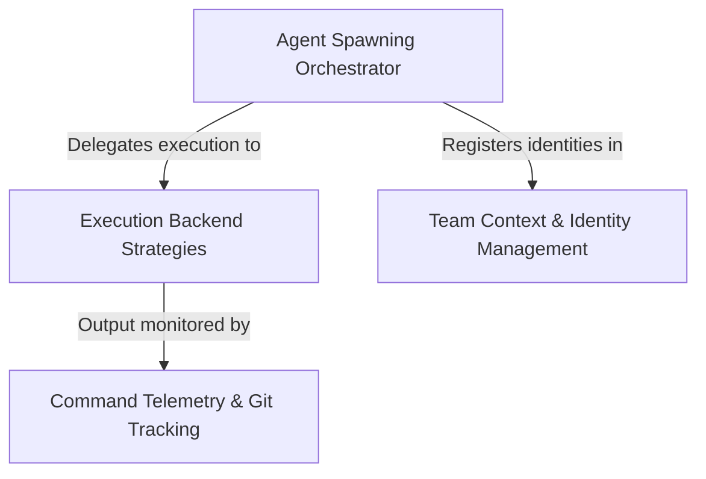

# Tutorial: shared

This project enables the creation and management of **multi-agent teams** where "teammates" are spawned to perform tasks alongside the user. It orchestrates the **lifecycle** of these agents by assigning them unique identities and colors, and dynamically selecting the appropriate **execution backend** (such as a split-pane tmux window or an internal Node.js process). Additionally, it includes a telemetry layer that observes shell output to **track Git operations** and usage metrics without interrupting the workflow.

## Chapters

1. [Team Context & Identity Management](01_team_context___identity_management.md)
2. [Agent Spawning Orchestrator](02_agent_spawning_orchestrator.md)
3. [Execution Backend Strategies](03_execution_backend_strategies.md)
4. [Command Telemetry & Git Tracking](04_command_telemetry___git_tracking.md)

---

Generated by [Code IQ](https://github.com/adityasoni99/Code-IQ)