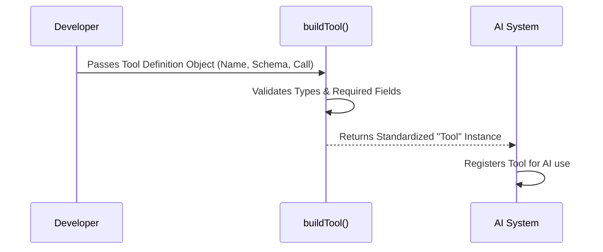

# Chapter 1: Tool Definition

Welcome to the **Testing** project tutorial!

Imagine you are hiring a very smart assistant (the AI). This assistant is great at conversation, but they don't have access to your computer's terminal, your files, or your testing suite. To fix this, you need to give them specific "gadgets" or "tools" to perform tasks.

In this project, a **Tool Definition** is the blueprint for one of these gadgets. It tells the AI:
1.  **What** the tool is called.
2.  **How** to use it (what inputs it needs).
3.  **What** happens when it runs.

In this chapter, we will learn how to wrap code into a tool that the AI can understand using the `buildTool` function.

---

## The Use Case: A "Permission" Tool

Let's say we want to build a tool called `TestingPermission`. Its job is simple but critical:
1.  It acts as a gatekeeper for end-to-end tests.
2.  It must ask the user for permission before running.
3.  It returns a success message if allowed.

We will look at how `TestingPermissionTool.tsx` implements this.

---

## 1. The Blueprint: `buildTool`

To create a tool, we don't just write a function. We need to package metadata, configuration, and logic together. We use the `buildTool` helper for this.

Think of `buildTool` as a laminating machine. You give it a piece of paper with instructions, and it turns it into a sturdy, standardized card the system can file and use.

Here is how we start defining the tool:

```typescript
import { buildTool } from '../../Tool.js';

const NAME = 'TestingPermission';

export const TestingPermissionTool = buildTool({
  name: NAME,
  userFacingName() {
    return 'TestingPermission';
  },
  // ... more properties go here
});
```

**Explanation:**
*   We import `buildTool`.
*   We define a constant `NAME`.
*   We pass an object to `buildTool` containing the `name`. This is the unique ID the AI uses to find this tool.

---

## 2. Describing the Tool to the AI

If you hand someone a gadget without a label, they won't know when to use it. We need to provide a **Description** and a **Prompt**.

```typescript
  async description() {
    return 'Test tool that always asks for permission';
  },
  async prompt() {
    return 'Test tool that always asks for permission before executing.';
  },
```

**Explanation:**
*   `description`: A short summary used by the system UI or logs.
*   `prompt`: Detailed instructions specifically for the AI model. This tells the AI *when* and *why* it should pick this tool.

---

## 3. Defining Inputs (The Schema)

The AI needs to know exactly what data to send to the tool. Does it need a filename? A number? In our specific case, this tool is simple and takes **no inputs**.

We use a library called `zod` to define this shape.

```typescript
import { z } from 'zod/v4';
import { lazySchema } from '../../utils/lazySchema.js';

// We expect an empty object because there are no inputs
const inputSchema = lazySchema(() => z.strictObject({}));

// Inside buildTool:
  get inputSchema() {
    return inputSchema();
  },
```

**Explanation:**
*   `z.strictObject({})` means "I expect an object with absolutely no properties."
*   If we required inputs, we would define them here.

*For a deep dive on validating data, see [Input Schema Validation](02_input_schema_validation.md).*

---

## 4. Configuration Flags

Tools have behavior settings (flags). For our testing tool, we want to ensure it is safe to run.

```typescript
  isEnabled() {
    return "production" === 'test';
  },
  isReadOnly() {
    return true;
  },
  isConcurrencySafe() {
    return true;
  },
```

**Explanation:**
*   `isEnabled`: checks if we are in the 'test' environment. If not, the tool essentially disappears.
*   `isReadOnly`: Tells the system this tool reads data but doesn't modify your files (a safety feature).
*   `isConcurrencySafe`: Tells the system multiple versions of this tool can run at the same time.

---

## 5. The Logic: `call`

This is the engine of the tool. When the AI decides to use the tool, the `call` function is executed.

```typescript
  async call() {
    // The actual work happens here
    return {
      data: `${NAME} executed successfully`
    };
  },
```

**Explanation:**
*   This is a standard asynchronous function.
*   It performs the task and returns a result object containing `data`.
*   The AI will read this string to know the tool succeeded.

---

## 6. Permission Control

Our specific use case requires asking the user for permission. We define a `checkPermissions` method within the tool definition.

```typescript
  async checkPermissions() {
    return {
      behavior: 'ask' as const,
      message: `Run test?`
    };
  },
```

**Explanation:**
*   Before `call()` runs, the system checks this method.
*   Returning `behavior: 'ask'` forces a popup dialog for the user.

*We will cover the details of how this halts execution in [Permission Control](03_permission_control.md).*

---

## Understanding the Lifecycle

What actually happens when you define this tool?

The `buildTool` function validates that you haven't forgotten anything (like the description or schema). It binds your specific logic into a generic `Tool` object that the rest of the system knows how to handle.

Here is a simplified flow of how the definition comes to life:



### Under the Hood: The Return Type

The `TestingPermissionTool` constant we exported isn't just a raw object anymore. It is a typed instance of `Tool`.

```typescript
import type { ToolDef } from '../../Tool.js';

// The object we passed to buildTool satisfies the ToolDef interface
} satisfies ToolDef<InputSchema, string>);
```

**Explanation:**
*   `satisfies ToolDef`: This is a TypeScript feature. It checks that our object matches the requirements of a tool definition without changing the inferred types.
*   This ensures that if you forget to add `name` or `call`, your code editor will show a red error line immediately.

---

## Summary

In this chapter, we learned that a **Tool Definition** is a structured way to give the AI new capabilities.

We used `buildTool` to combine:
1.  **Metadata:** `name`, `description`, `prompt`.
2.  **Interface:** `inputSchema`.
3.  **Configuration:** `isReadOnly`, `isEnabled`.
4.  **Behavior:** `call`, `checkPermissions`.

Now that we have the blueprint, the next step is to ensure the AI uses the tool correctly by sending valid data.

[Next Chapter: Input Schema Validation](02_input_schema_validation.md)

---

Generated by [Code IQ](https://github.com/adityasoni99/Code-IQ)