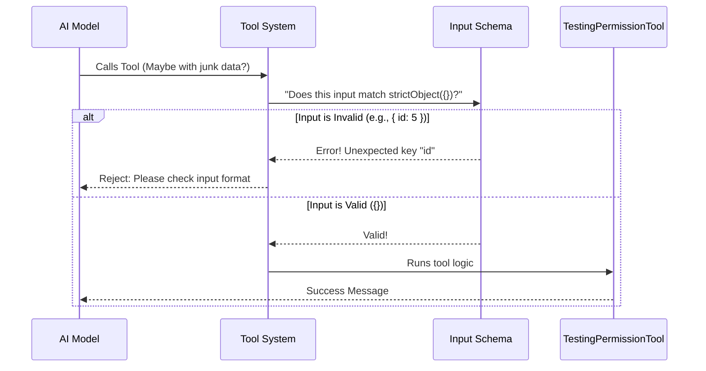

# Chapter 2: Input Schema Validation

In the previous [Tool Definition](01_tool_definition.md) chapter, we built the outer shell of our `TestingPermission` tool. We gave it a name and a description so the AI knows it exists.

But there is a risk. AI models are creative. Sometimes, they try to "hallucinate" arguments. For example, the AI might try to send a filename or a user ID to our tool, even though our tool doesn't need any data!

This is where **Input Schema Validation** comes in. It acts as a strict security guard that checks everything the AI tries to pass to your code *before* your code actually runs.

---

## The Problem: Garbage In, Garbage Out

Imagine you have a function that adds two numbers. If the AI sends the word "banana" instead of a number, your code will crash.

To prevent this, we create a **Schema**. A schema is a contract that says:
> "To run this tool, you MUST provide exactly this data, in this format."

If the data doesn't match the schema, the system rejects it automatically, and your `call()` function never has to deal with bad data.

---

## 1. Introducing Zod

We use a library called **Zod** to define these rules. Zod allows us to describe data shapes in simple TypeScript code.

Think of Zod as a shape-sorting toy. If the AI tries to push a "Square" piece of data into a "Circle" hole, Zod stops it.

### A Hypothetical Example
If we wanted a tool that required a username, the schema would look like this:

```typescript
import { z } from 'zod/v4';

// Rule: We need an object with a 'username' that is a string
const mySchema = z.object({
  username: z.string()
});
```

---

## 2. Our Use Case: The "Empty" Schema

Our `TestingPermission` tool is unique. It doesn't need a filename, a number, or a username. It is just a trigger. Therefore, its input must be **nothing**.

We need to enforce that the input is strictly an empty object.

### Step 1: Import Zod and LazySchema

We use a helper called `lazySchema` (which helps with performance and loading order), and the standard `z` library.

```typescript
import { z } from 'zod/v4';
import { lazySchema } from '../../utils/lazySchema.js';
```

### Step 2: Define the Strict Empty Object

Here is the actual validation logic for our tool:

```typescript
// Define the shape: An object with NO properties allowed
const inputSchema = lazySchema(() => z.strictObject({}));
```

**Explanation:**
1.  `z.strictObject({})`: This creates a strict validator.
2.  The `{}` means "no keys allowed".
3.  `strict` is crucial here. It tells Zod: "If the AI tries to sneak in extra data (like `{ filename: 'test.ts' }`), throw an error."

### Step 3: Inferring the Type

One of the best features of Zod is that it can write your TypeScript types for you.

```typescript
// Automatically creates the TypeScript type { }
type InputSchema = ReturnType<typeof inputSchema>;
```

**Why do we do this?**
Later, when we write the tool's logic, TypeScript will know that the input variable is an empty object. If we try to access `input.filename`, our code editor will warn us immediately!

---

## 3. Connecting the Schema to the Tool

Now that we have defined the rule, we need to attach it to our tool definition so the AI system knows about it.

```typescript
export const TestingPermissionTool = buildTool({
  name: 'TestingPermission',
  
  // Link the schema getter here
  get inputSchema() {
    return inputSchema();
  },
  
  // ... rest of the tool definition
});
```

**What happens here?**
When the AI asks "How do I use this tool?", the system looks at this `inputSchema` property. It converts our Zod definition into a JSON format that the AI can read. The AI then understands: *"Ah, I should call this tool without any arguments."*

---

## Under the Hood: The Validation Flow

What happens when the AI actually tries to use the tool? The system acts as a middleware between the AI and your tool code.



### Internal Implementation Details

In the `TestingPermissionTool.tsx` file, notice how `ToolDef` uses the type we created earlier.

```typescript
// We tell TypeScript exactly what this tool expects
} satisfies ToolDef<InputSchema, string>);
```

This generic type `<InputSchema, string>` is the final connection.
1.  `InputSchema`: Ensures the `call()` function receives the correct input type.
2.  `string`: Ensures the `call()` function returns a string result (or a promise of one).

If you were to change `z.strictObject({})` to `z.object({ id: z.number() })` in the definition, TypeScript would immediately underline your `call()` function if you didn't update it to handle the number. This keeps your code safe and synchronized.

---

## Summary

In this chapter, we learned:
1.  **Why validation matters:** It stops the AI from sending unexpected data that breaks code.
2.  **Zod:** The library we use to define the "shape" of valid data.
3.  **Strict Objects:** How to enforce that a tool receives *no* arguments.

Now that the system has validated the input, the tool is ready to run. However, before we execute the logic, we might need to ask the human user if they actually *want* this test to run.

[Next Chapter: Permission Control](03_permission_control.md)

---

Generated by [Code IQ](https://github.com/adityasoni99/Code-IQ)