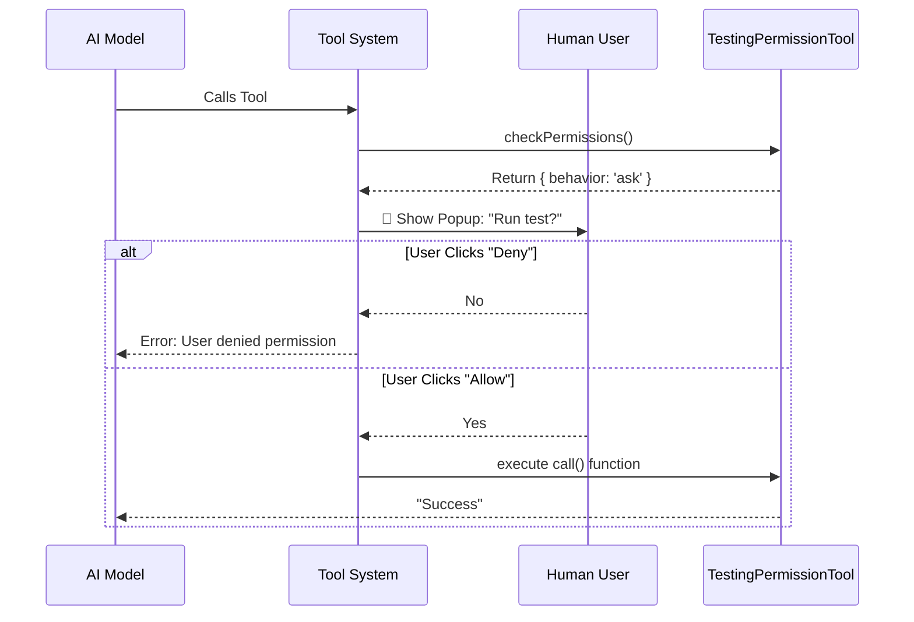

# Chapter 3: Permission Control

In the previous chapter, [Input Schema Validation](02_input_schema_validation.md), we built a "security guard" that checks if the **data** coming from the AI is valid. We ensured that if the AI sends garbage data, the tool rejects it immediately.

However, **valid** data doesn't always mean **safe** action.

Imagine a tool called `DeleteAllFiles`. The input "C:/" is perfectly valid text (it matches the schema), but you definitely don't want the AI to execute that without you saying "Yes" first!

This is where **Permission Control** comes in. It is a mechanism that allows a tool to pause execution and ask the human user for approval.

---

## The Concept: The "Confirm Action" Dialog

In this project, we don't just let the AI run wild. We want to implement a "User-in-the-Loop" workflow.

For our `TestingPermission` tool, we want to simulate a sensitive action (running a test suite). Even if the AI wants to run it, we want a popup asking: **"Run test?"**

To do this, we implement a special method called `checkPermissions`.

---

## 1. Defining the Permission Check

In our `TestingPermissionTool.tsx` file, inside the `buildTool` object, we add the `checkPermissions` function.

This function runs *before* the main logic (`call`).

```typescript
  async checkPermissions() {
    // We always want to ask the user
    return {
      behavior: 'ask' as const,
      message: `Run test?`
    };
  },
```

**Explanation:**
1.  **`behavior: 'ask'`**: This is the magic switch. It tells the system: "Stop! Do not run the `call()` function yet. Go ask the user."
2.  **`as const`**: This is a TypeScript trick to tell the compiler strictly: "The value is exactly the word 'ask', not just any random string."
3.  **`message`**: This is the text the user will see in the dialog box.

---

## 2. Conditional Permissions

Our current tool *always* asks for permission. However, you can write logic to be smarter.

For example, you might only want to ask for permission if the action is dangerous.

*Hypothetical Example (not in our file, but good for understanding):*
```typescript
async checkPermissions(input) {
  // If reading a file, it's safe -> No permission needed
  if (input.action === 'read') return null;

  // If deleting a file, it's dangerous -> Ask user!
  return { behavior: 'ask', message: 'Allow delete?' };
}
```

If you return `null` (or `undefined`), the system assumes the tool is safe and runs it immediately without bothering the user.

---

## 3. The Flow of Control

What happens when `checkPermissions` returns `'ask'`? The entire tool execution halts.

Think of it like a border crossing.

1.  **AI (Driver):** Approaches the booth.
2.  **Schema (Customs):** Checks if the passport (data) is valid.
3.  **Permission (Guard):** Sees the destination is restricted. Lowers the gate.
4.  **User (Supervisor):** Must press the button to lift the gate.

Here is the visual flow:



---

## 4. Under the Hood

Let's look at how this is implemented in our specific `TestingPermissionTool.tsx` file.

The `TestingPermissionTool` is designed specifically to test this feature. It doesn't actually do anything dangerous, but it acts *as if* it is dangerous so developers can verify the permission system works.

### The Code Block

```typescript
// From TestingPermissionTool.tsx

  async checkPermissions() {
    // This tool always requires permission
    return {
      behavior: 'ask' as const,
      message: `Run test?`
    };
  },
```

### How the System Handles It

When the system sees `behavior: 'ask'`, it creates an **Interruption**.

1.  The system saves the current state (the tool name and the inputs).
2.  It sends a request to the User Interface (UI).
3.  The code literally stops waiting (`await`). It will not proceed to the `call()` line until the UI responds.

If you were to look at the `call()` function in our file:

```typescript
  async call() {
    return {
      data: `${NAME} executed successfully`
    };
  },
```

This code is **unreachable** unless the user explicitly grants permission. This guarantees that no matter how smart or tricky the AI is, it cannot force this code to run without your consent.

---

## Summary

In this chapter, we learned about **Permission Control**, the gatekeeper of tool execution.

*   **`checkPermissions`**: The method that decides if we need to stop.
*   **`behavior: 'ask'`**: The command to pause execution and query the user.
*   **Safety**: This ensures sensitive operations (like running tests or deleting files) never happen silently.

Now we have a tool that is defined, validated, and secured by permissions. But what happens once the user clicks "Yes"? How does the tool actually run and return data to the AI?

[Next Chapter: Tool Execution Lifecycle](04_tool_execution_lifecycle.md)

---

Generated by [Code IQ](https://github.com/adityasoni99/Code-IQ)