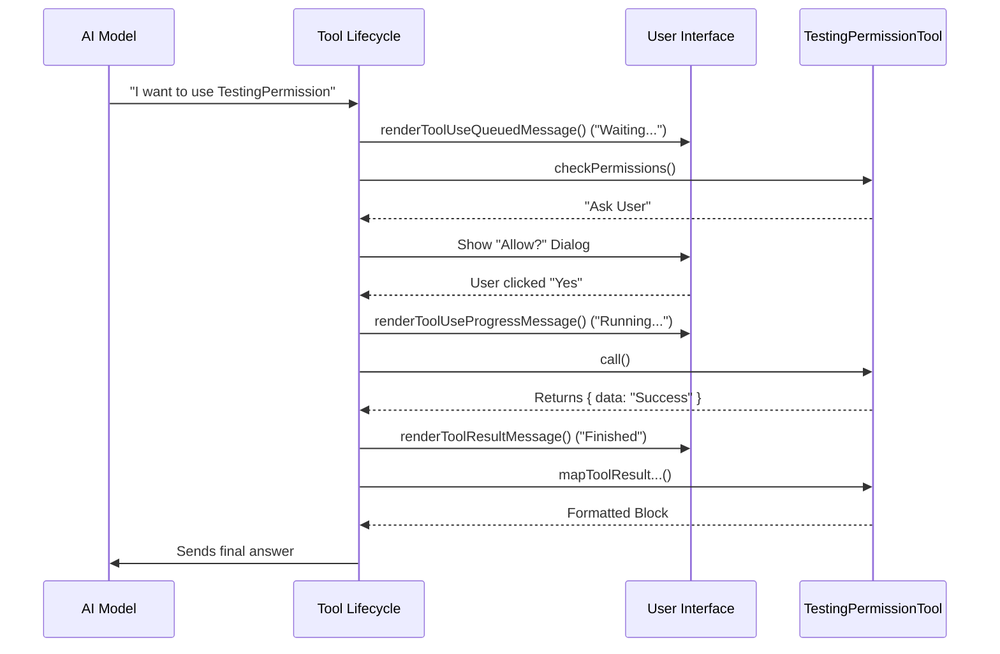

# Chapter 4: Tool Execution Lifecycle

In the previous chapter, [Permission Control](03_permission_control.md), we learned how to stop the tool to ask the user for permission.

But what happens once the user says "Yes"? Or what if the tool takes 10 seconds to run? Does the screen just freeze?

This brings us to the **Tool Execution Lifecycle**.

This lifecycle manages the tool's behavior from the moment it starts until it finishes. It handles two main jobs:
1.  **Doing the work:** Running the logic inside `call()`.
2.  **Talking to the Human:** Updating the User Interface (UI) so you know what is happening.

---

## The Concept: The Dashboard

Imagine you are ordering a pizza via an app. You don't just hit "Order" and wait in silence for 30 minutes. You see status updates:
*   "Order Received"
*   "Baking"
*   "Out for Delivery"
*   "Delivered"

A **Tool** needs to provide this same feedback. Even though the *AI* called the tool, the *Human* is watching the screen. The Lifecycle methods allow the tool to communicate its status to the human user.

---

## 1. UI Feedback Loops

In our `TestingPermissionTool.tsx`, we define several "render" methods. These methods control what the user sees in the chat interface.

Since `TestingPermission` is an internal testing tool, we don't want to clutter the screen, so we set them to return `null` (nothing). However, it is important to understand what they *could* do.

```typescript
  // What to show when the tool is waiting in line
  renderToolUseQueuedMessage() {
    return null;
  },
  
  // What to show while the tool is actually working
  renderToolUseProgressMessage() {
    return null; 
  },
```

**Explanation:**
*   **Queued:** Used if the system is busy and the tool hasn't started yet.
*   **Progress:** Crucial for slow tools (e.g., "Downloading file... 50%").
*   If we returned a string here (like `'Running test...'`), a spinner with that text would appear in the UI.

---

## 2. Reporting Success or Failure

Once the tool finishes, we need to tell the user the outcome.

```typescript
  // What to show if the user (or system) rejects the tool
  renderToolUseRejectedMessage() {
    return null;
  },

  // What to show when the tool finishes successfully
  renderToolResultMessage() {
    return null;
  },
```

**Explanation:**
*   **Rejected:** If you clicked "No" in the permission dialog (from Chapter 3), this message would display.
*   **Result:** This is the final receipt. For a calculator, it might show "Result: 42". For our test tool, we keep it invisible (`null`) to keep the chat clean.

---

## 3. The Execution Engine: `call()`

We have prepared the inputs, checked permissions, and updated the UI. Now, we actually run the logic.

We briefly looked at `call()` in [Tool Definition](01_tool_definition.md), but let's look at it as part of the lifecycle.

```typescript
  async call() {
    // 1. Perform the Logic
    return {
      data: `${NAME} executed successfully` // 2. Return Data
    };
  },
```

**The Lifecycle Rule:**
The `call()` function **only** runs if:
1.  Input Validation passed (Chapter 2).
2.  Permissions were granted (Chapter 3).

If either of those fail, `call()` is never touched. This guarantees that your core logic is always safe and receives valid data.

---

## 4. The Translator: `mapToolResult...`

This is a step beginners often forget.

Your `call()` function returns a JavaScript object (e.g., `{ data: "Success" }`).
However, the AI model (like Claude or GPT) doesn't speak "JavaScript Object". It speaks a specific API language.

We need a translator method to format our result into a block the AI can understand.

```typescript
  mapToolResultToToolResultBlockParam(result, toolUseID) {
    return {
      type: 'tool_result',       // Required tag
      content: String(result),   // The actual output text
      tool_use_id: toolUseID     // Links result back to the specific question
    };
  }
```

**Explanation:**
*   **`toolUseID`**: The AI might ask 3 questions at once. This ID tells the AI: "This answer belongs to Question #2."
*   **`content`**: We convert our result to a string so the AI can read it as text.

---

## Under the Hood: The Full Sequence

How does the system orchestrate all these methods? It acts like a conductor.

Here is the flow of a tool execution from start to finish:



### Why separation matters?
You might wonder: *"Why not just put the print statements inside the `call()` function?"*

By separating **Logic** (`call`) from **Presentation** (`render...`), we make the tool cleaner.
*   The `call` function can be used by an automated script (headless) without needing a screen to print to.
*   The `render` functions can be changed by a designer without breaking the code logic.

---

## Summary

Congratulations! You have completed the **Testing** project tutorial series.

We have built a complete tool from scratch:
1.  **[Tool Definition](01_tool_definition.md)**: We created the blueprint and identity of the tool.
2.  **[Input Schema Validation](02_input_schema_validation.md)**: We secured the tool against bad data using Zod.
3.  **[Permission Control](03_permission_control.md)**: We added a human-in-the-loop to approve sensitive actions.
4.  **Tool Execution Lifecycle**: We learned how to manage UI feedback and translate results back to the AI.

You now understand the anatomy of an AI tool. You can take this pattern—Schema, Permission, Call, Lifecycle—and build tools for file editing, web browsing, or database management. The possibilities are endless!

---

Generated by [Code IQ](https://github.com/adityasoni99/Code-IQ)