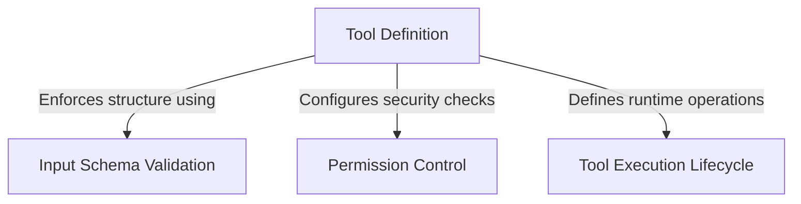

# Tutorial: testing

This project defines a **testing tool** for an AI system designed to verify **permission workflows**. Instead of performing a real task, this tool acts as a "dummy" capability that always pauses to ask for user approval ("Run test?"), ensuring that the system's **security gatekeeping** and confirmation dialogs function correctly.

## Chapters

1. [Tool Definition](01_tool_definition.md)
2. [Input Schema Validation](02_input_schema_validation.md)
3. [Permission Control](03_permission_control.md)
4. [Tool Execution Lifecycle](04_tool_execution_lifecycle.md)

---

Generated by [Code IQ](https://github.com/adityasoni99/Code-IQ)