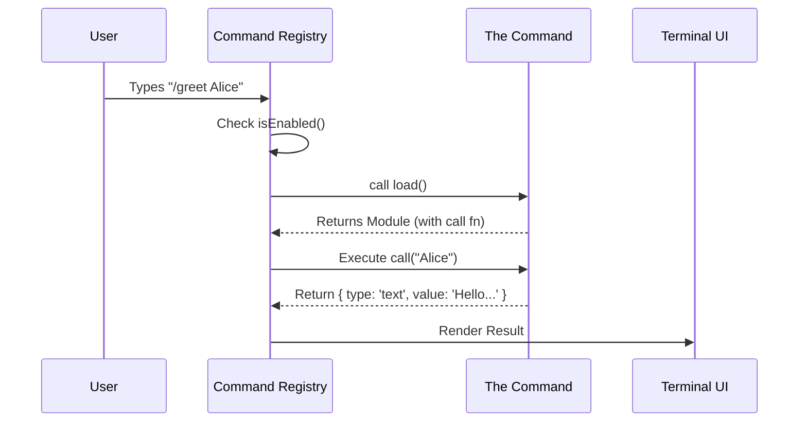

# Chapter 1: Command Architecture

Welcome to the **Command Architecture**! In this project, a "Command" is the fundamental unit of action.

## The Motivation: From Chatbot to Agent

If you are building a standard chatbot, text goes in, and text comes out. But what if you want the system to *do* something? What if you want it to edit a file, run a git commit, or show an interactive menu?

Think of your system as a character in a Role-Playing Game (RPG).
*   **The Model** is the player making decisions.
*   **The Commands** are the **Skill Tree**.

Each Command (like `/commit` or `/search`) is a specific ability in that skill tree. It has rules:
*   **Availability:** Who can use this skill? (Level requirement).
*   **Arguments:** What does it need to work? (Mana cost/Inputs).
*   **Execution:** What actually happens? (The spell effect).

By abstracting these tools into a unified `Command` structure, we treat built-in tools, user scripts, and plugins exactly the same way.

---

## Key Concepts

The architecture defines three "flavors" of commands. They all share a common identity but behave differently.

### 1. The Metadata (`CommandBase`)
Before a command does anything, it needs an ID card. This is the `CommandBase`. It tells the system *what* the command is and *who* can see it.

```typescript
export type CommandBase = {
  name: string          // e.g., "git-commit"
  description: string   // e.g., "Commits staged changes"
  isEnabled?: () => boolean // Is this skill unlocked right now?
  isHidden?: boolean    // Should we hide it from the help menu?
}
```
*   **Beginner Tip:** `isEnabled` is powerful. It allows a command to exist but remain "greyed out" until specific conditions are met (like being inside a Git repository).

### 2. The Three Flavors

#### A. Prompt Command (`PromptCommand`)
This is the simplest type. It's essentially a "macro" or a pre-written script. It injects instructions into the conversation context to guide the AI.

*   **Analogy:** A "Scroll" the wizard reads to cast a spell.
*   **Output:** Text instructions sent to the AI model.

#### B. Local Command (`LocalCommand`)
This runs a standard function on your machine. It takes text input and returns a text result.

*   **Analogy:** A "Sword Swing." Immediate, physical action.
*   **Output:** A string of text (e.g., the output of a CLI tool).

#### C. Local JSX Command (`LocalJSXCommand`)
This is the most advanced type. Instead of returning text, it returns a **React Component**. This renders interactive UI (buttons, forms, spinners) directly in the terminal using a library like Ink.

*   **Analogy:** Opening a generic "Inventory Menu." It pauses the game and lets the user click things.
*   **Output:** Visual UI elements.

---

## Use Case: Creating a "Greeter" Command

Let's build a simple **Local Command** called `greet`. It takes a name as an argument and returns a welcome message.

### Step 1: Define the Structure
First, we define the command object. We give it a type of `'local'`.

```typescript
const greetCommand: Command = {
  type: 'local',           // It runs a function locally
  name: 'greet',           // User types /greet
  description: 'Says hello to the user',
  supportsNonInteractive: true, // Can run without user input
  // ... implementation comes next
}
```
*   **Explanation:** We've created the "ID Card" for our command. The system now knows `/greet` exists.

### Step 2: Lazy Loading the Logic
To keep the application fast, we don't load the code for every command at startup. We use a `load()` function.

```typescript
// Inside the object from Step 1...
  load: async () => {
    // This code only runs when the user actually types /greet
    return {
      call: async (args, context) => {
        return { type: 'text', value: `Hello, ${args}!` }
      }
    }
  }
```
*   **Explanation:** `load` returns a module containing a `call` function. This `call` function receives the arguments (e.g., if user types `/greet Alice`, `args` is "Alice").

### Step 3: Handling the Result
The `call` function returns a `LocalCommandResult`.

```typescript
// The return value from the code above
{ 
  type: 'text', 
  value: 'Hello, Alice!' 
}
```
*   **Explanation:** The system receives this object and knows, "Ah, I should print 'Hello, Alice!' to the transcript."

---

## Under the Hood: How Execution Works

When a user types a command, several systems work together to make it happen.

### Visual Flow
Here is the lifecycle of a command execution:



### Implementation Details

The core definition resides in `command.ts`. Let's look at the `LocalCommand` type definition again to see how it ties together.

```typescript
type LocalCommand = {
  type: 'local'
  // Determines if this can run in scripts without a human watching
  supportsNonInteractive: boolean
  // The lazy-loader
  load: () => Promise<LocalCommandModule>
}
```

The `LocalCommandModule` is simply the container for the executable function:

```typescript
export type LocalCommandCall = (
  args: string,
  context: LocalJSXCommandContext,
) => Promise<LocalCommandResult>

export type LocalCommandModule = {
  call: LocalCommandCall
}
```

### Context & Safety
You might notice the `context` argument in `LocalCommandCall`. This gives the command access to the rest of the application, such as:
*   **Theme:** Light/Dark mode settings.
*   **API Keys:** To access external services.
*   **Tools:** Ability to use other tools.

However, just because a command *exists* doesn't mean it allows unsafe actions. The [Permission & Safety System](03_permission___safety_system.md) wraps around this architecture to ensure commands like `/delete-all-files` prompt the user for confirmation before executing.

Furthermore, once the command finishes, we need to remember what happened. The result is stored using the [Session & Transcript Persistence](02_session___transcript_persistence.md) layer.

---

## Conclusion

The **Command Architecture** acts as the skeleton of our system. It turns loose scripts and prompts into standardized "Skills" that look and feel the same to the user, whether they are simple text echoes or complex interactive UIs.

By using the `load()` pattern, we ensure the "Skill Tree" can grow infinitely large without slowing down the application startup.

In the next chapter, we will learn how the system remembers the history of these commands and the conversations surrounding them.

[Next Chapter: Session & Transcript Persistence](02_session___transcript_persistence.md)

---

Generated by [Code IQ](https://github.com/adityasoni99/Code-IQ)