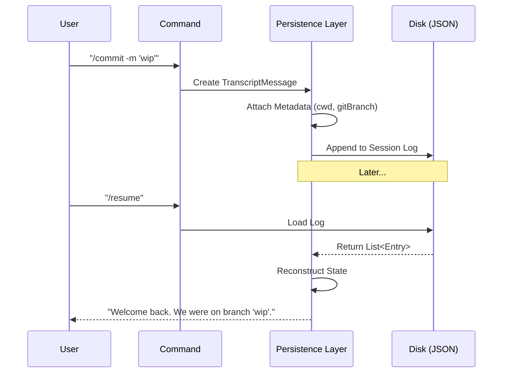

# Chapter 2: Session & Transcript Persistence

In the previous chapter, [Command Architecture](01_command_architecture.md), we learned how to make the agent perform actions. But an action without memory is fleeting. If you close your terminal, does the agent forget it wrote a file? Does it forget which Git branch it was on?

This chapter introduces **Session & Transcript Persistence**.

## The Motivation: A Ship's Log, Not a Diary

Most chat apps store a "Diary":
> *User: "Hi"*
> *Bot: "Hello"*

Our agent needs a **Ship's Log**. It needs to record the exact state of the "ship" (your environment) at every turn.

Imagine you are debugging a crash. You don't just want to know *what* was said. You need to know:
1.  **Context:** What directory were we in? (`cwd`)
2.  **State:** What git branch was active?
3.  **Changes:** Did the agent edit `index.ts` before crashing?
4.  **Identity:** Was this the main agent or a sub-agent helper?

By storing this rich data, we enable the **Resume** capability. You can quit the application, restart it, and the agent picks up exactly where it left off—variables, history, and context intact.

---

## Key Concepts

To achieve this, we don't just save strings of text. We save a database of **Entries**.

### 1. The Session ID
Every interaction begins with a unique ID. However, we don't just use a plain string. We use "Branded Types" to prevent mistakes (like mixing up a User ID with a Session ID).

```typescript
// From ids.ts
export type SessionId = string & { readonly __brand: 'SessionId' }

// We use a helper to generate or cast these
export function asSessionId(id: string): SessionId {
  return id as SessionId
}
```
*   **Beginner Tip:** A "Branded Type" is a TypeScript trick. It forces you to prove a string is truly a `SessionId` before the compiler lets you use it. It prevents bugs!

### 2. The Transcript Entry
The transcript is a list. But it's not a list of strings; it's a list of `Entry` objects. An `Entry` can be a chat message, but it can also be a hidden system event.

Here are a few "flavors" of entries found in `logs.ts`:

*   **TranscriptMessage:** Standard chat (User/Assistant).
*   **WorktreeStateEntry:** Records if we entered a specific Git worktree.
*   **FileHistorySnapshotMessage:** A backup of a file before we changed it.
*   **PRLinkMessage:** Remembers that this session is linked to GitHub PR #42.

### 3. The "Rich" Message
Even a standard text message carries heavy baggage. We call this a `SerializedMessage`.

```typescript
export type SerializedMessage = Message & {
  cwd: string         // Where were we?
  timestamp: string   // When did it happen?
  gitBranch?: string  // What code version?
  sessionId: string   // Which conversation?
}
```
*   **Why this matters:** When you resume a session, the agent looks at the last message's `cwd`. If you are currently in `/home/user`, but the last message was in `/home/user/project`, the agent knows it needs to switch directories back.

---

## Use Case: Resuming a Coding Task

Let's walk through a scenario: **The User asks the Agent to fix a bug, then closes the window.**

### Step 1: The Event Stream
As the agent works, it generates a stream of mixed events.

1.  **User:** "Fix the bug." -> `TranscriptMessage`
2.  **System:** (Agent checks git) -> `WorktreeStateEntry`
3.  **Agent:** (Edits file) -> `FileHistorySnapshotMessage` (Backup created)
4.  **Agent:** "I fixed it." -> `TranscriptMessage`

### Step 2: The Persistence Layer
These are saved to a JSON structure on the disk.

```json
[
  { "type": "message", "text": "Fix the bug", "cwd": "/src" },
  { "type": "worktree-state", "branch": "fix/login-bug" },
  { "type": "file-history-snapshot", "file": "login.ts", "content": "..." },
  { "type": "message", "text": "I fixed it", "cwd": "/src" }
]
```

### Step 3: Resuming
When the user types `claude resume`:
1.  The system reads the JSON.
2.  It replays the **WorktreeState** (checking out the branch).
3.  It loads the **File Snapshots** (so it knows what changed).
4.  It presents the chat history to the Model so it "remembers" the conversation.

---

## Under the Hood: The `Entry` Union

How does TypeScript handle a list containing so many different types of objects? We use a **Discriminated Union**.

This is the core definition in `logs.ts`. It acts as a router for data types.

```typescript
export type Entry =
  | TranscriptMessage
  | SummaryMessage
  | WorktreeStateEntry
  | FileHistorySnapshotMessage
  | PRLinkMessage
  // ... and many others
```

### Visualization: The Lifecycle of a Log



### Implementation Details

Let's look at two specific entry types to see how specialized they are.

#### 1. Tracking Git State (`WorktreeStateEntry`)
This entry allows the agent to handle complex git setups involving worktrees (checking out multiple branches at once).

```typescript
export type WorktreeStateEntry = {
  type: 'worktree-state' // The "Discriminator"
  sessionId: UUID
  worktreeSession: {
    originalCwd: string
    worktreePath: string
    worktreeBranch?: string
  } | null
}
```
*   **Explanation:** If `worktreeSession` is stored, the resume logic knows to `cd` into that specific folder. If it is `null`, it knows the user exited that mode.

#### 2. Tracking Attribution (`AttributionSnapshotMessage`)
In a multi-agent world (or when working with a human), we need to know who wrote which line of code.

```typescript
export type AttributionSnapshotMessage = {
  type: 'attribution-snapshot'
  messageId: UUID
  fileStates: Record<string, {
    claudeContribution: number // How many chars did the AI write?
  }>
}
```
*   **Explanation:** This tracks metrics. We can calculate "The AI wrote 80% of this file" by replaying these snapshots.

---

## Conclusion

The **Session & Transcript Persistence** layer is the brain's long-term memory. By treating history as a database of structured events—rather than just a text log—we allow the agent to:
1.  Safely resume complex tasks.
2.  Undo file changes (using snapshots).
3.  Understand the context (git branches, directories) surrounding every message.

Now that our agent can execute commands and remember the results, we need to ensure it doesn't do anything dangerous.

[Next Chapter: Permission & Safety System](03_permission___safety_system.md)

---

Generated by [Code IQ](https://github.com/adityasoni99/Code-IQ)