# Chapter 3: Permission & Safety System

In the previous chapter, [Session & Transcript Persistence](02_session___transcript_persistence.md), we gave our agent a long-term memory. It remembers where it is and what it has done.

But a powerful memory combined with powerful tools (like file editing or shell execution) creates a risk. What if the agent hallucinates and tries to delete your entire project? What if it tries to upload your `.env` file to a public server?

This chapter introduces the **Permission & Safety System**.

## The Motivation: The Club Bouncer

Imagine your computer is an exclusive nightclub. The **Agent** is a guest who wants to enter various rooms (folders) and interact with people (files/APIs).

The **Permission System** is the **Bouncer** at the door.

Every time the agent tries to use a tool—whether it's writing a file (`write_file`) or running a terminal command (`run_command`)—it must present its "ID" to the Bouncer. The Bouncer checks three things:
1.  **The Mode:** Is it "Open House" night or "VIP Only"?
2.  **The Rules:** Is this specific guest on the blacklist?
3.  **The Intuition (Classifiers):** Does this guest *look* suspicious?

Based on this, the Bouncer makes one of three decisions: **Allow**, **Deny**, or **Ask the Manager** (You).

---

## Key Concepts

The system is built around three core definitions found in `permissions.ts`.

### 1. Permission Modes
The "Mode" sets the overall strictness level for the session.

```typescript
// From permissions.ts
export const EXTERNAL_PERMISSION_MODES = [
  'acceptEdits',      // Trusted. Allows most file edits automatically.
  'default',          // Balanced. Asks for potentially risky actions.
  'dontAsk',          // Strict. If it's risky, just block it.
  'plan',             // Read-only. The agent can look but cannot touch.
] as const
```
*   **Beginner Tip:** When you start the application, you choose a mode. `default` is best for daily use. `acceptEdits` is great when you want the agent to refactor a lot of code without nagging you.

### 2. Permission Rules
Specific overrides can be set for specific tools. A rule answers: "Who said this is allowed?"

```typescript
export type PermissionRule = {
  source: 'userSettings' | 'projectSettings' | 'session',
  ruleBehavior: 'allow' | 'deny' | 'ask',
  ruleValue: {
    toolName: string // e.g., "run_command"
  }
}
```
*   **Explanation:** You might have a `projectSetting` that says: *"Always **deny** the `npm publish` command in this repo."*

### 3. Permission Decisions
This is the final verdict returned by the system before a tool runs.

```typescript
export type PermissionDecision = 
  | { behavior: 'allow', updatedInput?: ... }
  | { behavior: 'deny', message: string }
  | { behavior: 'ask', message: string }
```
*   **Explanation:** The rest of the codebase waits for this object. If it receives `'ask'`, it pauses execution and renders a dialog box to the user.

---

## Use Case: The "Delete Command" Safety Check

Let's walk through a scenario: **The Agent tries to run `rm -rf /`**.

### Step 1: The Request
The agent constructs a command object. It wants to use the tool `run_command` with the argument `rm -rf /`.

### Step 2: The Logic Check
The Permission System analyzes the request. It notices this is a high-stakes command. Even if you are in `acceptEdits` mode, the system might have a "safety clamp" for destructive shell commands.

### Step 3: The Result (`PermissionAskDecision`)
The system returns an "Ask" decision.

```typescript
const decision: PermissionAskDecision = {
  behavior: 'ask',
  message: 'The agent wants to run a destructive command: rm -rf /',
  decisionReason: {
    type: 'safetyCheck',
    reason: 'High risk shell command detected'
  }
}
```

### Step 4: The User Interface
Because `behavior` is `'ask'`, the tool execution pauses. The user sees a prompt:
> ⚠️ **Warning:** The agent wants to delete files. Allow? [Y/n]

Only if the user types "Y" does the system convert this into an `'allow'` decision and proceed.

---

## Under the Hood: Internal Implementation

How does the system decide? It's not just a simple `if/else`. It uses a pipeline of checks, including "Classifiers" (mini-AI models) that evaluate risk.

### Visual Flow: The Permission Pipeline

```mermaid
sequenceDiagram
    participant A as Agent
    participant S as Safety System
    participant C as Classifier (AI)
    participant U as User

    A->>S: Request: "Update file.ts"
    
    rect rgb(20, 20, 20)
        Note right of S: Pipeline Start
        S->>S: Check Explicit Rules (Blacklist)
        S->>C: Check "Is this malicious?"
        C-->>S: "Looks safe (Low Risk)"
        S->>S: Check Current Mode
    end
    
    alt Mode is 'default' (Strict)
        S-->>U: Prompt: "Allow file write?"
        U->>S: Click "Yes"
        S-->>A: Permission Granted
    else Mode is 'acceptEdits' (Trusted)
        S-->>A: Permission Granted (Auto)
    end
```



### Implementation Details

Let's look at how the code structures these complex decisions.

#### 1. The Decision Reason
When a decision is made, we must know *why*. Was it a rule? Was it the AI classifier? Was it just the default mode?

```typescript
// From permissions.ts
export type PermissionDecisionReason =
  | { type: 'rule', rule: PermissionRule } // "Because config.json said so"
  | { type: 'mode', mode: PermissionMode } // "Because you are in Plan mode"
  | { type: 'classifier', reason: string } // "Because the AI thinks it's safe"
  | { type: 'safetyCheck', reason: string } // "Because it matches a danger pattern"
```
*   **Beginner Tip:** This "traceability" is crucial for debugging. If the agent is blocked, you can look at the logs and see `type: 'rule'` to know you need to update your settings.

#### 2. The Smart Classifier
Sometimes, regex isn't enough. We use a `ClassifierResult` to handle fuzzy logic.

```typescript
export type ClassifierResult = {
  matches: boolean         // Did the AI flag this?
  confidence: 'high' | 'medium' | 'low'
  reason: string           // e.g., "Command attempts to exfiltrate data"
}
```
*   **Explanation:** We send the command to a small, fast, local LLM. We ask: *"Is this command dangerous?"* If the confidence is high, the Permission System overrides the default settings to protect the user.

#### 3. Attribution and Risk
For advanced reporting, we calculate a `RiskLevel`.

```typescript
export type RiskLevel = 'LOW' | 'MEDIUM' | 'HIGH'

export type PermissionExplanation = {
  riskLevel: RiskLevel
  explanation: string // Human readable summary
  reasoning: string   // Technical details
}
```
*   **Explanation:** This data is often displayed in the UI next to the "Allow/Deny" buttons, helping the user make an informed choice.

---

## Conclusion

The **Permission & Safety System** is the gatekeeper of the application. It ensures that while the [Command Architecture](01_command_architecture.md) provides the *ability* to act, and [Session Persistence](02_session___transcript_persistence.md) provides the *context* to act intelligently, the Agent never acts *recklessly*.

By separating "Capability" (Tools) from "Policy" (Permissions), we can build powerful agents that are safe enough to run on your local machine.

Now that the agent is safe to accept input, we need to handle the complex state of that input—what if the user is typing, pasting an image, or interrupting the agent?

[Next Chapter: Input State Management](04_input_state_management.md)

---

Generated by [Code IQ](https://github.com/adityasoni99/Code-IQ)