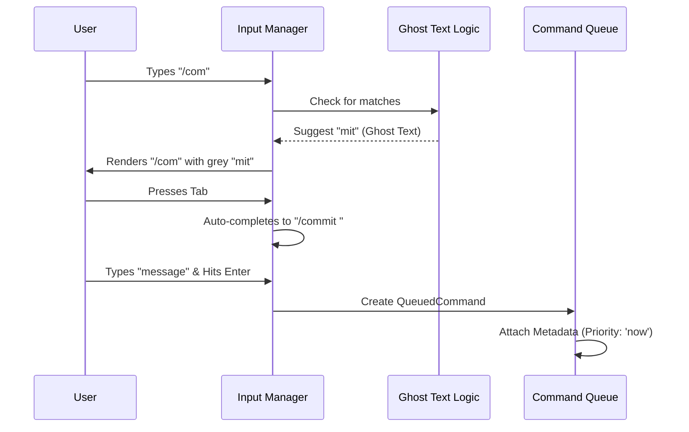

# Chapter 4: Input State Management

In the previous chapter, [Permission & Safety System](03_permission___safety_system.md), we established the "Bouncer" that stops the agent from doing dangerous things.

Now that we are safe, we need to talk. You might think handling user input is easy: just an empty box where you type letters. But in a professional agent system, the input box is a complex engine. It handles **Vim keybindings**, **image pasting**, **autocomplete suggestions**, and **history navigation**.

This chapter covers **Input State Management**: the cockpit controls of our application.

## The Motivation: More Than Just a String

If you are building a simple web form, you just care about the text value: `const name = "Alice"`.

But for an AI Agent running in a terminal, we need to manage the **entire experience** of typing.
1.  **Cursor Logic:** If the user presses the `Up Arrow`, do we move the cursor up a line, or do we fetch the previous command from history?
2.  **Modes:** Are we typing text (`Insert Mode`) or navigating code (`Vim Normal Mode`)?
3.  **Rich Content:** What happens if the user pastes a generic screenshot? We can't put binary image data into a text string.
4.  **Ghost Text:** How do we show autocomplete suggestions (like greyed-out text) without actually changing what the user typed?

The Input State Manager acts as the translation layer between your keyboard and the agent's brain.

---

## Key Concepts

The input system is defined primarily in `textInputTypes.ts`. Here are the core components used to manage this complexity.

### 1. The Input State (`TextInputState`)
This tracks where you are physically on the screen. It's not enough to know *what* was typed; we must know *how* it is displayed.

```typescript
export type BaseInputState = {
  renderedValue: string  // What the user sees
  offset: number         // Where the cursor is (index 0-100)
  cursorLine: number     // Vertical position
  cursorColumn: number   // Horizontal position
  
  // Is the user currently pasting a massive block of text?
  isPasting?: boolean    
}
```
*   **Beginner Tip:** `offset` is crucial. If a user wants to delete a character, we don't just delete the last letter; we delete the letter at the `offset`.

### 2. Ghost Text (`InlineGhostText`)
"Ghost Text" is the grey text that appears ahead of your cursor to suggest a command. It guides the user without forcing them to commit to the text.

```typescript
export type InlineGhostText = {
  text: string           // e.g., "mit" (completing "com" -> "commit")
  fullCommand: string    // e.g., "commit"
  insertPosition: number // Where does this ghost start?
}
```
*   **Analogy:** This is like the "Heads-Up Display" (HUD) in a video game. It overlays information on the real world (your input) to help you aim.

### 3. Vim Modes (`VimInputState`)
For power users, we support Vim bindings. This introduces the concept of **Modal Editing**.

```typescript
export type VimMode = 'INSERT' | 'NORMAL'

export type VimInputState = BaseInputState & {
  mode: VimMode               // Are we typing or commanding?
  setMode: (mode: VimMode) => void
}
```
*   **Explanation:** In `INSERT` mode, pressing 'i' types the letter 'i'. In `NORMAL` mode, pressing 'i' switches you to Insert mode. The state manager must listen to every keystroke to decide what to do.

---

## Use Case: The "Smart Paste"

Let's look at a common scenario: **The User copies a screenshot of an error and pastes it into the terminal.**

Standard terminals would crash or print gibberish characters. Our Input Manager handles this gracefully.

### Step 1: Detecting the Paste
The `BaseTextInputProps` defines a handler specifically for images.

```typescript
// Inside BaseTextInputProps
readonly onImagePaste?: (
  base64Image: string, // The raw image data
  mediaType?: string,  // e.g., "image/png"
  filename?: string    // e.g., "screenshot.png"
) => void
```

### Step 2: Queuing the Command
When the user hits "Enter", we don't just send a string. We bundle the text *and* the image into a `QueuedCommand`.

```typescript
export type QueuedCommand = {
  value: string          // The text: "Fix this error"
  mode: 'prompt'         // Standard chat mode
  
  // The magic happens here:
  pastedContents?: Record<number, PastedContent> 
}
```
*   **Explanation:** The `pastedContents` field acts like an email attachment. The `value` is the body of the email, and `pastedContents` holds the heavy files.

---

## Under the Hood: The Input Pipeline

How does a keystroke become a command? It goes through a pipeline of filtering, ghost-text checking, and finally, queuing.

### Visual Flow



### Implementation Details

Let's look deeper into the `QueuedCommand` in `textInputTypes.ts`. This is the final output of the Input State Manager. It prepares the data for the [Command Architecture](01_command_architecture.md).

#### 1. Prioritization (`QueuePriority`)
Not all inputs are equal. If the agent is running a long loop, and you press `Esc`, you want that to happen *now*.

```typescript
/**
 * now   - Interrupt immediately (Abort current tool)
 * next  - Wait for current tool, but go before next API call
 * later - Wait for the agent to finish its whole turn
 */
export type QueuePriority = 'now' | 'next' | 'later'
```

#### 2. The Bridge Guard (`skipSlashCommands`)
Sometimes, input comes from a remote UI (like a phone app connected to the agent). In these cases, we might want to disable local slash commands to prevent security issues or confusion.

```typescript
export type QueuedCommand = {
  // ... other fields
  
  // If true, "/quit" is treated as plain text, not a command.
  skipSlashCommands?: boolean
  
  // Did this come from a remote bridge?
  bridgeOrigin?: boolean
}
```
*   **Beginner Tip:** This is a safety feature. It ensures that inputs from untrusted sources (or sources that can't see the terminal) don't accidentally trigger powerful local actions.

---

## Conclusion

**Input State Management** is about robustly handling the chaotic nature of human interaction. By treating input as a complex state object—containing cursor positions, modes, and attachments—rather than a simple string, we enable features like:
1.  **Rich Media:** Pasting images directly into the flow.
2.  **Developer Experience:** Vim bindings and Autocomplete.
3.  **Responsiveness:** Prioritizing "Abort" signals over standard chat.

Now that we have collected the user's input, processed it, and queued it, we might want to extend the agent's capabilities beyond what came in the box.

[Next Chapter: Extensibility (Plugins & Hooks)](05_extensibility__plugins___hooks_.md)

---

Generated by [Code IQ](https://github.com/adityasoni99/Code-IQ)