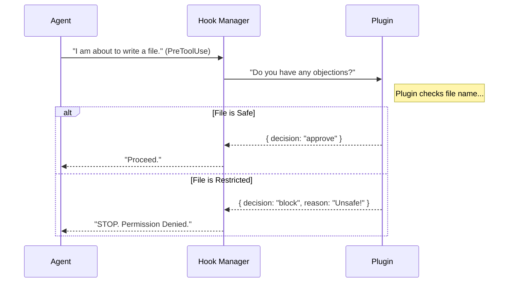

# Chapter 5: Extensibility (Plugins & Hooks)

In the previous chapter, [Input State Management](04_input_state_management.md), we learned how the system handles what the user types. But what if the user wants the agent to do something it wasn't originally programmed to do?

This chapter introduces **Extensibility**.

## The Motivation: The "Browser Extension" Model

Think about your web browser. Out of the box, it can browse the web. But if you want to block ads, manage passwords, or check your grammar, you install **Extensions**.

We apply the same logic here:
1.  **Core Agent:** The base system (safe, fast, minimal).
2.  **Plugins:** Optional packages you install to add new skills.
3.  **Hooks:** The mechanism plugins use to "listen" and react to what the agent is doing.

If you wanted to build a feature that says, *"Stop the agent if it tries to commit code without running tests first,"* you wouldn't rewrite the agent's source code. You would write a **Plugin** with a **Hook**.

---

## Key Concepts

The system separates the *definition* of a plugin from the *logic* that runs when events happen.

### 1. The Plugin Manifest
Just like a shipping manifest lists what is inside a container, a **Plugin Manifest** tells the system what is inside the plugin. Does it have new commands? Does it have specialized tools (MCP Servers)?

```typescript
// From plugin.ts
export type LoadedPlugin = {
  name: string          // e.g., "git-safety-check"
  manifest: PluginManifest
  enabled?: boolean     // Is it turned on?
  
  // What does this plugin provide?
  hooksConfig?: HooksSettings
  mcpServers?: Record<string, McpServerConfig>
}
```
*   **Beginner Tip:** Think of `LoadedPlugin` as the installation record. It tells the system: "The 'git-safety-check' plugin is installed, enabled, and located at this folder path."

### 2. The Hook Event
A **Hook** is an event listener. It waits for a specific moment in the agent's lifecycle.

Common events (defined in `hooks.ts`) include:
*   `SessionStart`: The user just opened the app.
*   `PreToolUse`: The agent is *about* to run a command (e.g., `write_file`).
*   `PostToolUse`: The agent *just finished* running a command.
*   `UserPromptSubmit`: The user just hit "Enter".

### 3. The Hook Result
When a Hook triggers, it must give an answer back to the main system. It can say:
*   **"Carry on."** (Do nothing).
*   **"Stop!"** (Block the action).
*   **"Here is extra info."** (Inject context into the conversation).

---

## Use Case: The "Safety Net" Plugin

Let's imagine a plugin that prevents the agent from editing `.env` files (which contain secrets) without explicit permission, even if the global safety settings usually allow edits.

### Step 1: Listening for the Event
The plugin registers a hook for `PreToolUse`. This event fires *before* the tool runs.

### Step 2: The Logic (Conceptual)
The hook receives the input:
> *Agent is trying to use `write_file` on `.env`*

The hook logic checks the filename. It sees `.env`.

### Step 3: The Response
The hook returns a specific object to block the action.

```typescript
// Conceptual response object
{
  hookEventName: 'PreToolUse',
  permissionDecision: 'deny', // Block it!
  permissionDecisionReason: 'Plugins are not allowed to touch .env files'
}
```

### Step 4: The Outcome
The agent receives this "Deny" signal. Instead of writing the file, it sees an error: *"Action blocked by plugin: Plugins are not allowed to touch .env files."*

---

## Under the Hood: The Hook Lifecycle

How does the system ensure plugins don't freeze the application? It uses a strict schema for communication.

### Visual Flow



### Implementation Details

Let's look at the actual types in `hooks.ts`.

#### 1. Defining the Response Schema
Because plugins might be written in other languages or run in different processes, we use **Zod** (a validation library) to ensure the data they send back is perfect.

```typescript
// From hooks.ts
export const syncHookResponseSchema = lazySchema(() =>
  z.object({
    // Can we proceed?
    decision: z.enum(['approve', 'block']).optional(),
    
    // If we block, why?
    reason: z.string().optional(),
    
    // Updates to permissions
    permissionDecision: permissionBehaviorSchema().optional(),
  })
)
```
*   **Explanation:** This code creates a strict contract. If a plugin sends a response with a typo (like `dicision` instead of `decision`), the system rejects it immediately to prevent crashes.

#### 2. The Aggregated Result
Since you might have 10 plugins installed, the system has to collect answers from *all* of them. This is the `AggregatedHookResult`.

```typescript
export type AggregatedHookResult = {
  // Did any plugin say "Stop"?
  preventContinuation?: boolean
  stopReason?: string

  // Did any plugin add new data to the prompt?
  additionalContexts?: string[]
  
  // Did any plugin change the input arguments?
  updatedInput?: Record<string, unknown>
}
```
*   **Beginner Tip:** If Plugin A says "Allow" but Plugin B says "Block", the `preventContinuation` flag will be set to `true`. Safety always wins.

#### 3. Injecting Context
Hooks aren't just for blocking. They can be helpful! A `SessionStart` hook might check your project folder and say:

```typescript
{
  hookEventName: 'SessionStart',
  additionalContext: 'NOTICE: This project uses Python 2.7. Be careful.'
}
```
The system takes this string and secretly whispers it to the Agent so it knows how to behave, without the user having to type it manually.

---

## Conclusion

**Extensibility** turns our agent from a static tool into a platform.
1.  **Plugins** bundle capabilities (`LoadedPlugin`).
2.  **Hooks** intercept events (`PreToolUse`, `SessionStart`).
3.  **Schemas** ensure that plugins—even buggy ones—cannot crash the core system (`hookJSONOutputSchema`).

By using this architecture, developers can build tools that inspect, modify, and improve the agent's workflow without ever touching the core source code.

This concludes the core logic of the agent. But how do we know if the agent is working correctly? How do we track errors across all these plugins and sessions?

[Next Chapter: Telemetry & Event Contracts](06_telemetry___event_contracts.md)

---

Generated by [Code IQ](https://github.com/adityasoni99/Code-IQ)