# Chapter 6: Telemetry & Event Contracts

In the previous chapter, [Extensibility (Plugins & Hooks)](05_extensibility__plugins___hooks_.md), we learned how to let outside developers add new features to our agent.

But with great power comes great complexity. If a user says "The agent crashed," and they have 5 different plugins installed, running on a specific version of Linux, inside a Docker container... how do you debug that?

This chapter introduces **Telemetry & Event Contracts**.

## The Motivation: The "Black Box" Flight Recorder

In a simple script, you might use `console.log("Something went wrong")`.
In a complex AI agent, "Something went wrong" is useless.

We need a **Flight Recorder**.
When an airplane flies, it records *everything*: altitude, speed, wind direction, engine temperature. It doesn't write this in a diary; it writes it in a strict, mathematical format that never changes.

Our Telemetry system does the same. It defines a **Strict Contract** (a specific shape of data) that must be sent whenever an event happens. This ensures that whether the event comes from a Mac, a Windows machine, or a GitHub Action, the data looks exactly the same to our analytics backend.

---

## Key Concepts

We don't just send JSON blobs. We use strictly typed interfaces generated from **Protobufs** (Protocol Buffers). This is a way of defining data structures that works across any programming language.

### 1. The Environment (`EnvironmentMetadata`)
Context is everything. If the agent fails, the first question is: "Where are we?"
This structure captures the state of the machine.

```typescript
export interface EnvironmentMetadata {
  platform?: string          // e.g., "darwin" (macOS)
  node_version?: string      // e.g., "v18.1.0"
  terminal?: string          // e.g., "iTerm.app"
  is_ci?: boolean           // Are we running in a robot (CI/CD)?
  is_github_action?: boolean // Specific CI check
}
```
*   **Beginner Tip:** This isn't just about debugging crashes. It helps us answer questions like: *"Do most of our users use VS Code or the System Terminal?"*

### 2. The Universal Clock (`Timestamp`)
Time is tricky. Timezones, leap seconds, and different formats make sorting logs a nightmare.
We use a standardized `Timestamp` object.

```typescript
export interface Timestamp {
  seconds?: number  // Seconds since 1970 (Unix Epoch)
  nanos?: number    // Nanoseconds (for extreme precision)
}
```
*   **Why strict?** This prevents one developer from sending `"2023-01-01"` and another sending `"Jan 1st"`. The math must match.

### 3. The Master Event (`ClaudeCodeInternalEvent`)
This is the envelope that holds everything. It combines *what* happened with *where* it happened.

```typescript
export interface ClaudeCodeInternalEvent {
  event_name?: string        // e.g., "tengu_api_success"
  session_id?: string        // The conversation ID from Chapter 2
  env?: EnvironmentMetadata  // The machine info from above
  auth?: PublicApiAuth       // Who is this user?
  client_timestamp?: Date    // When did it happen?
}
```

---

## Use Case: Reporting a "Bug Fix" Event

Let's imagine the agent just successfully fixed a bug in your code. We want to record this victory.

### Step 1: Gather the Environment
First, the system looks at where it is running.

```typescript
const myEnv: EnvironmentMetadata = {
  platform: 'darwin',       // macOS
  terminal: 'vscode',
  node_version: 'v20.5.0',
  is_ci: false              // A real human is watching
}
```

### Step 2: Construct the Event
We create the strictly typed event object. If we try to add a field that doesn't exist (like `mood: 'happy'`), TypeScript will yell at us. This is the "Contract" in action.

```typescript
const successEvent: ClaudeCodeInternalEvent = {
  event_name: 'bug_fix_success',
  session_id: 'sess_12345',
  env: myEnv,
  // usage metrics
  additional_metadata: JSON.stringify({ 
    files_changed: 2, 
    duration_ms: 500 
  })
}
```

### Step 3: Serialization
Before sending this over the internet, we convert it to a standard format (JSON or Binary).

```typescript
// The generated code provides a helper for this
const payload = ClaudeCodeInternalEvent.toJSON(successEvent);

// Result: A clean object ready for the API
// { "event_name": "...", "env": { "platform": "darwin" } }
```
*   **Explanation:** The `toJSON` method ensures that complex types (like Dates) are converted to strings in the exact format the server expects.

---

## Under the Hood: The Flight Recorder Flow

How does an event get from your code to the database?

### Visual Flow

```mermaid
sequenceDiagram
    participant Agent
    participant TE as Telemetry Engine
    participant VB as Validation (Protobuf)
    participant S as Server

    Agent->>TE: "Task Completed"
    TE->>TE: Gather Environment (OS, Node ver)
    TE->>TE: Generate Timestamp
    TE->>VB: Create ClaudeCodeInternalEvent
    
    rect rgb(20, 20, 20)
        Note right of VB: The Contract Check
        VB->>VB: Ensure types match Schema
    end
    
    VB-->>TE: Validated Object
    TE->>S: Send Data
```



### Implementation Details

Let's look at the generated files provided in the project. These files (`.ts`) are usually auto-generated from a `.proto` definition file.

#### 1. The Helper Functions (`MessageFns`)
You'll notice objects like `EnvironmentMetadata` are accompanied by a constant with the same name. This holds the tools to work with that data type.

```typescript
// From generated/.../claude_code_internal_event.ts
export const EnvironmentMetadata: MessageFns<EnvironmentMetadata> = {
  // Converts raw JSON into the strict Type
  fromJSON(object: any): EnvironmentMetadata {
    return {
      platform: isSet(object.platform) ? String(object.platform) : '',
      is_ci: isSet(object.is_ci) ? Boolean(object.is_ci) : false,
      // ... checks every single field manually
    }
  },
  
  // Converts strict Type to JSON for sending
  toJSON(message: EnvironmentMetadata): unknown {
    // ...
  }
}
```
*   **Explanation:** This code is verbose so you don't have to be. It handles `null` checks, type conversions (String to Number), and defaults (setting `false` if `is_ci` is missing).

#### 2. The Event Union
The `ClaudeCodeInternalEvent` is designed to be a "Union" of all possible things we might want to track.

```typescript
export interface ClaudeCodeInternalEvent {
  // Core Data
  event_name?: string
  
  // Specific Contexts (Optional)
  slack?: SlackContext        // Only used if running in Slack
  swe_bench_run_id?: string   // Only used if running benchmarks
  marketplace_name?: string   // Only used if installed via marketplace
}
```
*   **Beginner Tip:** By having one giant event definition with many optional fields, we create a single "Pipeline". We don't need 50 different API endpoints for 50 different events. We just have one endpoint that accepts `ClaudeCodeInternalEvent`.

---

## Conclusion

**Telemetry & Event Contracts** provide the nervous system for our agent. 
1.  **Strict Types** ensure we speak a consistent language.
2.  **Environment Metadata** gives us the context of the user's machine.
3.  **Generated Code** handles the boring work of validation and serialization.

This "Flight Recorder" ensures that when we improve the [Command Architecture](01_command_architecture.md) or add new [Permissions](03_permission___safety_system.md), we can scientifically measure if we are making the agent better or worse.

This concludes the beginner's guide to the **types** project architecture! You now understand the full loop:
1.  **Commands** define actions.
2.  **Persistence** remembers history.
3.  **Safety** protects the user.
4.  **Input** handles complex interactions.
5.  **Plugins** allow expansion.
6.  **Telemetry** measures success.

Happy Coding!

---

Generated by [Code IQ](https://github.com/adityasoni99/Code-IQ)