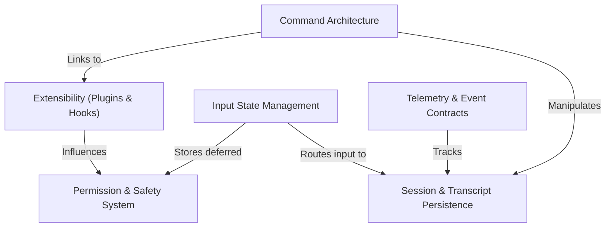

# Tutorial: types

This project defines the core **TypeScript type definitions** that structure the Claude Code CLI. It establishes the contracts for an *agentic workflow*, unifying **interactive commands**, **persistent session history**, and a granular **permission system** with an extensible architecture for **plugins and hooks**, ensuring type safety across the application's lifecycle and **telemetry** reporting.

## Chapters

1. [Command Architecture](01_command_architecture.md)
2. [Session & Transcript Persistence](02_session___transcript_persistence.md)
3. [Permission & Safety System](03_permission___safety_system.md)
4. [Input State Management](04_input_state_management.md)
5. [Extensibility (Plugins & Hooks)](05_extensibility__plugins___hooks_.md)
6. [Telemetry & Event Contracts](06_telemetry___event_contracts.md)

---

Generated by [Code IQ](https://github.com/adityasoni99/Code-IQ)