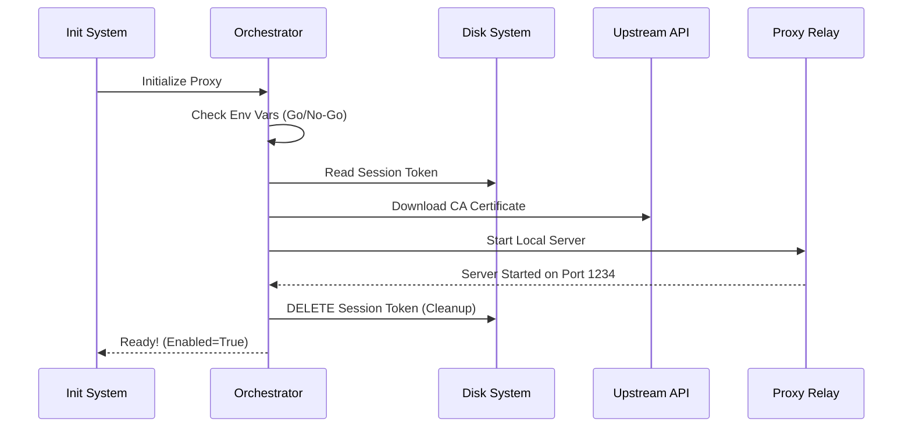

# Chapter 1: Proxy Orchestration & Lifecycle

Welcome to the **Upstream Proxy** project! If you are new to proxy servers or networking, don't worry. We are going to break this down into simple, manageable pieces.

## The Stage Manager Analogy

Imagine a high-security theater production. For the show to start, several things must happen in a perfect sequence:

1.  **Check the Schedule:** Is the show supposed to happen today?
2.  **Prepare the Props:** Get the necessary authorized equipment.
3.  **Unlock the Doors:** Open the theater so actors can get in.
4.  **Burn the Script:** Once the actors know their lines (the connection is made), destroy the secret script so no spies can steal it.

In our code, the **Orchestration & Lifecycle** module is the **Stage Manager**. Its job is to check the environment, set up security certificates (props), start the connection relay (open doors), and delete the sensitive authentication token (burn the script).

### Use Case: The Secure Coding Session

Imagine a developer starts a cloud coding environment. They want to run `npm install` or `pip install`.
1.  We need to intercept that traffic to authorize it.
2.  We need to do it **automatically** when the container starts.
3.  We need to ensure no sensitive passwords (tokens) are left lying around on the hard drive.

This chapter explains the code that automates this entire flow.

---

## Key Concepts

Before looking at the code, let's understand the three main phases of the lifecycle:

1.  **Initialization:** The "Go/No-Go" decision. We check environment variables (like asking "Is the feature enabled?").
2.  **Setup:** We download a **Certificate Authority (CA) Bundle**. This is like an ID badge that tells tools (like Python or Node.js) to trust our proxy.
3.  **Cleanup:** We start the proxy, and immediately delete the file containing the secret password (session token).

---

## The "Main Loop" Walkthrough

Here is what happens step-by-step when our application starts up.



1.  **Check Env:** If disabled, stop immediately.
2.  **Read Token:** Read the secret key from the disk.
3.  **Download Certs:** Get the "ID Badge" from the server.
4.  **Start Relay:** Launch the listener (covered in [CONNECT-over-WebSocket Relay](02_connect_over_websocket_relay.md)).
5.  **Delete Token:** Remove the secret key file for safety.

---

## Internal Implementation

Let's look at how we implement this in `upstreamproxy.ts`. We will look at simplified versions of the code to understand the logic.

### Step 1: The Go/No-Go Decision

First, we check if the feature is actually turned on using Environment Variables.

```typescript
// upstreamproxy.ts
export async function initUpstreamProxy() {
  // Check if the overall remote environment is active
  if (!process.env.CLAUDE_CODE_REMOTE) return { enabled: false }

  // Check if the specific proxy feature flag is on
  if (!process.env.CCR_UPSTREAM_PROXY_ENABLED) return { enabled: false }
  
  // If we pass these checks, we proceed...
}
```

**Explanation:** If the environment variables aren't set to "true", the function returns immediately. The "Stage Manager" sees there is no show tonight and goes home.

### Step 2: Reading the Secret

If the show is on, we need the "Secret Script" (the Session Token) to authenticate with the upstream server.

```typescript
// upstreamproxy.ts
const tokenPath = '/run/ccr/session_token'

// Read the token from the file system
const token = await readToken(tokenPath)

if (!token) {
  // If the file is missing, we can't start.
  return { enabled: false }
}
```

**Explanation:** We attempt to read the token file. If it's missing, we log a warning and disable the proxy. We fail "open"—meaning if the proxy breaks, we just disable it so we don't crash the whole system.

### Step 3: Preparing the Props (Certificates)

Tools like `curl` or `pip` are paranoid. They won't talk to our proxy unless they trust it. We download a Certificate Authority (CA) bundle to establish this trust.

```typescript
// upstreamproxy.ts
const baseUrl = process.env.ANTHROPIC_BASE_URL
const caBundlePath = join(homedir(), '.ccr', 'ca-bundle.crt')

// Download remote certs and merge with system certs
const caOk = await downloadCaBundle(baseUrl, SYSTEM_CA_BUNDLE, caBundlePath)

if (!caOk) return { enabled: false } // No props, no show.
```

**Explanation:** We fetch the certificate from our API and combine it with the Linux system's existing certificates. We save this new "Super Bundle" to a file. We will tell other programs to use this file later in [Environment Injection](04_environment_injection.md).

### Step 4: Starting the Relay & Cleaning Up

This is the most critical part. We start the actual networking component and then destroy the evidence (the token file).

```typescript
// upstreamproxy.ts
try {
    // 1. Start the Relay (The component that actually handles traffic)
    // See Chapter 2 for details on startUpstreamProxyRelay
    const relay = await startUpstreamProxyRelay({ wsUrl, sessionId, token })

    // 2. Register cleanup so it stops when the app stops
    registerCleanup(async () => relay.stop())

    // 3. BURN THE SCRIPT: Delete the token file from disk
    // We only do this AFTER the relay is running successfully.
    await unlink(tokenPath) 

    state = { enabled: true, port: relay.port, caBundlePath }
} catch (err) {
    // If anything fails, log it and stay disabled
}
```

**Explanation:**
1.  We call `startUpstreamProxyRelay`. This connects to the internet via WebSocket.
2.  **Crucially**, once the connection is established, we run `unlink(tokenPath)`. This deletes the file containing the secret.
3.  Why? Because the token is now safely inside the memory of our running process. We don't want other processes or hackers peeking at the hard drive to find it.

## Setting the Scene for Actors

Once `initUpstreamProxy` finishes successfully, we have a running server and a certificate file. But other programs (the actors) don't know about it yet.

We provide a function `getUpstreamProxyEnv` that generates the instructions for them.

```typescript
// upstreamproxy.ts
export function getUpstreamProxyEnv() {
  if (!state.enabled) return {}

  return {
    // Tell tools to route traffic to our localhost port
    HTTPS_PROXY: `http://127.0.0.1:${state.port}`,
    // Tell tools to trust our custom certificate file
    SSL_CERT_FILE: state.caBundlePath,
    // ... other variants like NODE_EXTRA_CA_CERTS
  }
}
```

**Explanation:** This function doesn't *do* anything active; it just returns a list of settings. The system will inject these settings into terminal shells so that every command run by the user automatically uses our proxy.

---

## Conclusion

In this chapter, we learned how the **Proxy Orchestration** acts as a Stage Manager. It:
1.  Verifies the environment.
2.  Secures the necessary certificates.
3.  Starts the relay server.
4.  Deletes the sensitive token file to ensure security.

Now that the stage is set and the doors are open, how does the actual traffic move? How do we turn a standard HTTP request into something that can travel over a secure WebSocket?

Join us in the next chapter to find out!

[Next Chapter: CONNECT-over-WebSocket Relay](02_connect_over_websocket_relay.md)

---

Generated by [Code IQ](https://github.com/adityasoni99/Code-IQ)