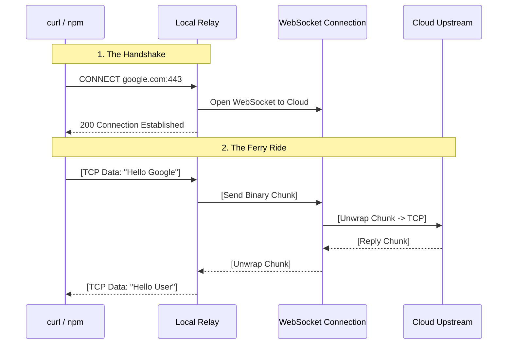

# Chapter 2: CONNECT-over-WebSocket Relay

In the previous chapter, [Proxy Orchestration & Lifecycle](01_proxy_orchestration___lifecycle.md), we acted as the **Stage Manager**. We set up the environment, got our security certificates ready, and prepared to start the show.

Now, we need to look at the star of the show: the **Relay**.

## The Problem: Crossing the River

Imagine you are in a secure container (your coding environment). You want to run a command like `npm install` or `curl google.com`.
1.  These tools drive "cars" (TCP packets).
2.  They want to drive to the "Internet Highway."
3.  **Problem:** There is a massive river (the network security gap) between your container and the internet. There is no bridge.

If `curl` tries to drive directly into the river, it drowns (connection timeout).

## The Solution: The Ferry Boat

The **CONNECT-over-WebSocket Relay** is a ferry service.

1.  **The Terminal:** We start a local server inside the container.
2.  **Loading:** `curl` drives its car to our local server (instead of the river).
3.  **The Route:** Our server opens a **WebSocket** connection. This is the only authorized ferry route across the river.
4.  **Transport:** We load the car (TCP packets) onto the ferry (WebSocket messages) and float them across to the other side.

This chapter explains how we build this ferry terminal in code.

---

## Key Concepts

To build this, we need to understand three small concepts:

### 1. The Local Listener
We need a standard TCP server listening on `127.0.0.1` (localhost). This acts as the "Ferry Terminal." It tricks tools like `git` or `npm` into thinking they have reached the internet.

### 2. HTTP CONNECT
When a tool (like `curl`) uses a proxy, it sends a polite request first:
`CONNECT google.com:443 HTTP/1.1`
It is asking: "Can you please set up a tunnel to Google for me?" We need to parse this text.

### 3. WebSocket Tunneling
Standard internet traffic is TCP. Our ferry route is a WebSocket. We cannot just copy-paste the data; we have to wrap it in an envelope (Chunk) so it travels safely.

---

## The "Traffic Flow" Walkthrough

Before looking at the code, let's visualize the sequence of events when you run a command like `curl https://google.com`.



1.  **Handshake:** The tool asks for a connection.
2.  **Ferry Launch:** The Relay calls the Cloud via WebSocket.
3.  **Confirmation:** The Relay tells the tool, "Okay, the line is open."
4.  **Streaming:** Data flows back and forth, wrapped in chunks.

---

## Internal Implementation

Let's look at `relay.ts`. We have simplified the code to show only the logic, removing complex error handling and buffer management for clarity.

### Step 1: Starting the Listener

We start a server on a random port. This is the entry point for all traffic.

```typescript
// relay.ts (Simplified)
import { createServer } from 'node:net'

export async function startUpstreamProxyRelay(opts) {
  // Create a standard TCP server
  const server = createServer((socket) => {
    // A new "car" has arrived at the terminal!
    handleConnection(socket, opts);
  });

  // Listen on localhost, port 0 means "assign me a random port"
  server.listen(0, '127.0.0.1');
  
  return { port: server.address().port, stop: () => server.close() }
}
```
**Explanation:** This code creates the "Ferry Terminal." It waits for local tools to connect to it.

### Step 2: The Handshake (Phase 1)

When a connection comes in, it's just raw data. We need to check if it's a valid `CONNECT` request.

```typescript
// Inside handleConnection...
socket.on('data', (data) => {
  const text = data.toString();
  
  // Check if the car is asking for a ride
  if (text.startsWith('CONNECT')) {
    // Extract destination (e.g., "google.com:443")
    const target = text.split(' ')[1]; 
    
    // Start the ferry!
    openTunnel(socket, target, opts);
  }
});
```
**Explanation:** We look at the first few bytes. If the tool says `CONNECT`, we know where it wants to go. We pause the traffic and prepare to open the WebSocket.

### Step 3: Opening the Tunnel (The Ferry)

Now we connect to the Cloud using a secure WebSocket.

```typescript
function openTunnel(socket, target, opts) {
  // Create the WebSocket to our cloud infrastructure
  const ws = new WebSocket(opts.wsUrl, {
    headers: { Authorization: `Bearer ${opts.token}` }
  });

  ws.onopen = () => {
    // 1. Tell the cloud where we want to go
    ws.send(encodeChunk(`CONNECT ${target}`));

    // 2. Tell the local tool the trip has started
    socket.write('HTTP/1.1 200 Connection Established\r\n\r\n');
  }
}
```
**Explanation:**
1.  We dial the cloud.
2.  Once connected, we send a special message inside the tunnel telling the cloud our destination.
3.  We reply `200 OK` to `curl` or `npm`. Now `curl` thinks it is talking directly to Google.

### Step 4: Forwarding Traffic (Phase 2)

Once the tunnel is open, we simply shuffle data back and forth.

```typescript
// 1. Traffic from Tool -> Cloud
socket.on('data', (data) => {
  // Wrap the TCP bytes in a special envelope
  const chunk = encodeChunk(data);
  ws.send(chunk);
});

// 2. Traffic from Cloud -> Tool
ws.onmessage = (event) => {
  // Unwrap the envelope
  const data = decodeChunk(event.data);
  // Give the raw TCP bytes back to the tool
  socket.write(data);
}
```
**Explanation:**
*   **Encapsulation:** We use `encodeChunk` to wrap the raw data. This prevents the WebSocket from getting confused about where one message ends and another begins.
*   **Transparency:** The tool (`curl`) doesn't know about the WebSocket. It just writes bytes and gets bytes back.

---

## Technical Challenges

While the concept is simple, the implementation in `relay.ts` handles some tricky edge cases:

1.  **Partial Data:** Sometimes the `CONNECT` header is split across two packets. We have to buffer the data until we have the full header.
2.  **Leftover Bytes:** Sometimes a tool sends `CONNECT ...` *and* the first bit of data (like "Hello") in the exact same packet. We must not lose that "Hello" while setting up the WebSocket.
3.  **Keepalives:** If no cars are driving for a while, the river patrol (firewalls) might close the route. We send empty "ping" chunks to keep the connection alive.

## Conclusion

We have successfully built a "Ferry" (Relay) that:
1.  Accepts TCP connections from local tools.
2.  Translates them into a WebSocket stream.
3.  Forwards them to the cloud.

However, we glazed over one detail: `encodeChunk`. How exactly do we wrap these data packets? If we just sent raw text, how would the server know the difference between connection metadata and actual user data?

We need a strict protocol for this packaging.

[Next Chapter: Protobuf Chunking Protocol](03_protobuf_chunking_protocol.md)

---

Generated by [Code IQ](https://github.com/adityasoni99/Code-IQ)