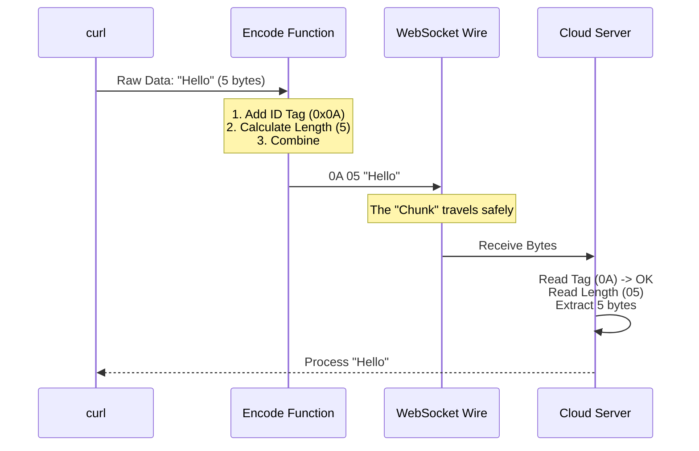

# Chapter 3: Protobuf Chunking Protocol

In the previous chapter, [CONNECT-over-WebSocket Relay](02_connect_over_websocket_relay.md), we built a "Ferry" (the Relay) to carry traffic across the river using WebSockets.

Now we face a logistical problem. WebSockets are message-based (packets), but the tools we use (like `curl`) send continuous streams of data (like a hose). If we just pour the water into the boat, it gets messy.

We need to package the data. This chapter introduces the **Protobuf Chunking Protocol**, the specific method we use to wrap raw data into safe, shippable boxes.

---

## The Concept: The Shipping Container

Imagine you are mailing a fragile vase. You cannot just throw the vase into a mail truck. You need to:
1.  **Wrap it:** Put it in a box.
2.  **Label it:** Write exactly how big the box is so the postman knows how much space it takes.
3.  **Tag it:** Identify what is inside.

In our system, we use **Protocol Buffers (Protobuf)** to define this box.

### The Blueprint
We use a very simple Protobuf definition. It serves as our "Box Design":

```protobuf
message UpstreamProxyChunk { 
  bytes data = 1; 
}
```

This tells the server: "I am sending you a message. It has one field (Field #1) which contains raw bytes."

---

## Why Manual Encoding?

Usually, developers use heavy libraries to handle Protobufs. However, our "Box Design" is so simple (just one field!) that using a large library would be like renting a crane to lift a shoebox.

Instead, we **manually encode** the bytes. This makes our proxy faster and smaller.

---

## The "Assembly Line" Walkthrough

Before we look at the code, let's see what happens to a piece of data, say the text `"Hello"`, as it moves through our system.



1.  **Tag:** We add a byte `0x0A`. This is computer shorthand for "Field Number 1, Wire Type 2 (Length Delimited)."
2.  **Length:** We calculate the length of the message.
3.  **Payload:** We attach the actual message.

---

## Internal Implementation: Encoding

Let's look at how we write `encodeChunk` in `relay.ts`. We will break it down into small pieces.

### Part 1: The Varint (Variable Integer)

The tricky part of Protobuf is the length. It uses "Varints."
*   If the number is small (0-127), it takes **1 byte**.
*   If the number is huge, it expands to take more bytes.

It's like an expandable suitcase.

```typescript
// relay.ts
const varint: number[] = []
let n = data.length

// While the number is too big for one byte...
while (n > 0x7f) {
  // Take the last 7 bits and add a "More coming" flag (0x80)
  varint.push((n & 0x7f) | 0x80)
  // Shift the number down to process the next chunk
  n >>>= 7
}
// Push the final chunk (no "More coming" flag)
varint.push(n)
```
**Explanation:** We chop the length (e.g., 500 bytes) into 7-bit slices. We add a flag (bit 8) to tell the decoder "Wait, there is another byte coming for the length count."

### Part 2: Assembling the Box

Now we put the Tag, the Length (Varint), and the Data together.

```typescript
// relay.ts
// Create a container big enough for Tag + Length + Data
const out = new Uint8Array(1 + varint.length + data.length)

// Set the Tag (Field 1, Type 2 = 0x0A)
out[0] = 0x0a

// Copy the length bytes
out.set(varint, 1)

// Copy the actual data bytes
out.set(data, 1 + varint.length)

return out
```
**Explanation:** 
1. `out[0] = 0x0a`: This is the permanent ID tag for our `UpstreamProxyChunk`.
2. `out.set`: Efficiently copies memory.
3. The result `out` is ready to be sent over WebSocket.

---

## Internal Implementation: Decoding

When the cloud replies, we get a chunk back. We must unbox it to get the raw data for our local tool.

### Part 1: Checking the Label

First, we ensure this is actually a message we understand.

```typescript
// relay.ts
export function decodeChunk(buf: Uint8Array): Uint8Array | null {
  // If empty, return empty (Keepalive ping)
  if (buf.length === 0) return new Uint8Array(0)
  
  // Check the Tag. If it isn't 0x0A, the box is labeled wrong.
  if (buf[0] !== 0x0a) return null
  
  // ... continue to decoding length
}
```
**Explanation:** If the first byte isn't `0x0A`, the server sent us garbage or a different protocol message. We return `null` to reject it.

### Part 2: Reading the Length

We read the Varint bytes one by one to figure out how big the payload is.

```typescript
// relay.ts
let len = 0
let shift = 0
let i = 1 // Start after the Tag

// Loop through bytes to rebuild the number
while (i < buf.length) {
  const b = buf[i]
  len |= (b & 0x7f) << shift
  i++
  if ((b & 0x80) === 0) break // No "More coming" flag? Done.
  shift += 7
}
```
**Explanation:** We take the 7-bit slices we made during encoding and glue them back together to get the original number (the length).

### Part 3: Opening the Box

Finally, we slice out the data.

```typescript
// relay.ts
// Safety check: Do we actually have enough bytes?
if (i + len > buf.length) return null

// Return only the payload (the meat inside the sandwich)
return buf.subarray(i, i + len)
```
**Explanation:** `subarray` gives us a view of the actual data without copying it again (which is fast). This raw data is then handed back to `curl` or `npm`.

---

## Example Scenario

Let's say `curl` sends the text **"Hi"**.

1.  **Raw Bytes:** `[0x48, 0x69]` (2 bytes).
2.  **Tag:** `0x0A`.
3.  **Length:** The length is 2. In Varint, 2 is just `0x02`.
4.  **Encoded Chunk:** `[0x0A, 0x02, 0x48, 0x69]`.

The WebSocket sends these 4 bytes. The server receives them, strips the first two bytes, and reads "Hi".

## Why This Matters

By doing this manually:
1.  **Zero Dependencies:** We don't need `npm install protobufjs` (which is huge).
2.  **Speed:** We allocate exactly the memory we need.
3.  **Robustness:** The server knows exactly where one message ends and the next begins, preventing data corruption.

---

## Conclusion

We now have a **Relay** (Chapter 2) and a **Protocol** (Chapter 3) to move data safely. We have a working proxy!

But wait—how does `curl` or `npm` know to *use* our proxy? We can't expect the user to type `--proxy http://localhost:1234` on every single command. We need a way to make this happen automatically and magically.

In the next chapter, we will learn how to inject this configuration into the user's shell.

[Next Chapter: Environment Injection](04_environment_injection.md)

---

Generated by [Code IQ](https://github.com/adityasoni99/Code-IQ)