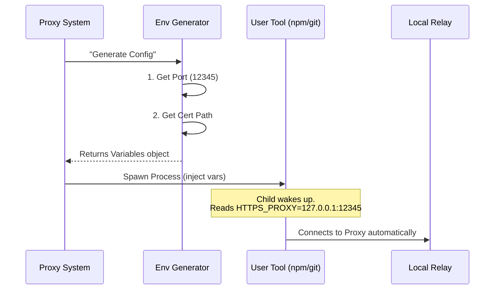

# Chapter 4: Environment Injection

In the previous chapter, [Protobuf Chunking Protocol](03_protobuf_chunking_protocol.md), we defined the language our proxy uses to wrap data safely. Before that, in [CONNECT-over-WebSocket Relay](02_connect_over_websocket_relay.md), we built the actual server.

We now have a fully functional proxy server running on `localhost:12345` (or similar).

**But we have a problem.** If you open a terminal and type `git clone ...` or `npm install`, those tools have no idea our proxy exists. They will try to connect directly to the internet, hit the security wall, and fail.

We cannot ask users to type complicated configuration flags for every single command. We need a way to make this happen **automatically** and **invisibly**. This is where **Environment Injection** comes in.

---

## The Concept: DNA Inheritance

Think of your main program (the `upstreamproxy` system) as a **Parent**.
Think of the tools you run (like `curl`, `git`, or `node`) as **Children**.

When a Parent creates a Child process, the Child inherits certain traits. In computer systems, these traits are called **Environment Variables**.

1.  **The Survival Trait:** The Parent knows how to survive (how to reach the internet via the proxy).
2.  **Encoding the Gene:** The Parent writes this knowledge into specific variables: `HTTPS_PROXY` and `SSL_CERT_FILE`.
3.  **Inheritance:** When the Parent launches a Child, the Child is born with these variables already set. The Child automatically knows where to go.

### Use Case: The Invisible Helper

Imagine a developer runs a script:
```bash
$ npm install react
```

*   **Without Injection:** `npm` looks for the internet. It sees a void. It crashes.
*   **With Injection:** `npm` wakes up. It checks its "pockets" (Environment Variables). It finds a note saying: *"Go to 127.0.0.1:12345 to reach the internet."* It connects successfully.

---

## Key Concepts

To implement this, we need to understand the standard "notes" that tools read.

### 1. `HTTPS_PROXY`
This is the address of our local relay. Most networking tools (written in Python, Go, Node, etc.) are programmed to look for this variable first. If it exists, they send their traffic there.

### 2. `SSL_CERT_FILE`
Remember the "ID Badge" (Certificate Authority Bundle) we downloaded in [Proxy Orchestration & Lifecycle](01_proxy_orchestration___lifecycle.md)? We need to tell the tools where that file is. If we don't, the tool will connect to our proxy but will refuse to talk because it doesn't recognize our security signature.

### 3. `NO_PROXY`
Sometimes, we *don't* want to use the ferry. If a tool is trying to talk to `localhost` or a private internal IP, sending it to the cloud proxy would be a mistake. This variable is a list of addresses that should stay local.

---

## The "Inheritance" Walkthrough

Here is the flow of information when the system prepares to run a user command.



1.  The system asks for the configuration.
2.  The function builds the map (URL) and the key (Certificate path).
3.  The system launches the user's tool, attaching this map and key.
4.  The tool uses them without the user ever knowing.

---

## Internal Implementation

Let's look at `upstreamproxy.ts`. The core logic happens in `getUpstreamProxyEnv`.

### Step 1: Verification

First, we ensure the proxy is actually running. If we inject environment variables pointing to a dead port, we will break the user's internet entirely.

```typescript
// upstreamproxy.ts
export function getUpstreamProxyEnv() {
  // If the stage manager says we are disabled, return nothing.
  if (!state.enabled || !state.port || !state.caBundlePath) {
    return {}
  }
  
  // If we are active, proceed to generate the genes...
}
```

**Explanation:** We check our internal state. If `state.enabled` is false, we return an empty object `{}`. The child process will be born "normal" (no proxy settings).

### Step 2: Defining the Proxy Address

We construct the URL pointing to our local relay.

```typescript
// upstreamproxy.ts
  const proxyUrl = `http://127.0.0.1:${state.port}`

  return {
    // Tell tools to route secure traffic to us
    HTTPS_PROXY: proxyUrl,
    // Lowercase version (some tools are picky)
    https_proxy: proxyUrl,
    
    // ... continued below
  }
```

**Explanation:** We set both uppercase `HTTPS_PROXY` and lowercase `https_proxy`. Different programming languages and tools prefer one or the other, so we set both to be safe.
*Note: We usually do not set `HTTP_PROXY` (insecure HTTP) because our relay is designed for secure `CONNECT` tunnels only.*

### Step 3: Defining the Trust (Certificates)

We point the tools to the "Super Bundle" file we created in Chapter 1.

```typescript
// upstreamproxy.ts
    // Standard variable for many tools
    SSL_CERT_FILE: state.caBundlePath,
    
    // Specific variable for Node.js
    NODE_EXTRA_CA_CERTS: state.caBundlePath,
    
    // Specific variable for Python requests
    REQUESTS_CA_BUNDLE: state.caBundlePath,
    // ...
```

**Explanation:** Unfortunately, not all tools agree on the name of the "Certificate File" variable.
*   `SSL_CERT_FILE` is the standard.
*   Node.js specifically looks at `NODE_EXTRA_CA_CERTS`.
*   Python's `requests` library looks at `REQUESTS_CA_BUNDLE`.
We set them all to ensure maximum compatibility.

### Step 4: The "Do Not Proxy" List

We must protect local traffic.

```typescript
// upstreamproxy.ts
const NO_PROXY_LIST = [
  'localhost', '127.0.0.1', '::1', // Loopback
  '169.254.0.0/16',                // Cloud Metadata
  'github.com'                     // Whitelisted direct access
].join(',')

// Inside the return object:
    NO_PROXY: NO_PROXY_LIST,
    no_proxy: NO_PROXY_LIST,
```

**Explanation:** We create a comma-separated list of hosts. If a tool tries to connect to `localhost`, it checks this list first. Seeing `localhost` in the list, it bypasses the proxy and connects directly. This prevents our proxy from breaking internal system communications.

---

## Edge Case: Grandchildren (Inheritance)

Sometimes, our program is running *inside* another environment that already set up these variables.

If `upstreamproxy` is restarted (for example, by a process supervisor), we don't want to overwrite valid existing settings with empty ones if something goes wrong.

```typescript
// upstreamproxy.ts
// If our proxy is disabled, but we see variables from a parent...
if (process.env.HTTPS_PROXY && process.env.SSL_CERT_FILE) {
  // Pass the torch! 
  // Return the variables we inherited so our children get them too.
  return {
    HTTPS_PROXY: process.env.HTTPS_PROXY,
    SSL_CERT_FILE: process.env.SSL_CERT_FILE,
    // ... copy others
  }
}
```

**Explanation:** If we cannot start our own proxy, but we see that our "Grandparent" gave us proxy settings, we pass those settings down to our children. This ensures the "DNA" isn't lost just because one generation failed to initialize.

---

## Conclusion

We have now completed the functional chain of the Upstream Proxy:

1.  **Lifecycle:** We start and stop the system safely.
2.  **Relay:** We move data from TCP to WebSocket.
3.  **Protocol:** We package the data efficiently.
4.  **Injection:** We tell user tools how to find and trust us.

The system works! However, we are dealing with high-security environments. We are intercepting traffic and handling authentication tokens. If we are not careful, a malicious user could spy on the proxy or steal the keys.

How do we lock this down? How do we ensure that *only* the authorized user can access this local port?

[Next Chapter: Security Hardening & Trust](05_security_hardening___trust.md)

---

Generated by [Code IQ](https://github.com/adityasoni99/Code-IQ)