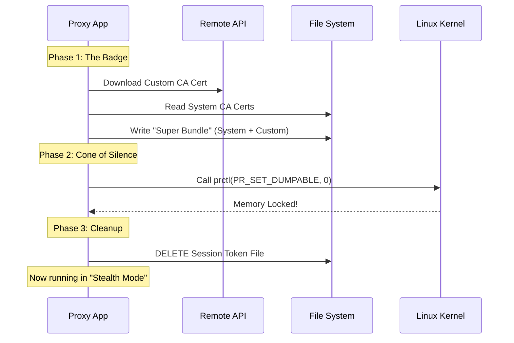

# Chapter 5: Security Hardening & Trust

In the previous chapter, [Environment Injection](04_environment_injection.md), we taught tools like `npm` and `git` how to find our proxy automatically. Our system is functional and invisible to the user.

However, "functional" isn't enough. We are handling sensitive authentication tokens. If a malicious actor creates a script running inside the same container, they might try to steal these secrets.

This chapter covers **Security Hardening**. We will transform our proxy from a simple helper into a **Secret Service Agent**.

## The Secret Service Analogy

To understand this chapter, imagine our proxy is a secret agent entering a high-security building. Two things must be true:

1.  **The Badge (Trust):** The building security (tools like `curl`) must trust the agent. If the agent shows a fake ID, security will block them. We need a valid "Badge" (Certificate Authority).
2.  **The Cone of Silence (Memory Protection):** The agent knows top-secret codes (the Session Token). Even if a spy (malicious process) gets into the same room, the agent must not let their mind be read.

In this chapter, we build both the Badge and the Cone of Silence.

---

## Key Concepts

### 1. The "Super Bundle" (Certificate Trust)
When we proxy HTTPS traffic, we are technically performing a "Man-in-the-Middle" attack on ourselves. We decrypt the traffic to inspect it, then re-encrypt it.
*   **The Problem:** Tools like Python or Node.js will scream "SECURITY ERROR" because the SSL certificate comes from us, not the real website.
*   **The Solution:** We download a custom **Certificate Authority (CA)** and tell the tools: "Trust this CA just like you trust Verisign or Google." We merge this with the system's existing certificates to create a "Super Bundle."

### 2. `prctl` (Process Control)
In Linux, one program can usually inspect the memory of another program running as the same user. This is how debuggers work.
*   **The Problem:** If a hacker runs `gdb -p <our_pid>`, they can pause our proxy and read the memory to find the Session Token.
*   **The Solution:** We use a system command called `prctl` with the flag `PR_SET_DUMPABLE = 0`. This tells the Linux Kernel: *"Lock my memory. Do not let anyone—not even the user who started me—read my mind."*

---

## The "Fortification" Walkthrough

Here is the sequence of events that secures the proxy during startup.



1.  **Get the Badge:** We combine our custom ID with the system's ID.
2.  **Lock the Mind:** We ask the Kernel to block debuggers.
3.  **Burn the Paper:** We delete the token file from the hard drive so it only exists in the locked memory.

---

## Internal Implementation

Let's look at `upstreamproxy.ts` to see how we implement these security features.

### Step 1: Building the "Super Bundle"

We cannot just replace the system certificates, or standard internet sites might stop working. We must **append** our certificate to the existing list.

```typescript
// upstreamproxy.ts
async function downloadCaBundle(baseUrl, systemCaPath, outPath) {
  // 1. Fetch our custom "Badge" from the server
  const resp = await fetch(`${baseUrl}/v1/code/upstreamproxy/ca-cert`)
  const ccrCa = await resp.text()

  // 2. Read the existing system "Badges" (fail safely if missing)
  const systemCa = await readFile(systemCaPath, 'utf8').catch(() => '')

  // 3. Glue them together and save the "Super Bundle"
  await writeFile(outPath, systemCa + '\n' + ccrCa, 'utf8')
  
  return true
}
```

**Explanation:**
1.  We fetch our specific CA from the API.
2.  We read the Linux default certs (usually at `/etc/ssl/certs/ca-certificates.crt`).
3.  We write a new file containing *both*. Later, via **Environment Injection** (Chapter 4), we tell tools to use this new file.

### Step 2: The Cone of Silence (`prctl`)

This part is tricky. JavaScript/TypeScript doesn't have a built-in command to talk directly to the Linux Kernel. We have to use a **Foreign Function Interface (FFI)** to call C code from within our app.

We use `bun:ffi` to call the C standard library (`libc`).

```typescript
// upstreamproxy.ts
function setNonDumpable() {
  // Load the C library
  const lib = ffi.dlopen('libc.so.6', {
    prctl: { args: ['int', ...], returns: 'int' }
  })

  // The magic number for "Set Dumpable" is 4
  const PR_SET_DUMPABLE = 4
  
  // Call the kernel: "Set Dumpable to 0 (False)"
  lib.symbols.prctl(PR_SET_DUMPABLE, 0, 0, 0, 0)
}
```

**Explanation:**
*   `dlopen`: Opens the system library that contains Linux commands.
*   `PR_SET_DUMPABLE`: This is the command ID.
*   `0`: This is the value (0 = Disabled).
*   **Result:** Immediately after this line runs, any attempt to attach a debugger to this process will receive an "Operation not permitted" error from the OS.

### Step 3: Burning the Evidence

We covered this briefly in [Proxy Orchestration & Lifecycle](01_proxy_orchestration___lifecycle.md), but it is a vital part of security.

```typescript
// upstreamproxy.ts
// ... inside initUpstreamProxy ...

// Start the relay first
const relay = await startUpstreamProxyRelay({ ... })

// Once running, delete the file!
await unlink(tokenPath)
```

**Explanation:**
The token exists in three states:
1.  **On Disk:** Dangerous. Anyone can read it.
2.  **In Memory:** Safer, but readable by debuggers.
3.  **In "Locked" Memory:** Safest.

By running `setNonDumpable()` (locking memory) and then `unlink()` (deleting from disk), we ensure the token only exists in the safest possible state.

---

## Conclusion

Congratulations! You have completed the **Upstream Proxy** tutorial.

We have built a sophisticated networking tool from scratch:

1.  **Orchestration:** We created a stage manager to handle the lifecycle.
2.  **Relay:** We built a "ferry" to move TCP traffic over WebSockets.
3.  **Protocol:** We designed a custom binary packaging format.
4.  **Injection:** We seamlessly integrated with user tools.
5.  **Hardening:** We secured the system against inspection and SSL errors.

The result is a transparent, secure tunnel that allows developer tools to access the internet from within a locked-down container, keeping the session safe and the user experience smooth.

You are now ready to explore the codebase with a full understanding of how these pieces fit together. Happy coding!

---

Generated by [Code IQ](https://github.com/adityasoni99/Code-IQ)