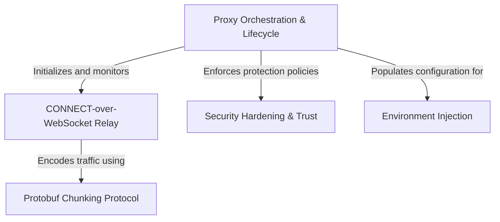

# Tutorial: upstreamproxy

This project establishes a **secure local bridge** that allows tools running inside an isolated container (like `curl` or `git`) to access the internet. It acts as a *Stage Manager*, coordinating a local server that intercepts network traffic, wraps it in a special **Protobuf** package, and ships it through a **WebSocket tunnel** to the outside world, while automatically configuring security permissions and environment variables so other applications can use it without setup.

## Chapters

1. [Proxy Orchestration & Lifecycle](01_proxy_orchestration___lifecycle.md)
2. [CONNECT-over-WebSocket Relay](02_connect_over_websocket_relay.md)
3. [Protobuf Chunking Protocol](03_protobuf_chunking_protocol.md)
4. [Environment Injection](04_environment_injection.md)
5. [Security Hardening & Trust](05_security_hardening___trust.md)

---

Generated by [Code IQ](https://github.com/adityasoni99/Code-IQ)