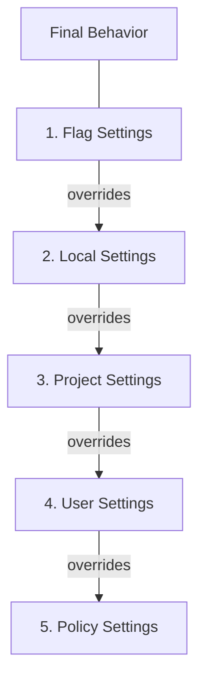
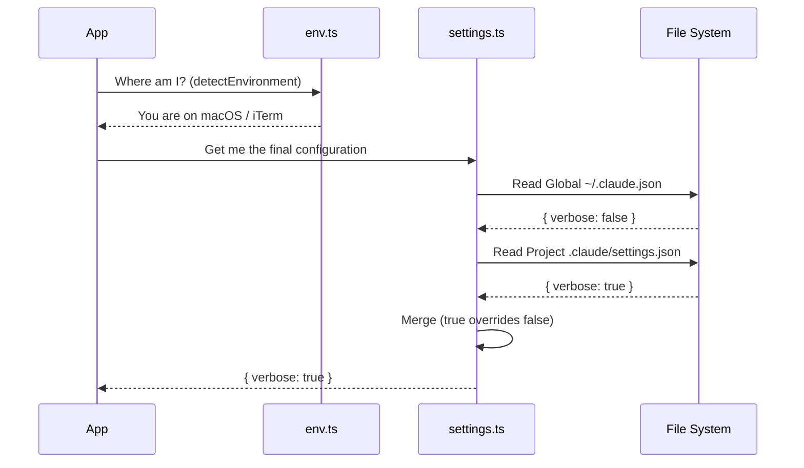

# Chapter 1: Configuration & Settings Hierarchy

Welcome to the `utils` project! Before we dive into complex features like AI models or Git operations, we need to understand how the application knows *how* to behave.

## The Problem: One Size Doesn't Fit All

Imagine you are using a tool on your personal laptop (macOS) and also on a work server (Linux). You might want "Dark Mode" enabled everywhere, but you only want "Verbose Logging" turned on for a specific buggy project you are fixing.

Hardcoding these values is bad. We need a system that:
1.  **Detects where it is** (Laptop vs. Server).
2.  **Loads your defaults** (Global preferences).
3.  **Allows specific overrides** (Project-specific rules).

This is the **Configuration & Settings Hierarchy**. It acts as the application's "Central Nervous System."

### The Hierarchy Analogy
Think of settings like getting dressed:
1.  **Environment (The Weather):** If it's raining, you wear a raincoat. You don't choose this; the environment dictates it.
2.  **Global Settings (Your Style):** You usually wear jeans and a t-shirt.
3.  **Project Settings (The Occasion):** If you are going to the gym, you wear shorts (overriding your jeans default).

## Key Concept 1: Detecting the Environment
Before loading any files, the application looks around to see where it is running. This is handled in `env.ts`. It checks the Operating System, the Terminal (e.g., iTerm, VS Code), and if it has internet access.

Here is how the application detects if you are running inside a specific terminal:

```typescript
// From env.ts - Simplified
function detectTerminal(): string | null {
  // Check for VS Code's specific environment variable
  if (process.env.VSCODE_GIT_ASKPASS_MAIN) {
    return 'vscode' // simplified return
  }

  // Check for specific terminal programs
  if (process.env.TERM_PROGRAM === 'iTerm.app') {
    return 'iterm'
  }

  return null // Could not detect
}
```
*Explanation: The code looks at `process.env`, which contains variables set by your computer. If it finds a specific "signature" (like `TERM_PROGRAM`), it identifies the terminal.*

## Key Concept 2: The Settings Layer Cake
The application merges settings from five different layers. A layer higher up the list overrides the layers below it.

1.  **Flag Settings** (Highest Priority): Command line flags like `--verbose`.
2.  **Local Settings**: Files meant for your machine only (`.claude/settings.local.json`).
3.  **Project Settings**: Shared project files (`.claude/settings.json`).
4.  **User Settings**: Your global config (`~/.claude/settings.json`).
5.  **Policy Settings** (Lowest Priority): Corporate or admin defaults.



## How It Works: The Merge Logic
The core magic happens in `settings.ts`. It reads files from all valid locations and "merges" them.

If **User Settings** says: `{ "theme": "dark", "retries": 3 }`
And **Project Settings** says: `{ "retries": 5 }`

The **Result** is: `{ "theme": "dark", "retries": 5 }`

Here is a simplified look at how the code iterates through these sources:

```typescript
// From settings/settings.ts - Simplified
function loadSettingsFromDisk() {
  let mergedSettings = {}
  
  // We iterate through sources from lowest to highest priority
  // Note: Real implementation handles priority inside the loop logic
  const sources = ['userSettings', 'projectSettings', 'flagSettings']

  for (const source of sources) {
    // 1. Get the file path for this source
    const filePath = getSettingsFilePathForSource(source)
    
    // 2. Read and parse the file
    const newSettings = parseSettingsFile(filePath)

    // 3. Merge on top of previous results
    mergedSettings = mergeWith(mergedSettings, newSettings)
  }

  return mergedSettings
}
```
*Explanation: We start with an empty object. We loop through every enabled source (User, Project, etc.), read the JSON file, and squash it into `mergedSettings`. The last one loaded "wins" for any conflicting keys.*

## Internal Implementation: The Sequence
When the application starts, it doesn't just read files randomly. It follows a strict sequence to ensure consistency.



### Deep Dive: Handling File Paths
To know *where* to look for these files, the system needs to calculate paths dynamically. This logic resides in `settings.ts` and `config.ts`.

```typescript
// From settings/settings.ts - Simplified
export function getSettingsRootPathForSource(source: string): string {
  switch (source) {
    case 'userSettings':
      // Returns ~/.config/claude/
      return resolve(getClaudeConfigHomeDir())
      
    case 'projectSettings':
      // Returns current working directory
      return resolve(getOriginalCwd())
      
    default:
      return resolve(getOriginalCwd())
  }
}
```
*Explanation: Depending on the `source` type, the code resolves a path relative to your Home directory (for global stuff) or your Current Working Directory (for project stuff).*

### Deep Dive: Saving Configuration
Sometimes the tool needs to write back to the config (e.g., updating a "last run" timestamp). To prevent two processes from writing to the file at the exact same time and corrupting it, we use a **Lock**.

```typescript
// From config.ts - Simplified
function saveConfigWithLock(file, updateFunction) {
  // 1. Try to acquire a system lock on the file
  lockfile.lockSync(file, { ... })

  try {
    // 2. Read current state
    const current = readConfig(file)
    
    // 3. Apply updates
    const updated = updateFunction(current)
    
    // 4. Write back to disk
    writeConfig(file, updated)
  } finally {
    // 5. Always release the lock!
    lockfile.unlockSync(file)
  }
}
```
*Explanation: The `lockSync` function creates a temporary `.lock` file. If another instance of the application sees this file, it waits. This ensures data integrity.*

## Summary
In this chapter, we learned that the application is context-aware:
1.  **Environment detection** (`env.ts`) tells the app *where* it is running.
2.  **Configuration** (`config.ts`) handles the core application state and file locking.
3.  **Settings** (`settings.ts`) merges preferences from multiple layers so local rules can override global defaults.

This hierarchy ensures that the tool behaves consistently while allowing for flexibility when you need it.

Now that we know *how* the application loads its preferences, we need to secure it. How do we ensure the user is who they say they are?

[Next Chapter: Authentication & Permissions](02_authentication___permissions.md)

---

Generated by [Code IQ](https://github.com/adityasoni99/Code-IQ)