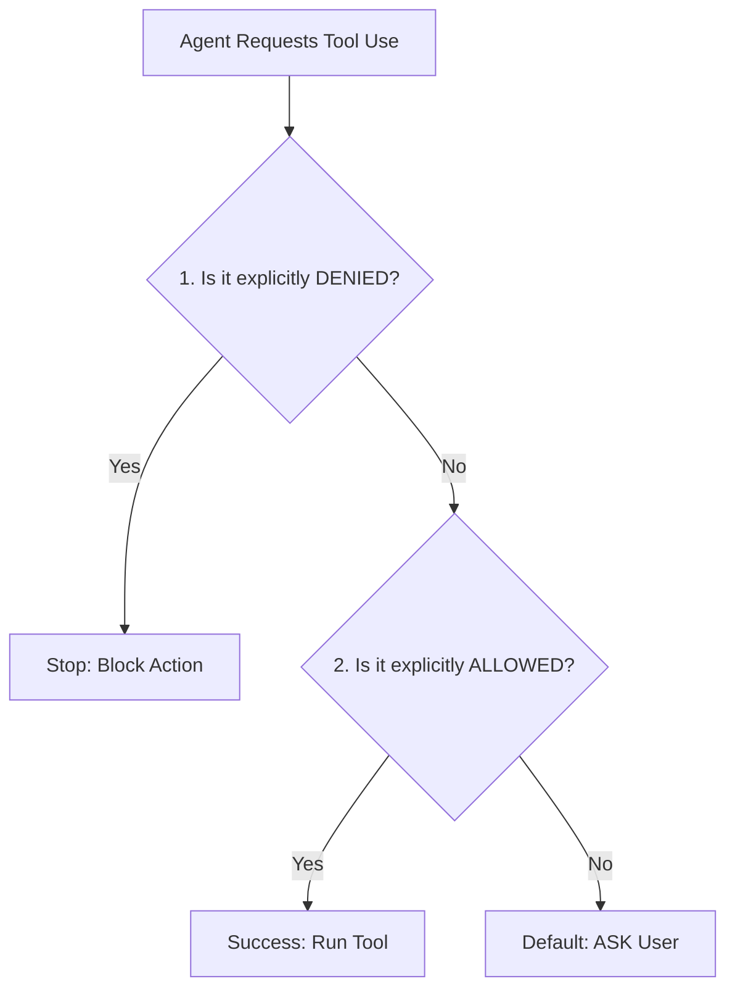
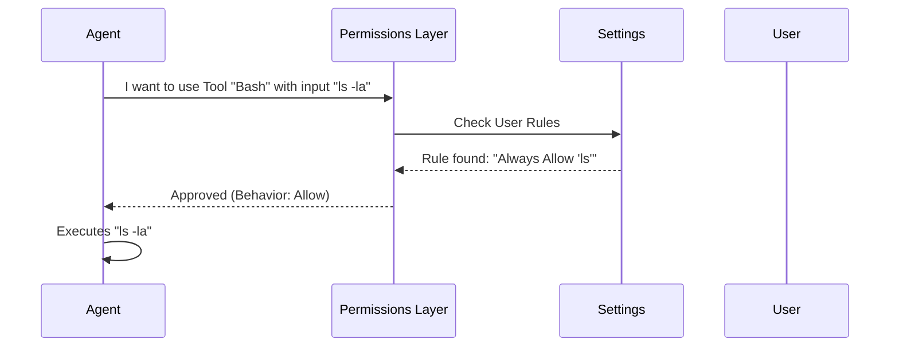
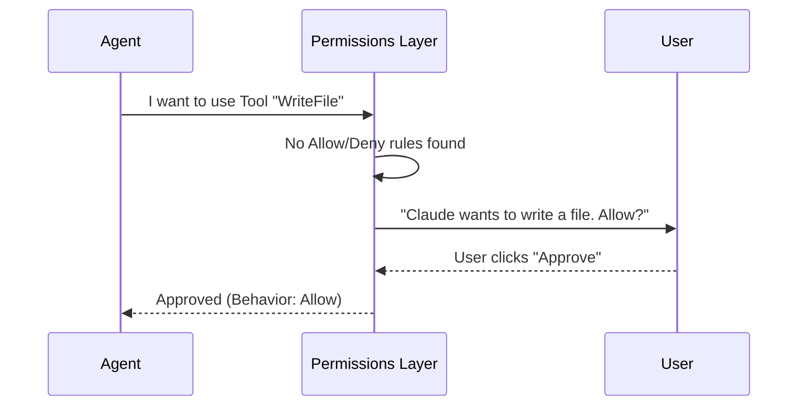

# Chapter 2: Authentication & Permissions

Welcome to the second chapter of the `utils` project tutorial. 

In the previous chapter, [Configuration & Settings Hierarchy](01_configuration___settings_hierarchy.md), we learned how the application adapts to different environments (laptop vs. server) and loads user preferences.

Now that the application knows *how* you want it to behave, it needs to answer two critical security questions:
1.  **Who are you?** (Authentication)
2.  **What are you allowed to do?** (Permissions)

## The Problem: The Over-Enthusiastic Intern

Imagine you hire an intern (the AI Agent) to help organize your files.
*   **Authentication:** First, you need to verify their identity so you can give them an access badge. You don't want a stranger walking in.
*   **Permissions:** Once inside, you want them to organize your "Documents" folder, but you definitely **do not** want them to delete your "System32" folder or email your boss.

Without a strict security layer, the AI might accidentally execute dangerous commands. This layer acts as the **Security Guard**.

## Key Concept 1: Authentication (The ID Badge)

Authentication handles how the application connects to the AI provider (Anthropic). There are two main ways this happens:
1.  **OAuth (The modern way):** You log in via a browser. The app gets a "Token" (like a temporary badge) that expires and needs refreshing.
2.  **API Key (The developer way):** You provide a long string (sk-ant-...) in an environment variable.

### How the Code Finds Your Credentials
The file `auth.ts` is responsible for hunting down valid credentials. It looks in a specific order:

1.  **Environment Variables:** Is `ANTHROPIC_API_KEY` set in your terminal?
2.  **OAuth Token:** Do we have a valid token from a previous login?
3.  **Config Files:** Is a key saved in a settings file?

Here is a simplified view of how the system decides which credential to use:

```typescript
// From auth.ts - Simplified
export function getAuthTokenSource() {
  // 1. Check for API Key in environment (Highest Priority)
  if (process.env.ANTHROPIC_API_KEY) {
    return { source: 'ANTHROPIC_API_KEY', hasToken: true }
  }

  // 2. Check for OAuth Token from login
  const oauthTokens = getClaudeAIOAuthTokens()
  if (oauthTokens?.accessToken) {
    return { source: 'claude.ai', hasToken: true }
  }

  // 3. No credentials found
  return { source: 'none', hasToken: false }
}
```
*Explanation: The code prioritizes explicit environment variables (often used in CI/CD or servers) over the user's local login session.*

### Storing Secrets Securely
When you log in via OAuth, we need to save your token so you don't have to log in every time you run a command. We shouldn't just save this in a plain text file if we can avoid it.

The system uses `secureStorage` to interact with the operating system's native keychain (like macOS Keychain).

```typescript
// From secureStorage/index.ts - Simplified
export function getSecureStorage() {
  // If on macOS, use the system Keychain
  if (process.platform === 'darwin') {
    return macOsKeychainStorage
  }

  // If on Linux/Windows, fallback to a file (encrypted or plain)
  return plainTextStorage
}
```
*Explanation: The application attempts to use the most secure storage available on your specific Operating System.*

## Key Concept 2: Permissions (The Access List)

Once authenticated, the Agent tries to use **Tools** (like `Bash` to run commands or `WriteFile` to save code). Before a tool runs, the Permission System intercepts the request.

This logic lives in `permissions/permissions.ts`. It classifies every action into three buckets:
1.  **Allow:** Run immediately.
2.  **Deny:** Block immediately.
3.  **Ask:** Pause and ask the human for approval.

### The Decision Logic
The system checks rules in a specific order. If a rule matches, it stops checking.



### Modes of Operation
The behavior changes based on the **Mode** the user has selected:
*   **Safe Mode:** Asks permission for almost everything.
*   **Auto Mode:** Uses a secondary, smaller AI "Classifier" to judge if an action is safe. If the classifier says it's safe, it allows it automatically. If it looks dangerous (like deleting files), it falls back to "Ask".

### Checking Permissions in Code
Here is how the code evaluates if a tool can run:

```typescript
// From permissions/permissions.ts - Simplified
async function hasPermissionsToUseTool(tool, input, context) {
  // 1. Check Deny Rules (e.g., "Never run rm -rf")
  const denyRule = getDenyRuleForTool(context, tool)
  if (denyRule) {
    return { behavior: 'deny', message: "Blocked by rule" }
  }

  // 2. Check Allow Rules (e.g., "Always allow ls")
  const allowRule = toolAlwaysAllowedRule(context, tool)
  if (allowRule) {
    return { behavior: 'allow' }
  }

  // 3. Default: Ask the user
  return { behavior: 'ask', message: "Allow this command?" }
}
```
*Explanation: This function returns a `PermissionDecision`. It doesn't run the tool itself; it just tells the system whether to proceed, stop, or prompt the user.*

## Internal Implementation: The Safety Sequence

Let's visualize what happens when the Agent wants to run a command, for example, listing files (`ls -la`).



Now, imagine the Agent tries to do something ambiguous, and there are no specific rules for it.



## Deep Dive: The "Auto Mode" Classifier
In `permissions.ts`, there is special logic for "Auto Mode". We don't want to annoy the user with 100 popups, but we don't want to be insecure.

We use a "YOLO" (You Only Look Once) Classifier. This is a lightweight check that happens before asking the user.

```typescript
// From permissions/permissions.ts - Simplified
if (mode === 'auto') {
  // 1. Ask a fast AI model: "Is this dangerous?"
  const classifierResult = await classifyYoloAction(tool, input)

  // 2. If the model says it's safe, allow it
  if (!classifierResult.shouldBlock) {
    return { behavior: 'allow' }
  }
  
  // 3. If dangerous, fall back to denying or asking
  return { behavior: 'deny', message: "Classifier blocked this." }
}
```
*Explanation: This block creates a hybrid experience. It feels magical (no popups) but keeps a safety net for risky actions.*

## Summary
In this chapter, we secured our application:
1.  **Authentication:** `auth.ts` verifies identity using Environment Variables or OAuth, storing secrets in `secureStorage`.
2.  **Permissions:** `permissions.ts` acts as a gatekeeper. It checks a list of rules (Allow/Deny) and user preferences (Safe/Auto Mode) before letting the Agent touch your system.

Now that the Agent is configured and authenticated, it needs to understand the task you want it to perform. This involves managing the history of the conversation and the context window.

[Next Chapter: Model Context & Strategy](03_model_context___strategy.md)

---

Generated by [Code IQ](https://github.com/adityasoni99/Code-IQ)